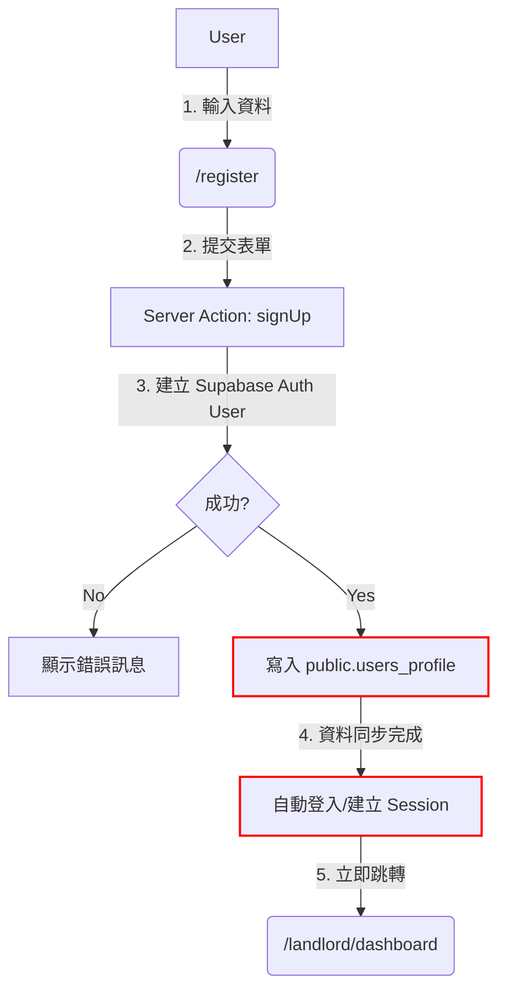

# 使用者身份驗證系統重新設計報告 (Screen Tree & Specs)

> **日期**: 2026-02-03
> **專案**: Owner Property Management AI SPA
> **狀態**: 待審核
> **作者**: Trae AI Pair Programmer

## 1. 執行摘要 (Executive Summary)

本文件旨在解決現有認證系統中的關鍵缺陷，包括密碼重設連結錯誤、註冊流程異常凍結以及權限管理漏洞。我們將透過重新設計 Screen Tree 與優化後端驗證邏輯，提供一個穩定、安全且流暢的使用者體驗。

### 主要修正目標
1.  **密碼重設**: 修正郵件連結指向錯誤 (`http://l`)，並確保使用者能順利完成密碼更新。
2.  **註冊優化**: 解決 `signUp` 後的 Race Condition 導致的頁面凍結與資料讀取錯誤。
3.  **權限控管**: 強化 Middleware 與 Dashboard 權限檢查，防止未授權存取。
4.  **UI/UX 提升**: 在 Dashboard 增加使用者個人選單與頭像顯示。

---

## 2. Screen Tree (頁面結構圖)

重新規劃後的路由結構，修正了重導向邏輯並明確區分「公開」與「私有」區域。

```text
App (Root)
├── (Auth) [公開路由 - Public Layout]
│   ├── /login                 # 登入頁 (Entry Point)
│   ├── /register              # 註冊頁 (修正凍結問題)
│   ├── /forgot-password       # 忘記密碼 (輸入 Email)
│   ├── /update-password       # 重設密碼頁 (點擊信件連結後進入此處) - ✅ 修正：應在公開區域
│   └── /auth/callback         # [API] 處理 Supabase 驗證回調 (Magic Link/Reset)
├── (Protected) [受保護路由 - Dashboard Layout]
│   ├── /landlord/dashboard    # 房東儀表板 (需登入 + 角色檢查)
│   ├── /tenant/dashboard      # 租客儀表板
│   ├── /agent/dashboard       # 經紀人儀表板
│   └── /super-admin/dashboard # 超級管理員儀表板
└── middleware.ts              # 路由守衛 (Route Guard)
```

---

## 3. 核心流程設計 (Flowcharts)

### A. 密碼重設流程 (修正 `http://l` 與連結問題)

此流程解決了使用者收到錯誤連結與重導向錯誤的問題。

```mermaid
graph TD
    A[User] -->|1. 點擊忘記密碼| B(/forgot-password)
    B -->|2. 輸入 Email (a04...@gmail.com)| C{Supabase Auth}
    C -->|3. 發送重設信件| D[User Email Inbox]
    D -->|4. 信件內含連結| E[連結指向 /auth/callback]
    E -->|5. 驗證 Code/Token| F{驗證成功?}
    F -->|Yes (建立 Session)| G(/update-password)
    F -->|No (Token 無效/過期)| H(/login?error=invalid_token)
    G -->|6. 輸入新密碼| I{更新密碼}
    I -->|7. 成功| J(/landlord/dashboard)
    
    style E stroke:#f00,stroke-width:2px
    style G stroke:#0f0,stroke-width:2px
```

**關鍵技術修正：**
*   **Redirect URL**: 強制指定 `redirectTo` 為 `${origin}/auth/callback?next=/update-password`。
*   **Token Handling**: 在 `/auth/callback` 中正確交換 Session，並將使用者導向 `/update-password` 進行密碼變更（此時使用者已處於登入狀態）。

### B. 註冊流程優化 (消除 3秒凍結與錯誤)



**關鍵技術修正：**
*   **Race Condition**: 確保 `users_profile` 寫入完成後才回傳成功響應給前端。
*   **Self-healing**: 針對舊帳號（如 `a04...`），若登入時發現 Profile 缺失，系統自動補建，避免「無法取得用戶資料」錯誤。

### C. 登入與權限管理

*   **Middleware**: 
    *   未登入 -> `/landlord/*` -> Redirect to `/login`
    *   已登入 -> `/login` -> Redirect to `/landlord/dashboard`
*   **Dashboard Header**: 
    *   實作 `UserNav` 元件，顯示 User Avatar。
    *   點擊顯示 Dropdown: `Profile`, `Settings`, `Sign out`。

---

## 4. 技術規格與實作細節

### 4.1 密碼重設 (Password Reset)

*   **API**: `supabase.auth.resetPasswordForEmail(email, { redirectTo })`
*   **Page**: `app/update-password/page.tsx`
    *   需驗證當前是否有 Session。
    *   表單包含：`New Password`, `Confirm Password`。
    *   提交後呼叫 `supabase.auth.updateUser({ password })`。

### 4.2 註冊 (Registration)

*   **Action**: `signUp` (in `lib/supabase/auth.ts`)
*   **Profile Sync**:
    *   使用 `adminSupabase` (Service Role) 確保權限寫入 `users_profile`。
    *   錯誤處理：若 Auth 建立成功但 Profile 失敗，需有重試或回滾機制（或在登入時修復）。

### 4.3 使用者介面 (UI Components)

*   **UserNav Component**:
    *   使用 `shadcn/ui` 的 Dropdown Menu。
    *   顯示 `user_metadata.full_name` 或 Email。
    *   Avatar 使用 `user_metadata.avatar_url` 或預設圖示。

---

## 5. 驗收標準 (Acceptance Criteria)

### 5.1 功能驗收
- [ ] **重設密碼**:
    - [ ] 輸入 `a0405142777@gmail.com` 能收到信件。
    - [ ] 信件連結正確導向 `/update-password` (經由 `/auth/callback`)。
    - [ ] 更新密碼後能用新密碼登入。
- [ ] **註冊**:
    - [ ] 新用戶註冊後直接跳轉 Dashboard，無錯誤訊息，無凍結。
    - [ ] 資料庫 `auth.users` 與 `public.users_profile` 資料一致。
- [ ] **登入**:
    - [ ] 舊帳號 (`a04...`) 若資料不全，登入時自動修復並成功進入。
    - [ ] Dashboard 右上角顯示正確的使用者資訊。

### 5.2 安全驗收
- [ ] 未登入無法訪問 `/landlord/dashboard`。
- [ ] 已登入無法訪問 `/login` 或 `/register`。

---

## 6. 測試計畫

1.  **單元測試**: 測試 `signUp` 與 `resetPassword` 函數的邏輯。
2.  **整合測試**: 模擬完整的使用者流程（註冊 -> 登出 -> 忘記密碼 -> 重設 -> 登入）。
3.  **手動驗證**: 使用提供的測試帳號進行實機驗證。
