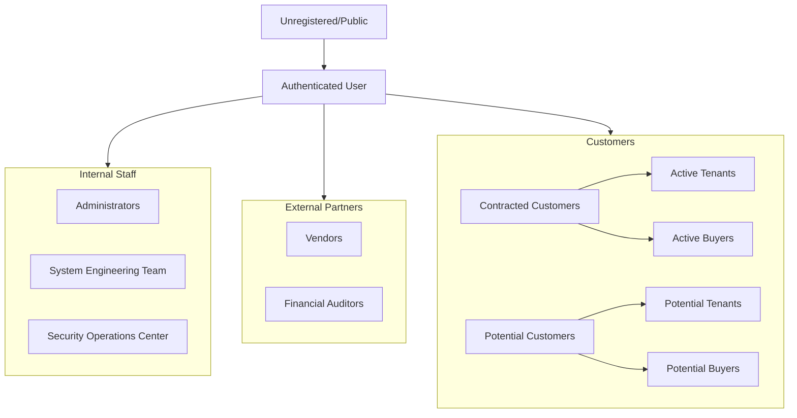

# Permission & Group Architecture (IAM)

**Version:** 1.0  
**Date:** 2026-02-10  
**Author:** System Engineering Team  

## 1. Group Hierarchy & De-duplication

We have consolidated the user requirements into a streamlined IAM Group structure.

### 1.1 Hierarchy Diagram



### 1.2 Group Definitions

| Group Name | ID (Key) | Description | Base Role |
| :--- | :--- | :--- | :--- |
| **Administrators** | `super_admin_group` | System Super Admins with full access | `super_admin` |
| **System Engineering Team** | `sys_eng_group` | Infrastructure & backend maintenance | `system_engineer` |
| **Security Operations Center** | `sec_ops_group` | Security audits & compliance monitoring | `cybersecurity_engineer` |
| **Active Tenants** | `contract_tenant` | Tenants with active lease contracts | `tenant` |
| **Active Buyers** | `contract_buyer` | Buyers with active sale contracts | `contract_buyer` |
| **Potential Tenants** | `potential_tenant` | Users interested in renting | `potential_tenant` |
| **Potential Buyers** | `potential_buyer` | Users interested in buying | `potential_buyer` |
| **Vendors** | `vendor_group` | Service providers (cleaning, repair) | `vendor` |
| **Financial Auditors** | `auditor_group` | External financial auditors | `auditor` |

---

## 2. Permission Matrix

### 2.1 Functional Access Levels

| Feature Module | Admin | Sys Eng | Sec Eng | Landlord | Tenant | Buyer | Vendor | Auditor | Potential |
| :--- | :---: | :---: | :---: | :---: | :---: | :---: | :---: | :---: | :---: |
| **User Management** | Full | Read | Read | - | - | - | - | - | - |
| **System Config** | Full | Full | Read | - | - | - | - | - | - |
| **Security Logs** | Full | Read | Full | - | - | - | - | Read | - |
| **Properties** | Full | Read | Read | Manage | Read | Read | Read | Read | Read (Pub) |
| **Contracts** | Full | Read | Read | Manage | Read (Own) | Read (Own) | - | Read | - |
| **Financials** | Full | - | Read | View | Pay | Pay | Invoice | Read | - |
| **Work Orders** | Full | - | - | Manage | Request | - | Update | Read | - |

### 2.2 Data Access Levels

*   **Public (L1)**: Published properties, About Us, Contact pages. (Role: `anon`)
*   **Internal (L2)**: User dashboard, basic profile. (Role: `authenticated`)
*   **Confidential (L3)**: Contracts, financial transactions, personal PII. (Role: `landlord`, `tenant`, `buyer`, `auditor`)
*   **Restricted (L4)**: System logs, security audits, admin tools. (Role: `super_admin`, `cybersecurity_engineer`)

---

## 3. Technical Implementation

### 3.1 Database Schema
The system uses `public.iam_groups`, `public.iam_roles`, and junction tables for flexibility.

*   `iam_groups`: Stores group definitions.
*   `iam_roles`: Stores granular capabilities.
*   `iam_group_roles`: Maps capabilities to groups.
*   `iam_group_members`: Maps users to groups.

### 3.2 Role Inheritance
Inheritance is implemented via **additive permissions**. A user belonging to the **Security Operations Center** group automatically inherits:
1.  `cybersecurity_engineer` role (Primary)
2.  `auditor` role (Inherited via `iam_group_roles` mapping)

### 3.3 API Security
*   **RLS (Row Level Security)**: Enforced at the database level.
*   **CASL (Ability.ts)**: Enforced at the frontend/UI level for better UX.

---

## 4. Security & Compliance

### 4.1 Principle of Least Privilege (PoLP)
*   **Default Deny**: All RLS policies default to deny unless explicitly allowed.
*   **Separation of Duties**: `system_engineer` can change config but cannot read `contract` PII details unless necessary. `auditor` can read financials but cannot change them.

### 4.2 Audit Logging
All critical actions (Permission changes, Login, Data export) are logged to `audit_logs` table.
*   **Retention**: 1 year.
*   **Access**: Read-only for `auditor` and `cybersecurity_engineer`.

---

## 5. Deployment Guide

### 5.1 Initial Setup
Run the migration script:
```bash
npx supabase migration up
```

### 5.2 Verification
Run the audit query:
```sql
SELECT g.name, r.name 
FROM iam_groups g 
JOIN iam_group_roles gr ON g.id = gr.group_id 
JOIN iam_roles r ON gr.role_id = r.role_id;
```
