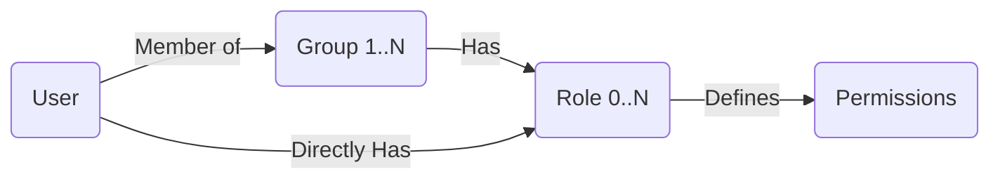

# IAM Group-Based Permission System Design

## 1. Overview
This document outlines the design for a "Group-Based" access control system, inspired by AWS IAM. This system introduces an intermediate "Group" layer between Users and Roles/Permissions, allowing for scalable management of user rights in the Real Estate Management platform.

### Goals
- **Scalability**: Manage permissions for large numbers of users by assigning them to groups (e.g., "Taipei Landlords") rather than individually.
- **Flexibility**: Allow users to belong to multiple groups (e.g., a user can be both a "Tenant" and a "Vendor").
- **Auditability**: Clearly track *why* a user has a specific permission (inherited from which group?).

## 2. Core Concepts
The architecture follows a standard RBAC (Role-Based Access Control) model extended with User Groups.

### 2.1 Entity Relationships

*Note: While AWS IAM allows attaching Policies directly to Users, our best practice recommendation is to attach Roles primarily to Groups.*

### 2.2 Definitions
1.  **User (`auth.users`)**: A registered entity (supabase auth).
2.  **Group (`iam_groups`)**: A collection of users (e.g., "Senior Landlords", "Audit Team").
3.  **Role (`iam_roles`)**: A set of permissions (e.g., "property_editor", "contract_viewer"). In our system, this is comparable to an AWS "Policy".
4.  **Permission**: Granular action rights (implicitly defined by the Role's capabilities in RLS policies or application logic).

## 3. Database Schema Design (Supabase)

We will introduce a new namespace/schema or prefix `iam_` to keep these tables organized.

### 3.1 Tables
- **`iam_groups`**: Stores group definitions.
    - `id` (uuid, PK)
    - `name` (text, unique) - e.g., "landlords_taipei"
    - `description` (text)
    - `is_system_managed` (bool) - prevents deletion of core groups

- **`iam_roles`**: Stores available roles.
    - `id` (uuid, PK)
    - `name` (text, unique) - e.g., "property_manager"
    - `description` (text)

- **`iam_group_members`**: Link table (User <-> Group).
    - `group_id` (fk -> iam_groups)
    - `user_id` (fk -> auth.users)

- **`iam_group_roles`**: Link table (Group <-> Role).
    - `group_id` (fk -> iam_groups)
    - `role_id` (fk -> iam_roles)

- **`iam_user_roles`**: Link table for direct assignment (User <-> Role). *Optional use, generally discouraged in favor of groups.*
    - `user_id` (fk -> auth.users)
    - `role_id` (fk -> iam_roles)

## 4. Permission Logic (The "Effective Permission" Calculation)

When the application (React) or Database (RLS) checks if `User A` can perform `Action X`:

1.  **Fetch Direct Roles**: Get roles assigned directly to `User A`.
2.  **Fetch Group Roles**:
    - Find all groups `User A` belongs to.
    - Collect all roles assigned to those groups.
3.  **Union**: Combine Direct Roles + Group Roles = **Effective Roles**.
4.  **Check**: Does any of the Effective Roles grant `Action X`?

## 5. Security & RLS
- **Management Access**: Only users with the `super_admin` role (likely a dedicated group) can INSERT/UPDATE the `iam_*` tables.
- **Read Access**: Authenticated users can read their own group memberships (to determining their own UI state).

## 6. Frontend Implementation Plan (React/Next.js)
The "Console" for managing this will be built in `apps/web`.

### 6.1 UI Components
- **Group List**: Table showing all groups and member counts.
- **Group Detail**: View members in a group; View attached roles.
- **User Detail**: "Effective Permissions" view - showing which groups are granting which roles.

### 6.2 Hooks
- `useUserGroups(userId)`
- `useUserPermissions(userId)` -> returns computed final permissions using CASL or custom logic.

## 7. Migration Strategy
1.  Create tables (SQL).
2.  Seed default roles (based on previous matrix: super_admin, landlord, etc.).
3.  Create default groups mapping 1:1 to roles (e.g., Group "Landlords" has Role "landlord").
4.  Migrate existing user-role data (if any) into the new structure.
