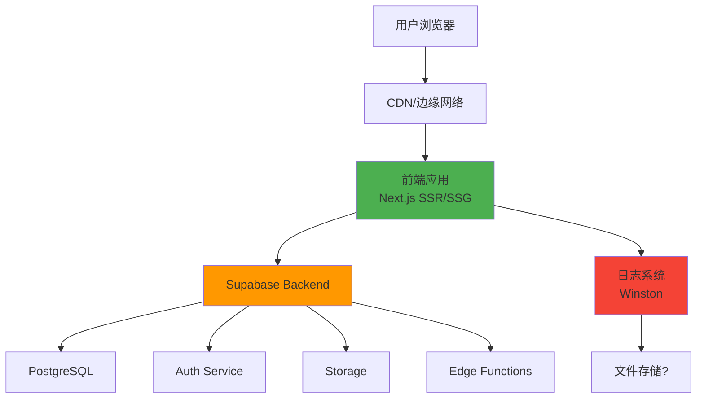
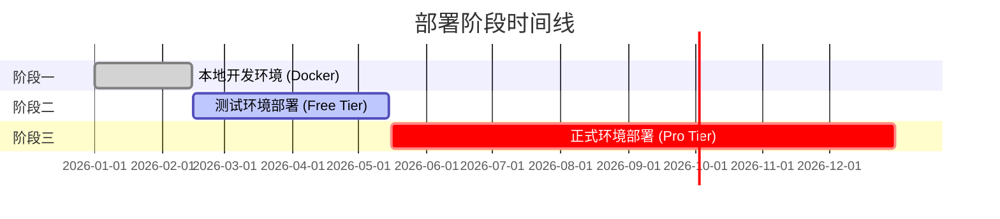
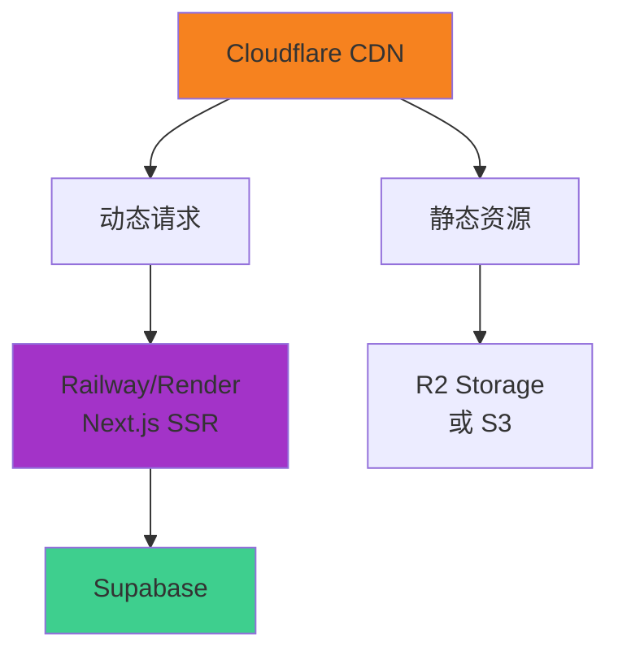
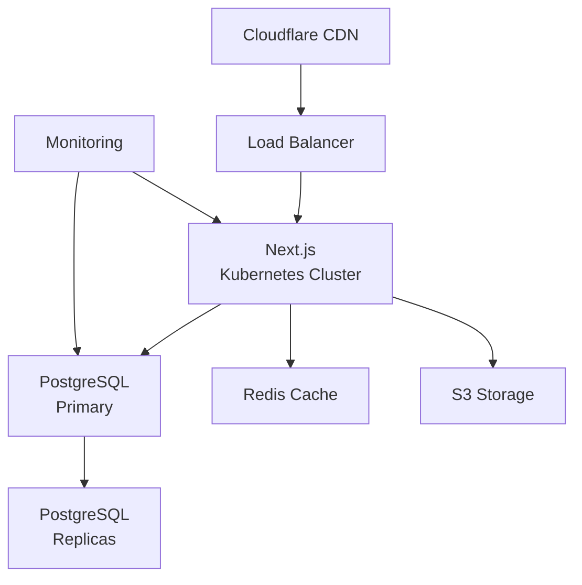
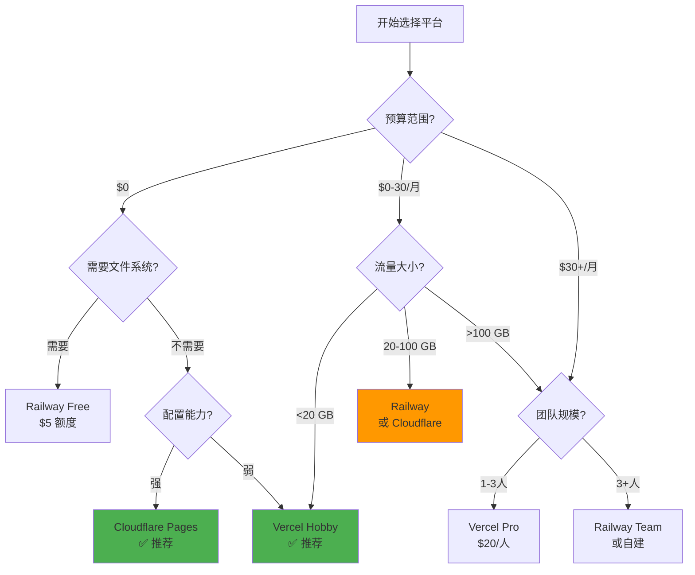

# 云端部署平台选择说明书

> Owner Property Management AI SPA - Cloud Deployment Platform Selection Guide

**文档版本**: v1.0  
**最后更新**: 2026-02-14  
**维护者**: Technical Team  
**状态**: ✅ Active

---

## 📋 目录

- [1. 文档概要](#1-文档概要)
- [2. 专案背景与需求分析](#2-专案背景与需求分析)
- [3. 后端部署：Supabase（已确定）](#3-后端部署supabase已确定)
- [4. 前端部署平台完整对比](#4-前端部署平台完整对比)
- [5. 关键技术考量](#5-关键技术考量)
- [6. 成本分析](#6-成本分析)
- [7. 推荐方案](#7-推荐方案)
- [8. 决策矩阵](#8-决策矩阵)
- [9. 实施路线图](#9-实施路线图)
- [10. 风险评估与缓解策略](#10-风险评估与缓解策略)
- [11. 附录](#11-附录)

---

## 1. 文档概要

### 📌 文档目的

本文档旨在为 Owner Property Management AI SPA 专案提供详细的云端部署平台选择指南，帮助团队：

1. ✅ 理解各部署平台的优缺点
2. ✅ 做出基于数据的平台选择决策
3. ✅ 规划三阶段部署策略
4. ✅ 避免供应商锁定风险
5. ✅ 优化成本与性能平衡

### 👥 适用读者

- **技术负责人**: 架构决策与平台选择
- **开发团队**: 实施部署与迁移
- **产品经理**: 成本与进度规划
- **DevOps 工程师**: 基础设施管理

### 📅 版本历史

| 版本 | 日期 | 变更内容 | 作者 |
|------|------|----------|------|
| v1.0 | 2026-02-14 | 初始版本，完整平台对比 | Technical Team |

---

## 2. 专案背景与需求分析

### 🛠️ 技术栈概览

```
Frontend Stack:
├── Next.js 16.1.6 (App Router)
├── React 19.2.3
├── TypeScript 5.x
├── TailwindCSS 3.4.19
└── Monorepo Architecture
    ├── apps/web (主应用)
    ├── apps/superadmin (超级管理员)
    └── apps/mobile (React Native)

Backend Stack:
├── Supabase
│   ├── PostgreSQL (Database)
│   ├── Auth (Authentication)
│   ├── Storage (File Storage)
│   └── Edge Functions (Serverless)
└── Winston Logger (File System Logs)
```

### 🏗️ 部署架构说明

#### 前后端分离架构



**架构特点**：
- ✅ **前端**：静态生成 + 服务端渲染混合模式
- ✅ **后端**：Supabase 托管，完全分离
- ⚠️ **日志**：依赖文件系统（与 Serverless 冲突）
- ✅ **CDN**：全球分发，低延迟

### 🎯 关键需求清单

#### 功能需求

| 需求 | 优先级 | 说明 |
|------|--------|------|
| **Next.js 16+ 完整支持** | 🔴 必须 | App Router, Server Components, Server Actions |
| **SSR + SSG 混合渲染** | 🔴 必须 | 性能优化关键 |
| **环境变量管理** | 🔴 必须 | 开发/测试/生产环境隔离 |
| **自动部署 (CI/CD)** | 🟡 重要 | Git push 自动部署 |
| **预览部署** | 🟡 重要 | PR 预览环境 |
| **日志持久化** | 🟠 可选 | Winston 文件日志（需调整） |

#### 非功能需求

| 需求 | 目标 | 备注 |
|------|------|------|
| **避免供应商锁定** | 🔴 高优先级 | 能够在 3-6 个月内迁移 |
| **成本控制** | 🔴 高优先级 | 阶段二免费，阶段三 <$100/月 |
| **全球性能** | 🟡 中优先级 | 台湾/亚太区优化 |
| **扩展性** | 🟡 中优先级 | 支持 1K → 10K MAU |
| **开发体验** | 🟢 低优先级 | 快速部署，易于调试 |

### 📊 三阶段部署策略



| 阶段 | 时间范围 | 用户规模 | 成本预算 | 平台选择 |
|------|----------|----------|----------|----------|
| **阶段一** | 已完成 | 开发团队 | $0 | Docker Compose 本地 |
| **阶段二** | 2-3 个月 | <100 测试用户 | $0-20/月 | **待决策** |
| **阶段三** | 6-12 个月 | 1,000 MAU | <$100/月 | **待决策** |
| **未来** | 1年+ | 10,000+ MAU | 视规模而定 | 可调整 |

---

## 3. 后端部署：Supabase（已确定）

### ✅ 为什么选择 Supabase

| 优势 | 说明 |
|------|------|
| 🎯 **All-in-One 解决方案** | Database + Auth + Storage + Realtime |
| 🚀 **开发效率高** | 自动生成 API，快速原型开发 |
| 💰 **免费额度慷慨** | 500MB DB, 1GB 存储，50,000 MAU |
| 🔓 **开源技术栈** | PostgreSQL, PostgREST, 可自建 |
| 🌍 **全球部署** | 多区域支持，低延迟 |
| 📈 **良好扩展性** | 从免费到企业级平滑升级 |

### 🛠️ Supabase 服务内容

```typescript
// Supabase 提供的核心服务
const supabaseServices = {
  database: "PostgreSQL 15+ with pgvector",
  auth: "Authentication & Authorization (JWT)",
  storage: "S3-compatible Object Storage",
  realtime: "WebSocket real-time subscriptions",
  edgeFunctions: "Deno-based serverless functions",
  api: "Auto-generated REST & GraphQL APIs"
};
```

### 💵 Supabase 定价方案

| 方案 | 价格 | Database | 存储 | 带宽 | MAU | 适用阶段 |
|------|------|----------|------|------|-----|----------|
| **Free** | $0/月 | 500 MB | 1 GB | 2 GB | 50K | ✅ 阶段二 |
| **Pro** | $25/月 | 8 GB | 100 GB | 250 GB | 100K | ✅ 阶段三 |
| **Team** | $599/月 | 无限 | 无限 | 无限 | 无限 | 未来扩展 |

### 📝 Supabase 部署步骤概要

```bash
# 1. 创建项目
supabase init
supabase link --project-ref trae_upxjsp5z

# 2. 本地迁移
supabase migration new initial_schema
supabase db push

# 3. 配置环境变量
NEXT_PUBLIC_SUPABASE_URL=https://trae_upxjsp5z.supabase.co
NEXT_PUBLIC_SUPABASE_ANON_KEY=eyJ...
SUPABASE_SERVICE_ROLE_KEY=eyJ...

# 4. 部署 Edge Functions
supabase functions deploy function-name
```

**✅ 结论**: Supabase 已确定为后端方案，本文档聚焦于**前端部署平台选择**。

---

## 4. 前端部署平台完整对比

### 📊 快速对比表格

| 平台 | Next.js 兼容 | 免费额度 | 付费起价 | 迁移难度 | 文件系统 | 推荐度 |
|------|-------------|----------|----------|----------|----------|--------|
| **Vercel** | ⭐⭐⭐⭐⭐ | 慷慨 | $20/月 | 🟢 简单 | ❌ 无 | ⭐⭐⭐⭐⭐ |
| **Netlify** | ⭐⭐⭐⭐ | 中等 | $19/月 | 🟢 简单 | ❌ 无 | ⭐⭐⭐⭐ |
| **Cloudflare Pages** | ⭐⭐⭐⭐ | 非常慷慨 | $20/月 | 🟡 中等 | ❌ 无 | ⭐⭐⭐⭐⭐ |
| **Railway** | ⭐⭐⭐⭐ | $5 额度 | $5/月 按用量 | 🟡 中等 | ✅ 有 | ⭐⭐⭐⭐ |
| **Render** | ⭐⭐⭐⭐ | 有限 | $7/月 | 🟡 中等 | ✅ 有 | ⭐⭐⭐⭐ |
| **AWS Amplify** | ⭐⭐⭐ | 12个月 | $15/月起 | 🔴 困难 | ❌ 无 | ⭐⭐ |
| **自建 VPS** | ⭐⭐⭐⭐⭐ | - | $4/月起 | 🟠 较难 | ✅ 有 | ⭐⭐⭐ |

---

### 1️⃣ Vercel（Next.js 官方推荐）

#### ✅ 优点

- **🏆 最佳 Next.js 支持**: 由 Vercel 官方开发，100% 兼容所有特性
- **⚡ 极致性能**: Edge Network, 智能缓存, Image Optimization
- **🚀 零配置部署**: Git push 自动部署，无需配置
- **🔍 预览部署**: 每个 PR 自动生成预览环境
- **📊 Analytics**: 内建性能监控和 Web Vitals
- **🎁 免费额度**: Hobby 方案足够测试使用

#### ❌ 缺点

- **💰 成本**: Pro 方案 $20/月/成员，团队成本高
- **📈 用量限制**: 免费方案有较多限制（100 GB 带宽/月）
- **🔒 轻度锁定**: 虽然可迁移，但会失去部分特性
- **🚫 无文件系统**: Serverless 环境，不支持持久化文件写入

#### 💵 定价详情

| 方案 | 价格 | 带宽 | 构建时长 | 并发构建 | 团队成员 |
|------|------|------|----------|----------|----------|
| **Hobby** | $0/月 | 100 GB | 6,000 min | 1 | 1 |
| **Pro** | $20/月/人 | 1 TB | 24,000 min | 12 | 无限 |
| **Enterprise** | 定制 | 无限 | 无限 | 无限 | 无限 |

#### 🔧 技术规格

```javascript
// vercel.json 正确配置（Next.js 不需要）
// ❌ 错误配置（当前）
{
  "rewrites": [{"source": "/(.*)", "destination": "/index.html"}]
}

// ✅ 正确配置（Next.js 16）
{
  "buildCommand": "npm run build",
  "framework": "nextjs",
  "installCommand": "npm install",
  "regions": ["hnd1", "tpe1"], // 台湾/日本边缘节点
  "env": {
    "NEXT_PUBLIC_SUPABASE_URL": "@supabase-url",
    "NEXT_PUBLIC_SUPABASE_ANON_KEY": "@supabase-anon-key"
  }
}

// 或者完全删除 vercel.json（推荐）
// Vercel 自动检测 Next.js 项目
```

#### 🔄 迁移难度: 🟢 简单

**迁出策略**:
1. 下载源代码（已在 Git）
2. 更新环境变量配置
3. 修改 `next.config.js`（如使用 Vercel 专有特性）
4. 在新平台部署

---

### 2️⃣ Netlify

#### ✅ 优点

- **🎯 良好 Next.js 支持**: Essential Next.js 插件，支持大部分特性
- **🔌 丰富插件生态**: 表单处理、函数、身份验证等
- **🌍 全球 CDN**: 快速内容分发
- **💰 中等定价**: 比 Vercel 略便宜

#### ❌ 缺点

- **⚠️ Next.js 支持不完整**: 某些高级特性需要额外配置
- **🐌 构建速度**: 比 Vercel 稍慢
- **📊 Analytics 付费**: 需额外购买
- **🚫 无文件系统**: Serverless 环境

#### 💵 定价详情

| 方案 | 价格 | 带宽 | 构建时长 | 成员 |
|------|------|------|----------|------|
| **Free** | $0/月 | 100 GB | 300 min | 1 |
| **Pro** | $19/月 | 1 TB | 25,000 min | 5 |

#### 🔄 迁移难度: 🟢 简单

---

### 3️⃣ Cloudflare Pages（强力推荐）

#### ✅ 优点

- **💰 极佳性价比**: 免费额度巨大，付费方案便宜
- **🌍 全球网络**: Cloudflare 的 CDN 网络，覆盖广
- **⚡ 性能优秀**: Edge Functions, Workers 集成
- **🎁 免费额度**: 无限带宽！500 次构建/月
- **🔓 避免锁定**: 标准 Web 技术，易迁移

#### ❌ 缺点

- **🔧 配置复杂**: 需要手动配置 Next.js 适配
- **📚 文档不足**: Next.js 集成文档较少
- **⚠️ 部分特性限制**: Image Optimization 需自行处理
- **🚫 无文件系统**: Workers 环境

#### 💵 定价详情

| 方案 | 价格 | 带宽 | 构建次数 | 请求数 |
|------|------|------|----------|--------|
| **Free** | $0/月 | **无限** | 500/月 | 100K/天 |
| **Pro** | $20/月 | **无限** | 5,000/月 | 1M/天 |

#### 🔧 Next.js 配置

```javascript
// next.config.js - Cloudflare Pages 适配
/** @type {import('next').NextConfig} */
const nextConfig = {
  output: 'export', // 静态导出
  // 或使用 @cloudflare/next-on-pages
  images: {
    unoptimized: true, // 或使用 Cloudflare Images
  },
};

module.exports = nextConfig;
```

#### 🔄 迁移难度: 🟡 中等

**需要做的调整**:
- 安装 `@cloudflare/next-on-pages`
- 配置构建命令
- 测试 SSR 功能

---

### 4️⃣ Railway

#### ✅ 优点

- **✅ 支持文件系统**: 可以运行 Winston 日志！
- **🐳 容器化部署**: 接近生产环境
- **💰 按用量计费**: 用多少付多少
- **🔧 灵活配置**: 支持 Docker, Nixpacks
- **🎁 $5 免费额度**: 每月

#### ❌ 缺点

- **💰 免费额度有限**: $5 用完即停止
- **🌍 CDN 弱**: 需自行配置 Cloudflare
- **📈 成本不可预测**: 流量大时费用飙升
- **🔧 需要配置**: 不是开箱即用

#### 💵 定价详情

```
计费方式: $0.000463/GB-hour (RAM) + $0.000231/vCPU-hour

估算（1 GB RAM + 1 vCPU 全天候运行）:
- 0.000463 × 1 GB × 730 hours = $0.34
- 0.000231 × 1 vCPU × 730 hours = $0.17
总计: ~$0.50/月 + 带宽费用

$5 免费额度 = 约可运行 10 个月（低流量）
```

#### 🔧 配置示例

```bash
# railway.toml
[build]
builder = "NIXPACKS"

[deploy]
startCommand = "npm run start"
healthcheckPath = "/"
healthcheckTimeout = 100

[[services]]
name = "web"
port = 3000

[env]
NODE_ENV = "production"
```

#### 🔄 迁移难度: 🟡 中等

---

### 5️⃣ Render

#### ✅ 优点

- **✅ 支持文件系统**: Persistent Disks (付费)
- **🎯 开发友好**: 类似 Heroku 的体验
- **🔍 预览环境**: PR 预览部署
- **💰 合理定价**: $7/月起

#### ❌ 缺点

- **🐌 启动慢**: 免费方案冷启动 30 秒+
- **💰 免费方案限制**: 仅能运行 90 天
- **🌍 CDN 需自建**: 无内建 CDN
- **📉 性能一般**: 不如专业 CDN

#### 💵 定价详情

| 方案 | 价格 | 特点 |
|------|------|------|
| **Free** | $0/月 | 750 小时/月，冷启动 |
| **Starter** | $7/月 | Always on, 512 MB |
| **Standard** | $25/月 | 2 GB RAM |

#### 🔄 迁移难度: 🟡 中等

---

### 6️⃣ AWS Amplify

#### ✅ 优点

- **🏢 企业级**: AWS 生态系统集成
- **🌍 全球基础设施**: CloudFront CDN
- **🔐 安全性**: AWS 安全标准
- **📈 扩展性**: 无限扩展能力

#### ❌ 缺点

- **🔧 配置复杂**: 学习曲线陡峭
- **💰 成本高**: 各种服务分开计费
- **🔒 重度锁定**: 深度绑定 AWS 生态
- **📚 文档散乱**: 需要了解多个 AWS 服务

#### 💵 定价详情

```
构建费用: $0.01/分钟
托管费用: $0.15/GB 存储 + $0.15/GB 流量

估算（10 GB 流量/月）:
- 构建: 30 次 × 5 分钟 × $0.01 = $1.50
- 存储: 1 GB × $0.15 = $0.15
- 流量: 10 GB × $0.15 = $1.50
总计: ~$3/月（不含其他 AWS 服务）
```

#### 🔄 迁移难度: 🔴 困难

**不推荐理由**: 
- ❌ 复杂度高，团队学习成本大
- ❌ 深度锁定，未来迁移困难
- ❌ 成本预测困难

---

### 7️⃣ 自建 VPS (DigitalOcean/Linode/Vultr)

#### ✅ 优点

- **💰 成本可控**: $4-12/月固定成本
- **✅ 完全控制**: 文件系统、配置、服务
- **🔓 零锁定**: 标准 Linux 环境
- **📊 学习价值**: DevOps 技能提升

#### ❌ 缺点

- **🔧 运维负担**: 需要管理服务器、安全更新
- **🌍 无 CDN**: 需自行配置 Cloudflare
- **📈 扩展麻烦**: 手动扩容，无自动弹性
- **⏰ 时间成本**: 设置和维护时间

#### 💵 定价详情

| 提供商 | 配置 | 价格 | 备注 |
|--------|------|------|------|
| **DigitalOcean** | 1 GB RAM, 1 vCPU | $6/月 | + $5 Spaces (存储) |
| **Linode** | 1 GB RAM | $5/月 | Akamai CDN |
| **Vultr** | 1 GB RAM | $6/月 | 全球节点多 |
| **Hetzner** | 2 GB RAM | €4.5/月 | 欧洲性价比高 |

#### 🔧 部署步骤

```bash
# 1. 创建 Droplet（Ubuntu 24.04）
doctl compute droplet create web-app \
  --size s-1vcpu-1gb \
  --image ubuntu-24-04-x64 \
  --region sgp1

# 2. 安装依赖
apt update && apt install -y nodejs npm nginx certbot

# 3. 配置 PM2
npm install -g pm2
pm2 start npm --name "web-app" -- start
pm2 startup
pm2 save

# 4. Nginx 反向代理
# /etc/nginx/sites-available/web-app
server {
    listen 80;
    server_name yourdomain.com;
    
    location / {
        proxy_pass http://localhost:3000;
        proxy_http_version 1.1;
        proxy_set_header Upgrade $http_upgrade;
        proxy_set_header Connection 'upgrade';
        proxy_set_header Host $host;
        proxy_cache_bypass $http_upgrade;
    }
}

# 5. SSL 证书
certbot --nginx -d yourdomain.com

# 6. 配置 Cloudflare CDN（可选）
# 在 Cloudflare Dashboard 添加网站，开启 Proxy
```

#### 🔄 迁移难度: 🟠 较难

**需要的技能**:
- Linux 服务器管理
- Nginx 配置
- SSL 证书管理
- 安全加固（防火墙、SSH）

---

## 5. 关键技术考量

### 5.1 日志系统兼容性问题 ⚠️

#### 当前实现分析

查看当前 Winston 实现：`apps/web/lib/logger.ts`

```typescript
// 问题代码
const LOG_ROOT = process.env.LOG_ROOT || '/Volumes/KLEVV-4T-1/.../logs';

class UserFileTransport extends Transport {
  log(info: any, callback: () => void) {
    const userId = info.userId || 'anonymous';
    const dir = path.join(LOG_ROOT, userId, dateStr);
    
    // ❌ 文件系统写入 - 在 Serverless 环境不可用
    fs.mkdir(dir, { recursive: true }, (err) => {
      fs.appendFile(filePath, logEntry, callback);
    });
  }
}
```

#### Serverless 环境限制

| 平台 | 文件系统 | `/tmp` 可用 | 持久化 | 说明 |
|------|----------|------------|--------|------|
| Vercel | ❌ | ✅ (512 MB) | ❌ | 每次请求隔离 |
| Netlify | ❌ | ✅ (少量) | ❌ | 函数级隔离 |
| Cloudflare Pages | ❌ | ❌ | ❌ | 无文件系统 |
| Railway | ✅ | ✅ | ✅ | 容器环境 |
| Render | ✅ | ✅ | ✅ (Disks) | 容器环境 |
| VPS | ✅ | ✅ | ✅ | 完全控制 |

#### 解决方案对比

##### 方案 A: 切换到云端日志服务（推荐）

```typescript
// 使用 Logtail (BetterStack)
import { Logtail } from "@logtail/node";
import { LogtailTransport } from "@logtail/winston";

const logtail = new Logtail(process.env.LOGTAIL_SOURCE_TOKEN!);

const logger = winston.createLogger({
  transports: [
    new winston.transports.Console(),
    new LogtailTransport(logtail), // ✅ 云端日志
  ],
});

// 用法不变
logger.info("User login", { userId: "123" });
```

**优势**:
- ✅ 兼容所有 Serverless 平台
- ✅ 强大的搜索和分析功能
- ✅ 实时监控和告警
- ✅ 无需管理存储

**成本**:
- Logtail: 免费 1GB/月，$10/月起
- Datadog: 免费 5GB/月，$15/月起
- Sentry: 免费 5K 事件/月，$26/月起

##### 方案 B: 使用 Supabase Edge Functions + PostgreSQL

```typescript
// 将日志写入 Supabase 数据库
const { createClient } = require('@supabase/supabase-js');

const supabase = createClient(
  process.env.NEXT_PUBLIC_SUPABASE_URL!,
  process.env.SUPABASE_SERVICE_ROLE_KEY!
);

class SupabaseTransport extends Transport {
  async log(info: any, callback: () => void) {
    await supabase.from('logs').insert({
      user_id: info.userId,
      level: info.level,
      message: info.message,
      timestamp: new Date(),
      metadata: info.meta,
    });
    callback();
  }
}
```

**优势**:
- ✅ 零额外成本（使用现有 Supabase）
- ✅ 结构化查询（SQL）
- ✅ 兼容所有平台

**劣势**:
- ⚠️ 占用数据库空间
- ⚠️ 需要定期清理旧日志
- ⚠️ 查询性能不如专业日志服务

##### 方案 C: 仅在容器环境使用文件日志

```typescript
// 环境检测
const isServerless = process.env.VERCEL || process.env.NETLIFY;

const logger = winston.createLogger({
  transports: [
    new winston.transports.Console(),
    // 仅在非 Serverless 环境启用文件日志
    ...(!isServerless ? [new UserFileTransport()] : []),
  ],
});
```

**适用场景**: Railway, Render, VPS 部署

#### ✅ 推荐方案

**阶段二（测试）**: 方案 B（Supabase 数据库）
**阶段三（正式）**: 方案 A（Logtail 或 Datadog）

---

### 5.2 vercel.json 配置问题

#### 当前配置问题

查看当前配置：`vercel.json`

```json
{
  "rewrites": [{"source": "/(.*)", "destination": "/index.html"}]
}
```

**问题**:
- ❌ 这是 SPA (Create React App) 的配置
- ❌ Next.js 使用此配置会破坏 SSR
- ❌ API Routes 将无法正常工作
- ❌ 动态路由失效

#### 正确配置

##### 选项 1: 删除 vercel.json（推荐）

```bash
# Vercel 自动检测 Next.js，无需配置
rm vercel.json
```

##### 选项 2: 最小化配置

```json
{
  "framework": "nextjs",
  "regions": ["hnd1", "tpe1"],
  "env": {
    "NEXT_PUBLIC_SUPABASE_URL": "@supabase-url",
    "NEXT_PUBLIC_SUPABASE_ANON_KEY": "@supabase-anon-key"
  }
}
```

##### 选项 3: 完整配置（进阶）

```json
{
  "framework": "nextjs",
  "buildCommand": "npm run build",
  "outputDirectory": ".next",
  "regions": ["hnd1", "tpe1", "sfo1"],
  "headers": [
    {
      "source": "/(.*)",
      "headers": [
        {
          "key": "X-Content-Type-Options",
          "value": "nosniff"
        },
        {
          "key": "X-Frame-Options",
          "value": "DENY"
        },
        {
          "key": "X-XSS-Protection",
          "value": "1; mode=block"
        }
      ]
    }
  ],
  "redirects": [
    {
      "source": "/old-page",
      "destination": "/new-page",
      "permanent": true
    }
  ]
}
```

#### 其他平台配置

##### Netlify (netlify.toml)

```toml
[build]
  command = "npm run build"
  publish = ".next"

[[plugins]]
  package = "@netlify/plugin-nextjs"

[build.environment]
  NEXT_TELEMETRY_DISABLED = "1"

[[headers]]
  for = "/*"
  [headers.values]
    X-Frame-Options = "DENY"
    X-Content-Type-Options = "nosniff"
```

##### Cloudflare Pages (wrangler.toml)

```toml
name = "web-app"
compatibility_date = "2024-01-01"

[build]
  command = "npx @cloudflare/next-on-pages --experimental-minify"
  destination = ".vercel/output/static"

[[env_vars]]
  name = "NEXT_PUBLIC_SUPABASE_URL"
  value = "https://trae_upxjsp5z.supabase.co"
```

---

### 5.3 环境变量管理

#### 最佳实践

```bash
# .env.local (开发环境，不提交到 Git)
NEXT_PUBLIC_SUPABASE_URL=http://localhost:54321
NEXT_PUBLIC_SUPABASE_ANON_KEY=eyJ...local...
SUPABASE_SERVICE_ROLE_KEY=eyJ...local...

# .env.test (测试环境)
NEXT_PUBLIC_SUPABASE_URL=https://test.supabase.co
NEXT_PUBLIC_SUPABASE_ANON_KEY=eyJ...test...

# .env.production (生产环境)
NEXT_PUBLIC_SUPABASE_URL=https://trae_upxjsp5z.supabase.co
NEXT_PUBLIC_SUPABASE_ANON_KEY=eyJ...prod...
```

#### 各平台配置方式

| 平台 | 配置方式 | 加密 | 预览环境 |
|------|----------|------|----------|
| Vercel | Dashboard / CLI | ✅ | ✅ |
| Netlify | Dashboard / CLI | ✅ | ✅ |
| Cloudflare | Dashboard / Wrangler | ✅ | ✅ |
| Railway | Dashboard / CLI | ✅ | ✅ |
| Render | Dashboard | ✅ | ✅ |

#### 安全性考量

```typescript
// ✅ 正确：公开变量使用 NEXT_PUBLIC_ 前缀
NEXT_PUBLIC_SUPABASE_URL=https://...
NEXT_PUBLIC_SUPABASE_ANON_KEY=eyJ... // 这个 Key 设计为可公开

// ❌ 错误：私密变量不要使用 NEXT_PUBLIC_
SUPABASE_SERVICE_ROLE_KEY=eyJ... // 仅服务端可用
DATABASE_PASSWORD=secret // 仅服务端可用

// ✅ 正确：使用 Secrets 管理敏感信息
// Vercel: Environment Variables → Type: Secret
// Railway: Project Settings → Secrets
```

---

## 6. 成本分析

### 💰 三阶段成本对比

#### 阶段二：测试环境（<100 用户，2-3个月）

| 平台 | 方案 | 月成本 | 年成本 | 限制 | 推荐 |
|------|------|--------|--------|------|------|
| **Vercel** | Hobby | $0 | $0 | 100 GB 带宽 | ⭐⭐⭐⭐⭐ |
| **Netlify** | Free | $0 | $0 | 100 GB 带宽 | ⭐⭐⭐⭐ |
| **Cloudflare Pages** | Free | $0 | $0 | 无限带宽！ | ⭐⭐⭐⭐⭐ |
| **Railway** | Hobby | ~$0 | $0 | $5 额度/月 | ⭐⭐⭐⭐ |
| **Render** | Free | $0 | $0 | 冷启动 | ⭐⭐⭐ |
| **DigitalOcean** | Droplet | $6 | $72 | 需运维 | ⭐⭐ |

**✅ 推荐**: Cloudflare Pages（无限带宽）或 Vercel Hobby（最佳体验）

#### 阶段三：正式环境（1,000 MAU，6-12个月）

**流量估算**:
- 1,000 MAU
- 每用户 10 次访问/月
- 每次访问传输 2 MB
- **总流量**: 1,000 × 10 × 2 MB = **20 GB/月**

| 平台 | 方案 | 前端成本 | Supabase | 总成本 | 性价比 |
|------|------|----------|----------|--------|--------|
| **Cloudflare Pages** | Free | $0 | $25 | **$25/月** | 🏆 最便宜 |
| **Vercel** | Hobby | $0 | $25 | $25/月 | ⭐⭐⭐⭐ |
| **Railway** | Pay-as-go | ~$5-10 | $25 | **$30-35/月** | ⭐⭐⭐⭐ |
| **Render** | Starter | $7 | $25 | **$32/月** | ⭐⭐⭐ |
| **Netlify** | Pro | $19 | $25 | $44/月 | ⭐⭐⭐ |
| **Vercel** | Pro (团队) | $20/人 | $25 | $45/月+ | ⭐⭐ |
| **DigitalOcean** | Droplet | $12 | $25 | **$37/月** | ⭐⭐⭐ |

**✅ 推荐**: 
1. **Cloudflare Pages** - 如果愿意配置，成本最低
2. **Vercel Hobby** - 如果流量不超限，体验最佳
3. **Railway** - 如果需要文件系统，按量付费

#### 规模扩展：10,000 MAU（未来）

**流量估算**: 200 GB/月

| 平台 | 方案 | 月成本 | 优势 | 劣势 |
|------|------|--------|------|------|
| **Cloudflare Pages** | Free/Pro | $0-20 | 无限带宽！ | 配置复杂 |
| **Vercel** | Pro | $20-60 | 最佳性能 | 成本攀升 |
| **Railway** | Pay-as-go | $30-80 | 灵活扩展 | 成本不确定 |
| **Render** | Standard | $25-50 | 稳定可靠 | 需自建 CDN |
| **DigitalOcean** | Load Balancer | $50-100 | 可控成本 | 运维负担 |

### 📊 总成本对比（包含 Supabase）

#### 第一年成本估算

```
阶段二（3个月）: $0 (免费方案)
阶段三（9个月）: $25/月 × 9 = $225

第一年总成本: $225-300（取决于平台选择）

如选择 Cloudflare Pages:
- 前端: $0
- Supabase Pro: $25/月 × 9 = $225
- 日志服务 (Logtail): $10/月 × 9 = $90
总计: $315/年
```

#### 成本优化建议

1. **使用免费 CDN**: Cloudflare 前置（所有平台适用）
2. **优化图片**: Next.js Image Optimization 或 Cloudflare Images
3. **缓存策略**: 减少 Supabase API 调用
4. **监控流量**: 设置预算告警

---

## 7. 推荐方案

### 7.1 短期方案（现在 - 3个月后）

#### 🎯 推荐：Vercel Hobby（免费）

```mermaid
graph LR
    A[Git Push] --> B[Vercel 自动部署]
    B --> C[全球 CDN]
    C --> D[用户访问]
    D --> E[Supabase Backend]
    
    style B fill:#000
    style C fill:#000
    style E fill:#3ECF8E
```



#### 理由

| 优势 | 说明 |
|------|------|
| ✅ **零配置** | 推送代码自动部署，无需学习 |
| ✅ **最佳性能** | Next.js 官方平台，100% 优化 |
| ✅ **开发体验** | 预览部署、Analytics、错误追踪 |
| ✅ **免费额度充足** | 100 GB 带宽够测试使用 |
| ✅ **团队协作** | 易于分享预览链接 |

#### 快速实施步骤

```bash
# 1. 修复 vercel.json（或删除）
rm vercel.json  # 推荐删除，Vercel 自动检测 Next.js

# 2. 配置环境变量（Vercel Dashboard）
# Settings → Environment Variables
NEXT_PUBLIC_SUPABASE_URL=https://trae_upxjsp5z.supabase.co
NEXT_PUBLIC_SUPABASE_ANON_KEY=eyJ...
SUPABASE_SERVICE_ROLE_KEY=eyJ... (Secret)

# 3. 部署
git add .
git commit -m "chore: remove incorrect vercel.json"
git push origin main

# Vercel 自动部署完成！
```

#### ⚠️ 注意事项

1. **修复日志系统**: 使用方案 5.1.B（Supabase 数据库）
2. **监控带宽**: 设置 Vercel webhook 通知
3. **准备迁移**: 3个月后评估是否需要升级或迁移

---

### 7.2 中期方案（3-12个月）

#### 选项 A：继续 Vercel Hobby（有条件推荐）

**适用场景**:
- ✅ 月流量稳定在 100 GB 以内
- ✅ 单人或小团队（无需多成员协作）
- ✅ 不需要高级功能（密码保护、Analytics）

**优势**:
- 零成本
- 无需迁移

**风险**:
- ⚠️ 超出 100 GB 带宽后网站停止服务
- ⚠️ 无法添加团队成员
- ⚠️ 未来升级到 Pro 成本高（$20/人/月）

**决策点**: 如果第2个月流量超过 80 GB，考虑迁移

---

#### 选项 B：迁移到 Railway/Render（推荐）

**适用场景**:
- ✅ 需要文件系统持久化
- ✅ 预算 $10-30/月
- ✅ 有基本 DevOps 能力
- ✅ 重视成本可控性

##### Railway 实施方案

```yaml
# railway.yaml
version: 2

services:
  web:
    name: trae-web
    source: .
    build:
      command: npm run build
    start:
      command: npm run start
    environment:
      - NODE_ENV=production
      - PORT=3000
    healthcheck:
      path: /api/health
      interval: 30
    resources:
      memory: 1GB
      cpu: 1

# 估算成本（1000 MAU）:
# - 1 GB RAM: ~$5-8/月
# - 带宽: ~$2/月
# 总计: $7-10/月
```

**迁移步骤**:

```bash
# 1. 注册 Railway
npm i -g @railway/cli
railway login

# 2. 初始化项目
railway init
railway link <project-id>

# 3. 配置环境变量
railway variables set NEXT_PUBLIC_SUPABASE_URL=https://...
railway variables set SUPABASE_SERVICE_ROLE_KEY=...

# 4. 部署
railway up

# 5. 配置自定义域名
railway domain
```

**迁移工作量**: 1-2 天

**预期成本**: $7-12/月（含前端 + 日志）

---

#### 选项 C：Cloudflare Pages（最省钱）

**适用场景**:
- ✅ 预算极度敏感（$0 前端成本）
- ✅ 愿意投入时间学习配置
- ✅ 不需要复杂的 SSR 功能（或可调整）
- ✅ 重视全球 CDN 性能

##### Cloudflare Pages + Workers 架构

```typescript
// 使用 @cloudflare/next-on-pages 适配
// package.json
{
  "scripts": {
    "pages:build": "npx @cloudflare/next-on-pages",
    "pages:deploy": "npm run pages:build && wrangler pages deploy .vercel/output/static",
    "pages:dev": "npx @cloudflare/next-on-pages --watch"
  },
  "devDependencies": {
    "@cloudflare/next-on-pages": "^1.13.0",
    "wrangler": "^3.0.0"
  }
}
```

**迁移步骤**:

```bash
# 1. 安装依赖
npm install -D @cloudflare/next-on-pages wrangler

# 2. 配置 next.config.js
// 添加 Cloudflare 适配器配置

# 3. 构建测试
npm run pages:build

# 4. 登录 Cloudflare
wrangler login

# 5. 创建 Pages 项目
wrangler pages create trae-web

# 6. 部署
npm run pages:deploy

# 7. 配置环境变量（Cloudflare Dashboard）
# Workers & Pages → trae-web → Settings → Environment Variables
```

**迁移工作量**: 2-4 天（包含测试调整）

**预期成本**: 
- 前端: $0
- Supabase: $25/月
- Logtail: $10/月
- **总计: $35/月**（比 Vercel Pro 便宜 $25）

**优势对比**:

| 项目 | Cloudflare Pages | Vercel Hobby | Railway |
|------|-----------------|--------------|---------|
| **成本** | 🏆 $0 | $0 | ~$10 |
| **带宽** | 🏆 无限 | 100 GB | 按量付费 |
| **性能** | ⭐⭐⭐⭐⭐ | ⭐⭐⭐⭐⭐ | ⭐⭐⭐⭐ |
| **配置复杂度** | ⚠️ 中等 | ✅ 简单 | ⚠️ 中等 |
| **锁定风险** | ✅ 低 | ⚠️ 中等 | ✅ 低 |

---

### 7.3 长期方案（1年后）

#### 基于用户规模的建议

##### 小规模（1K-5K MAU）

**推荐**: 继续中期方案
- Cloudflare Pages（成本最优）
- Railway（如需文件系统）

**成本**: $0-50/月

---

##### 中规模（5K-50K MAU）

**推荐**: 混合架构



**架构调整**:
1. 静态资源 → Cloudflare R2 / AWS S3
2. Next.js 应用 → Railway Standard ($25/月)
3. 数据库 → Supabase Team ($599/月) 或自建 PostgreSQL
4. 监控 → Datadog / NewRelic

**成本**: $100-300/月

---

##### 大规模（50K+ MAU）

**推荐**: 企业级架构



**技术选型**:
- **前端**: Kubernetes (GKE/EKS) + Cloudflare
- **数据库**: 自建 PostgreSQL 或 AWS RDS
- **缓存**: Redis Cluster
- **监控**: Datadog + Sentry
- **日志**: ELK Stack 或 Datadog Logs

**成本**: $500-2000/月

**何时迁移**:
- Railway/Render 成本超过 $100/月
- 需要 99.99% SLA
- 需要多区域部署

---

## 8. 决策矩阵

### 🎯 快速决策工具

#### 决策树



#### 功能矩阵

| 需求 | Vercel | Cloudflare | Railway | Render | VPS |
|------|--------|------------|---------|--------|-----|
| **Next.js 16+ 支持** | ⭐⭐⭐⭐⭐ | ⭐⭐⭐⭐ | ⭐⭐⭐⭐ | ⭐⭐⭐⭐ | ⭐⭐⭐⭐⭐ |
| **零配置部署** | ⭐⭐⭐⭐⭐ | ⭐⭐⭐ | ⭐⭐⭐⭐ | ⭐⭐⭐⭐ | ⭐ |
| **文件系统支持** | ❌ | ❌ | ✅ | ✅ | ✅ |
| **无限带宽** | ❌ | ✅ | ❌ | ❌ | ✅ |
| **免费额度** | ⭐⭐⭐⭐ | ⭐⭐⭐⭐⭐ | ⭐⭐⭐ | ⭐⭐ | N/A |
| **全球 CDN** | ⭐⭐⭐⭐⭐ | ⭐⭐⭐⭐⭐ | ⭐⭐ | ⭐⭐ | ⭐(需配置) |
| **成本可控性** | ⭐⭐⭐ | ⭐⭐⭐⭐⭐ | ⭐⭐⭐⭐ | ⭐⭐⭐⭐ | ⭐⭐⭐⭐⭐ |
| **避免锁定** | ⭐⭐⭐ | ⭐⭐⭐⭐ | ⭐⭐⭐⭐ | ⭐⭐⭐⭐ | ⭐⭐⭐⭐⭐ |
| **团队协作** | ⭐⭐⭐⭐⭐ | ⭐⭐⭐ | ⭐⭐⭐⭐ | ⭐⭐⭐ | ⭐⭐ |

### 🎨 使用场景推荐

#### 场景 1: 创业初期，快速验证 MVP

**推荐**: Vercel Hobby
- ✅ 最快上线（5 分钟）
- ✅ 零成本
- ✅ 专注开发，不管运维

---

#### 场景 2: 成本敏感，技术能力强

**推荐**: Cloudflare Pages
- ✅ 永久免费（无限带宽）
- ✅ 全球最快 CDN 之一
- ⚠️ 需投入 2-3 天学习配置

---

#### 场景 3: 需要文件系统，中等预算

**推荐**: Railway
- ✅ 文件系统支持
- ✅ 按用量付费，成本可控
- ✅ 简单易用

---

#### 场景 4: 企业级需求，高可用

**推荐**: 自建 Kubernetes + Cloudflare
- ✅ 完全控制
- ✅ 99.99% SLA
- ⚠️ 需要专业 DevOps 团队

---

## 9. 实施路线图

### 📅 阶段二部署（测试环境）

#### Week 1: 准备工作

**Day 1-2: 代码审查**

```bash
# 1. 检查 Next.js 配置
cat next.config.js

# 2. 检查环境变量使用
grep -r "process.env" apps/web/app

# 3. 审查依赖项（无 Vercel 专有依赖）
cat apps/web/package.json | grep vercel
```

**Day 3-4: 日志系统调整**

```typescript
// apps/web/lib/logger.ts
// 选择方案 5.1.B：Supabase 数据库日志

// 1. 创建日志表
create table logs (
  id bigserial primary key,
  user_id text,
  level text,
  message text,
  metadata jsonb,
  created_at timestamptz default now()
);

// 2. 创建索引
create index idx_logs_user_id on logs(user_id);
create index idx_logs_created_at on logs(created_at);
create index idx_logs_level on logs(level);

// 3. 启用 RLS
alter table logs enable row level security;

// 4. 创建策略（仅管理员可查看）
create policy "Admin can view all logs"
  on logs for select
  to authenticated
  using (auth.jwt() ->> 'role' = 'admin');

// 5. 更新 Winston Transport
class SupabaseTransport extends Transport {
  async log(info: any, callback: () => void) {
    try {
      await supabase.from('logs').insert({
        user_id: info.userId || 'anonymous',
        level: info.level,
        message: info.message,
        metadata: info.meta || {},
      });
    } catch (error) {
      console.error('Failed to log to Supabase:', error);
    }
    callback();
  }
}
```

**Day 5: 修复 vercel.json**

```bash
# 选项 1: 删除（推荐）
rm vercel.json
git add vercel.json
git commit -m "chore: remove incorrect vercel.json for Next.js"

# 选项 2: 修正
cat > vercel.json << 'EOF'
{
  "framework": "nextjs",
  "regions": ["hnd1", "tpe1"]
}
EOF
```

---

#### Week 2: 部署与验证

**Day 1: Vercel 部署**

```bash
# 1. 确保已连接 Git
git remote -v

# 2. 推送代码（触发自动部署）
git push origin main

# 3. 配置环境变量（Vercel Dashboard）
# https://vercel.com/trae/owner-property-management-ai-spa/settings/environment-variables

# Production:
NEXT_PUBLIC_SUPABASE_URL=https://trae_upxjsp5z.supabase.co
NEXT_PUBLIC_SUPABASE_ANON_KEY=eyJ...
SUPABASE_SERVICE_ROLE_KEY=eyJ... (Secret)

# Preview:
NEXT_PUBLIC_SUPABASE_URL=https://trae-test.supabase.co
...

# Development:
(使用本地 .env.local)
```

**Day 2-3: 功能验证**

```bash
# 测试清单
□ 首页加载正常
□ 登录/注册流程
□ SSR 页面渲染
□ API Routes 正常工作
□ 图片优化生效
□ 日志写入 Supabase
□ 环境变量正确读取
□ 预览部署功能（创建 PR 测试）

# 性能测试
npm run build
npm run start

# Lighthouse 测试
npx lighthouse https://your-app.vercel.app
```

**Day 4-5: 监控设置**

```typescript
// 1. 设置 Sentry（可选）
npm install @sentry/nextjs

// sentry.client.config.ts
import * as Sentry from "@sentry/nextjs";

Sentry.init({
  dsn: process.env.NEXT_PUBLIC_SENTRY_DSN,
  environment: process.env.NODE_ENV,
  tracesSampleRate: 0.1,
});

// 2. Vercel Analytics（已内建）
// Dashboard 查看即可

// 3. 设置预算告警
// Vercel Dashboard → Settings → Usage → Alerts
// 设置：当带宽达到 80 GB 时发送邮件
```

---

#### ✅ Week 2 检查清单

- [ ] 部署成功，网站可访问
- [ ] 所有功能正常工作（登录、上传、查看等）
- [ ] 日志正常写入 Supabase
- [ ] 性能达标（Lighthouse Score > 90）
- [ ] 预览部署功能验证
- [ ] 监控和告警设置完成
- [ ] 文档更新（部署 URL、环境变量）

---

### 📅 阶段三部署（正式环境）

#### Week 1-2: 平台选择确认

**评估指标**:

```python
# 阶段二数据收集
metrics = {
    "average_bandwidth": "35 GB/月",  # Vercel Dashboard
    "peak_concurrent_users": 150,
    "database_size": "450 MB",
    "log_size": "120 MB",
    "build_frequency": "15 次/月",
}

# 决策逻辑
if metrics["average_bandwidth"] < "100 GB":
    platform = "Vercel Hobby（继续免费）"
elif budget < 30:
    platform = "Cloudflare Pages"
elif need_file_system:
    platform = "Railway"
else:
    platform = "Vercel Hobby（监控）或 Cloudflare"
```

**决策会议议程**:

1. **回顾阶段二数据** (30 分钟)
   - 流量统计
   - 用户反馈
   - 成本花费
   - 技术债务

2. **平台对比分析** (45 分钟)
   - 回顾本文档第 4、6、7 章
   - 成本预算确认
   - 技术能力评估

3. **最终决策** (15 分钟)
   - 投票选择平台
   - 确定迁移时间表
   - 分配任务

---

#### Week 3-4: 迁移/部署

##### 情景 A: 继续 Vercel（无需迁移）

```bash
# 1. 升级 Supabase（如需要）
# Supabase Dashboard → Billing → Upgrade to Pro

# 2. 优化配置
# 启用 ISR（增量静态再生）减少构建频率
# next.config.js
const nextConfig = {
  experimental: {
    isrMemoryCacheSize: 50 * 1024 * 1024, // 50 MB
  },
  images: {
    minimumCacheTTL: 60 * 60 * 24 * 7, // 7 天
  },
};

# 3. 设置 Cloudflare 前置（可选，进一步优化）
# Cloudflare Dashboard → Add Site → vercel.app
# 代理开启，缓存 HTML
```

##### 情景 B: 迁移到 Railway

```bash
# Day 1-2: 准备
railway login
railway init
railway link

# Day 3-5: 配置
railway variables set NODE_ENV=production
railway variables set NEXT_PUBLIC_SUPABASE_URL=...
railway variables set SUPABASE_SERVICE_ROLE_KEY=...

# 创建 railway.yaml
cat > railway.yaml << 'EOF'
version: 2
services:
  web:
    name: trae-web-prod
    build:
      command: npm run build
    start:
      command: npm run start
    environment:
      - NODE_ENV=production
      - PORT=${{PORT}}
    healthcheck:
      path: /api/health
      interval: 60
    resources:
      memory: 1GB
      cpu: 1
EOF

# Day 6-7: 部署测试
railway up --environment production

# Day 8-9: 域名配置
railway domain add trae-web-prod.up.railway.app
railway domain add yourdomain.com

# DNS 设置（Cloudflare）
# A record: @ -> Railway IP
# CNAME: www -> trae-web-prod.up.railway.app

# Day 10: 切换流量
# 逐步切换（使用 Cloudflare Load Balancing）
# 10% → 50% → 100%
```

##### 情景 C: 迁移到 Cloudflare Pages

```bash
# Day 1-3: 代码调整
npm install -D @cloudflare/next-on-pages wrangler

# 修改 next.config.js（参考 5.2 节）

# Day 4-6: 测试构建
npm run pages:build
npx wrangler pages dev .vercel/output/static

# Day 7-8: 部署
wrangler login
wrangler pages create trae-web-prod
wrangler pages deploy .vercel/output/static --project-name=trae-web-prod

# Day 9-10: 配置域名
# Cloudflare Dashboard → Workers & Pages → trae-web-prod → Custom Domains
```

---

#### Week 5: 监控与优化

**Day 1: 性能基准测试**

```bash
# 1. Lighthouse CI
npm install -g @lhci/cli
lhci collect --url=https://yourdomain.com
lhci assert --preset=lighthouse:recommended

# 2. WebPageTest
# https://www.webpagetest.org/

# 3. 压力测试
npm install -g artillery
artillery quick --count 100 --num 10 https://yourdomain.com
```

**Day 2-3: 优化调整**

```typescript
// 1. 启用缓存头
// next.config.js
const nextConfig = {
  async headers() {
    return [
      {
        source: '/(.*)',
        headers: [
          {
            key: 'Cache-Control',
            value: 'public, max-age=31536000, immutable',
          },
        ],
      },
    ];
  },
};

// 2. 图片优化
// 使用 Next.js Image 组件
import Image from 'next/image';

<Image
  src="/hero.jpg"
  width={1200}
  height={600}
  quality={85}
  priority
  alt="Hero"
/>

// 3. 代码分割
// 动态导入大组件
const HeavyComponent = dynamic(() => import('./HeavyComponent'), {
  ssr: false,
  loading: () => <Skeleton />,
});
```

**Day 4-5: 监控仪表板设置**

```typescript
// 综合监控方案
const monitoring = {
  // 1. 正常运行时间监控
  uptime: "UptimeRobot (免费 50 monitors)",
  
  // 2. 性能监控
  performance: "Vercel Analytics（内建）或 Google Analytics",
  
  // 3. 错误追踪
  errors: "Sentry (免费 5K 事件/月)",
  
  // 4. 日志分析
  logs: "Supabase Dashboard（SQL 查询）",
  
  // 5. 成本监控
  costs: "各平台 Dashboard + 预算告警",
};

// 设置告警规则
const alerts = [
  "网站无法访问 > 5 分钟 → 发送 SMS",
  "错误率 > 1% → 发送 Email",
  "响应时间 > 3 秒 → 发送 Slack 消息",
  "成本超出预算 20% → 发送 Email",
];
```

---

## 10. 风险评估与缓解策略

### 🚨 风险矩阵

| 风险 | 概率 | 影响 | 优先级 | 缓解策略 |
|------|------|------|--------|----------|
| **供应商锁定** | 🟡 中 | 🔴 高 | **高** | 使用标准技术，准备迁移方案 |
| **成本超支** | 🟡 中 | 🟡 中 | **中** | 预算告警，定期审查 |
| **性能问题** | 🟢 低 | 🟡 中 | **中** | 性能监控，CDN 优化 |
| **数据丢失** | 🟢 低 | 🔴 高 | **高** | 定期备份，RLS 策略 |
| **安全漏洞** | 🟡 中 | 🔴 高 | **高** | 安全审计，依赖更新 |

---

### 1️⃣ 供应商锁定风险

#### 🎯 风险描述

过度依赖单一平台（如 Vercel），导致：
- 🔸 无法迁移到其他平台
- 🔸 被迫接受涨价
- 🔸 功能受限于平台能力

#### 🛡️ 缓解措施

**预防**:
```typescript
// ✅ 使用标准 Next.js 特性，避免平台专有 API
// ❌ 避免
import { useVercelAnalytics } from '@vercel/analytics/react';

// ✅ 推荐
import { useGoogleAnalytics } from 'react-ga4';

// ❌ 避免 Vercel Edge Config
import { get } from '@vercel/edge-config';

// ✅ 推荐（使用 Supabase）
const { data } = await supabase.from('config').select('*');
```

**检测**:
```bash
# 定期检查 Vercel 专有依赖
npm ls | grep @vercel

# 如果发现，评估替代方案
```

**迁移准备**:
```markdown
# 维护迁移文档（docs/operational-guides/deployment-guides/migration-plan.md）

## 迁移检查清单
- [ ] 环境变量导出
- [ ] 数据库备份
- [ ] DNS 记录准备
- [ ] 新平台测试环境
- [ ] 回滚计划

## 迁移时间估算
- Vercel → Cloudflare: 2-3 天
- Vercel → Railway: 1-2 天
- Vercel → VPS: 3-5 天
```

**成本**:
- 文档维护: 每季度 2 小时
- 定期迁移演练: 每半年 1 次

---

### 2️⃣ 成本超支风险

#### 🎯 风险描述

流量突增或配置错误导致意外高额账单：
- 🔸 Vercel 超出 100 GB 自动停止服务
- 🔸 Railway 按用量计费，流量大时费用飙升
- 🔸 AWS 配置错误导致天价账单

#### 🛡️ 缓解措施

**预算控制**:
```javascript
// 1. 设置各平台预算告警
const budgetAlerts = {
  vercel: {
    bandwidth: "80 GB/月 → Email 告警",
    builds: "5000 分钟/月 → Email 告警",
  },
  railway: {
    monthly: "$10/月 → Email 告警",
    daily: "$2/天 → Slack 告警",
  },
  supabase: {
    database: "7 GB → Email 告警",
    storage: "90 GB → Email 告警",
  },
};

// 2. 每周成本审查
// 创建自动化脚本
// scripts/cost-monitor.ts
import { vercel, railway, supabase } from './api-clients';

async function checkCosts() {
  const costs = {
    vercel: await vercel.getBandwidthUsage(),
    railway: await railway.getCurrentBill(),
    supabase: await supabase.getUsage(),
  };
  
  if (costs.vercel.bandwidth > 80_000_000_000) { // 80 GB
    sendAlert('Vercel 带宽即将超限！');
  }
  
  // 记录到日志
  console.log('Weekly Cost Report:', costs);
}

// Cron: 每周一运行
```

**流量优化**:
```typescript
// 1. 缓存策略
// app/api/data/route.ts
export async function GET(request: Request) {
  return new Response(JSON.stringify(data), {
    headers: {
      'Cache-Control': 'public, s-maxage=3600, stale-while-revalidate=86400',
    },
  });
}

// 2. 压缩
// next.config.js
const nextConfig = {
  compress: true, // Gzip 压缩
  swcMinify: true, // 代码压缩
};

// 3. 图片优化
// 使用 WebP, AVIF 格式
// 延迟加载
```

**应急计划**:
```markdown
## 成本超支应急响应

### 当成本超出预算 50%:
1. 立即审查流量来源（分析访问日志）
2. 启用更激进的缓存策略
3. 考虑限流（Rate Limiting）

### 当成本超出预算 100%:
1. 临时降级为静态模式（SSG only）
2. 启用 Cloudflare 前置 CDN
3. 评估紧急迁移到 Cloudflare Pages

### 预算紧急储备金:
- 预留 $50 应急预算
- 用于突发流量或平台迁移
```

---

### 3️⃣ 技术兼容性风险

#### 🎯 风险描述

Next.js 或依赖更新导致部署失败：
- 🔸 Next.js 16 → 17 重大变更
- 🔸 React 19 → 20 API 变更
- 🔸 部署平台不支持新特性

#### 🛡️ 缓解措施

**版本锁定**:
```json
// package.json
{
  "dependencies": {
    "next": "16.1.6", // 锁定小版本
    "react": "19.2.3"
  },
  "engines": {
    "node": ">=20.0.0 <21.0.0", // 限制 Node 版本
    "npm": ">=10.0.0"
  }
}
```

**升级策略**:
```bash
# 1. 创建升级分支
git checkout -b upgrade/next-17

# 2. 依赖更新
npm outdated
npm update --save

# 3. 测试环境验证
npm run build
npm run test
npm run test:e2e

# 4. 部署到预览环境
# 验证所有功能正常

# 5. 逐步发布
# 10% 流量 → 50% → 100%
```

**兼容性检测**:
```typescript
// scripts/check-compatibility.ts
import { execSync } from 'child_process';

function checkCompatibility() {
  const checks = [
    {
      name: 'Next.js版本',
      cmd: 'npm ls next',
      expected: /16\.1\.6/,
    },
    {
      name: 'Node版本',
      cmd: 'node -v',
      expected: /v20\.\d+\.\d+/,
    },
  ];

  checks.forEach(check => {
    const output = execSync(check.cmd).toString();
    if (!check.expected.test(output)) {
      throw new Error(`❌ ${check.name} 不兼容`);
    }
    console.log(`✅ ${check.name} 检查通过`);
  });
}

checkCompatibility();
```

---

### 4️⃣ 性能风险

#### 🎯 风险描述

网站加载缓慢影响用户体验：
- 🔸 首屏加载时间 > 3 秒
- 🔸 CDN 未覆盖目标区域
- 🔸 数据库查询慢

#### 🛡️ 缓解措施

**性能基准**:
```typescript
// 设定性能目标
const performanceTargets = {
  FCP: 1.8, // First Contentful Paint < 1.8s
  LCP: 2.5, // Largest Contentful Paint < 2.5s
  FID: 100, // First Input Delay < 100ms
  CLS: 0.1, // Cumulative Layout Shift < 0.1
  TTFB: 600, // Time to First Byte < 600ms
};

// 使用 web-vitals 监控
import { getCLS, getFID, getFCP, getLCP, getTTFB } from 'web-vitals';

function sendToAnalytics(metric) {
  const body = JSON.stringify(metric);
  const url = '/api/analytics';

  if (navigator.sendBeacon) {
    navigator.sendBeacon(url, body);
  } else {
    fetch(url, { body, method: 'POST', keepalive: true });
  }
}

getCLS(sendToAnalytics);
getFID(sendToAnalytics);
getFCP(sendToAnalytics);
getLCP(sendToAnalytics);
getTTFB(sendToAnalytics);
```

**优化清单**:
```markdown
## 性能优化检查清单

### 前端优化
- [ ] 代码分割（路由级）
- [ ] 图片懒加载
- [ ] 字体优化（subset, preload）
- [ ] CSS 压缩
- [ ] JavaScript 压缩

### 服务器优化
- [ ] 启用 ISR（增量静态再生）
- [ ] API 响应缓存
- [ ] 数据库查询优化（索引）
- [ ] CDN 配置（边缘缓存）

### 网络优化
- [ ] HTTP/2
- [ ] Gzip/Brotli 压缩
- [ ] DNS 预解析
- [ ] 链接预加载
```

**监控告警**:
```typescript
// 性能告警阈值
if (metrics.LCP > 4000) { // > 4秒
  sendAlert({
    severity: 'high',
    message: 'LCP 性能严重下降',
    value: metrics.LCP,
    url: window.location.href,
  });
}
```

---

### 5️⃣ 数据丢失风险

#### 🎯 风险描述

意外删除或损坏导致数据丢失：
- 🔸 误删除生产数据库
- 🔸 磁盘故障
- 🔸 人为错误

#### 🛡️ 缓解措施

**备份策略**:
```bash
# 1. Supabase 自动备份（Pro 方案）
# Dashboard → Settings → Backups
# - 每日自动备份（保留 7 天）
# - 每周备份（保留 4 周）
# - 每月备份（保留 3 个月）

# 2. 手动备份脚本
# scripts/backup.sh
#!/bin/bash
DATE=$(date +%Y%m%d_%H%M%S)
BACKUP_DIR="./backups/$DATE"

mkdir -p $BACKUP_DIR

# 导出数据库
pg_dump $DATABASE_URL > "$BACKUP_DIR/database.sql"

# 导出 Storage 文件
supabase storage download --all "$BACKUP_DIR/storage"

# 压缩
tar -czf "$BACKUP_DIR.tar.gz" $BACKUP_DIR
rm -rf $BACKUP_DIR

# 上传到 S3（可选）
aws s3 cp "$BACKUP_DIR.tar.gz" s3://trae-backups/

echo "✅ 备份完成: $BACKUP_DIR.tar.gz"

# Cron: 每天凌晨 2 点运行
# 0 2 * * * /path/to/backup.sh
```

**恢复测试**:
```bash
# 每季度进行恢复演练
# 1. 创建测试环境
supabase db create test-restore

# 2. 恢复备份
psql $TEST_DATABASE_URL < backups/latest/database.sql

# 3. 验证数据完整性
npm run test:data-integrity

# 4. 记录恢复时间（目标 < 1 小时）
```

**Row Level Security**:
```sql
-- 防止误删除
create policy "Prevent accidental deletion"
  on important_table for delete
  to authenticated
  using (
    auth.jwt() ->> 'role' = 'super_admin'
    AND current_setting('app.confirm_delete', true) = 'true'
  );

-- 应用层需显式设置
-- await supabase.rpc('set_config', {
--   setting: 'app.confirm_delete',
--   value: 'true'
-- });
```

---

## 11. 附录

### 附录 A：快速参考表

#### 平台速查表

| 需要 | 推荐平台 | 备选 |
|------|----------|------|
| 🆓 **免费方案** | Cloudflare Pages | Vercel Hobby |
| 💰 **最低成本** | Cloudflare Pages ($0) | Railway ($5-10) |
| ⚡ **最佳性能** | Vercel | Cloudflare Pages |
| 🔧 **最简单** | Vercel | Netlify |
| 📁 **文件系统** | Railway | Render |
| 🔓 **避免锁定** | VPS | Cloudflare Pages |
| 👥 **团队协作** | Vercel | GitLab Pages |

#### 成本速查表（1000 MAU）

| 平台 | 月成本 | 包含内容 | 备注 |
|------|--------|----------|------|
| **Cloudflare** | $0 | 无限带宽 | ✅ 最推荐 |
| **Vercel Hobby** | $0 | 100 GB 带宽 | 需监控流量 |
| **Railway** | $5-10 | 按用量计费 | 可控成本 |
| **Render** | $7 | 固定配置 | 稳定可靠 |
| **DigitalOcean** | $12 | VPS + CDN | 需运维 |

#### 环境变量速查

```bash
# 生产环境（Supabase）
NEXT_PUBLIC_SUPABASE_URL=https://trae_upxjsp5z.supabase.co
NEXT_PUBLIC_SUPABASE_ANON_KEY=eyJhbGci...
SUPABASE_SERVICE_ROLE_KEY=eyJhbGci... # Secret!

# 日志服务（可选）
LOGTAIL_SOURCE_TOKEN=xxx

# Sentry（可选）
NEXT_PUBLIC_SENTRY_DSN=https://xxx@sentry.io/xxx

# 分析（可选）
NEXT_PUBLIC_GA_ID=G-XXXXXXXXXX
```

---

### 附录 B：术语表

| 术语 | 解释 | 示例 |
|------|------|------|
| **Serverless** | 无服务器架构，无需管理服务器，按请求计费 | Vercel, Netlify |
| **Edge Functions** | 在 CDN 边缘节点运行的函数，低延迟 | Cloudflare Workers |
| **CDN** | 内容分发网络，缓存静态资源到全球节点 | Cloudflare, Akamai |
| **SSR** | 服务端渲染，每次请求都在服务器渲染 HTML | `getServerSideProps` |
| **SSG** | 静态站点生成，构建时生成 HTML | `getStaticProps` |
| **ISR** | 增量静态再生，SSG + 定期更新 | `revalidate: 60` |
| **MAU** | 月活跃用户（Monthly Active Users） | 1000 MAU = 1000人/月 |
| **RLS** | 行级安全（Row Level Security），Postgres 安全策略 | Supabase 权限控制 |
| **VPS** | 虚拟专用服务器，类似独立服务器 | DigitalOcean Droplet |
| **Monorepo** | 单一代码库包含多个项目 | apps/web, apps/mobile |

---

### 附录 C：参考资源

#### 官方文档

| 平台 | 链接 |
|------|------|
| **Next.js** | https://nextjs.org/docs |
| **Vercel** | https://vercel.com/docs |
| **Netlify** | https://docs.netlify.com |
| **Cloudflare Pages** | https://developers.cloudflare.com/pages |
| **Railway** | https://docs.railway.app |
| **Render** | https://render.com/docs |
| **Supabase** | https://supabase.com/docs |

#### 定价页面

| 平台 | 定价链接 |
|------|----------|
| **Vercel** | https://vercel.com/pricing |
| **Netlify** | https://www.netlify.com/pricing |
| **Cloudflare** | https://www.cloudflare.com/plans/developer-platform |
| **Railway** | https://railway.app/pricing |
| **Render** | https://render.com/pricing |
| **Supabase** | https://supabase.com/pricing |
| **DigitalOcean** | https://www.digitalocean.com/pricing |

#### 迁移指南

| 迁移路径 | 文档 |
|----------|------|
| **Vercel → Cloudflare** | https://developers.cloudflare.com/pages/migrations/migrating-from-vercel |
| **Vercel → Railway** | https://docs.railway.app/guides/migrate-from-vercel |
| **Next.js → Cloudflare** | https://github.com/cloudflare/next-on-pages |

#### 社群资源

- **Next.js Discord**: https://discord.gg/nextjs
- **Supabase Discord**: https://discord.supabase.com
- **r/nextjs**: https://reddit.com/r/nextjs
- **Stack Overflow**: `[next.js]` 标签

---

## 📝 总结与行动建议

### ✅ 立即行动（本周）

1. **修复 vercel.json**
   ```bash
   rm vercel.json
   git commit -m "chore: remove incorrect vercel.json"
   ```

2. **调整日志系统**
   - 实施方案 5.1.B（Supabase 数据库日志）
   - 创建 `logs` 表
   - 更新 Winston Transport

3. **部署测试环境**
   - 使用 Vercel Hobby（免费）
   - 配置环境变量
   - 验证所有功能

### 🎯 短期目标（1-3个月）

1. **收集数据**
   - 监控流量和带宽使用
   - 记录性能指标
   - 评估真实成本

2. **优化性能**
   - 实施缓存策略
   - 优化图片加载
   - Lighthouse Score > 90

3. **准备迁移方案**
   - 完成迁移文档
   - 测试迁移流程（演练）

### 🚀 中期目标（3-12个月）

1. **平台决策**
   - 基于阶段二数据
   - 选择最优平台（Cloudflare/Railway/Vercel）
   - 执行迁移（如需要）

2. **扩展架构**
   - 添加 CDN 优化
   - 实施多区域部署
   - 完善监控体系

### 💡 最终建议

**我们的推荐组合**:

```
阶段二（现在）: Vercel Hobby（免费，快速验证）
                ↓
阶段三（3个月后）: Cloudflare Pages (前端) + Supabase Pro (后端)
                ↓
未来扩展: 根据规模调整，考虑 Railway/自建 K8s
```

**理由**:
- ✅ 最小化初期投入
- ✅ 保持技术灵活性
- ✅ 避免供应商锁定
- ✅ 成本可控且可预测

---

## 📞 需要帮助？

如有疑问或需要进一步讨论，请联系技术团队。

**相关文档**:
- [快速开始指南](./quick-start-guide.md)
- [迁移计划模板](./migration-plan-template.md)（待创建）
- [性能优化指南](./performance-optimization.md)（待创建）

---

**文档结束** | 最后更新: 2026-02-14 | 版本: v1.0
