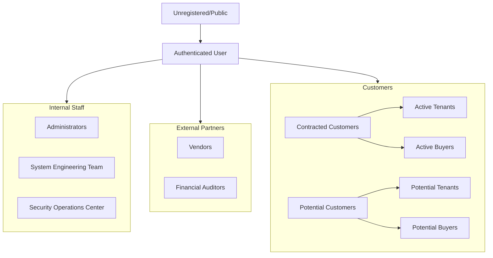

# Permission & Group Architecture (IAM)

**Version:** 1.1  
**Date:** 2026-02-14  
**Author:** System Engineering Team  

## 0. Postgres vs Application Layer & Single Source of Truth (Option A)

本專案採用 **方案 A**：應用層角色以 **IAM 為單一真相來源**，Postgres 角色僅用於系統連線。

### 0.1 Postgres 角色（系統層）

| 說明 | 實作 |
| --- | --- |
| **用途** | 僅決定「誰能連線資料庫」與使用哪個 JWT（`anon` / `authenticated` / `service_role`）。 |
| **業務角色** | **不**為 landlord、tenant、agent、vendor 等建立自訂 Postgres 角色。 |
| **稽核** | `get_postgres_roles_count()` 僅供 Superadmin IAM 稽核報表顯示 Postgres 角色數量，**不參與**任何業務權限判斷。 |

### 0.2 應用層角色（業務層）

| 說明 | 實作 |
| --- | --- |
| **單一來源** | 所有業務角色（含房東、仲介、租客、買方、廠商、稽核等）皆來自 **IAM**：`iam_groups`、`iam_roles`、`get_user_roles(auth.uid())`。 |
| **RLS** | 新 RLS 或新功能一律使用 `get_user_roles(auth.uid())` 或 `has_role(auth.uid(), 'role_name')` 等 helper，不依賴 `users_profile.role` 作為權限判斷。 |
| **users_profile** | `users_profile.role` / `primary_role` 為**衍生欄位**（由 IAM trigger 同步），**僅供前端顯示與既有 RLS 讀取**；應用程式不得直接寫入，改動角色一律透過 IAM（群組/直接角色）。 |

### 0.3 新程式約定（Phase 4.3）

- **新功能、新表、新 RLS**：權限判斷一律使用 `get_user_roles(auth.uid())` 或 `has_role(auth.uid(), 'role_name')`，**不要**再依賴 `users_profile.role` 或 `users_profile.primary_role` 做權限判斷。
- 既有 RLS 仍可讀取 profile.role（已由 trigger 從 IAM 同步），行為與 IAM 一致；後續可選改為直接使用 `has_role()`。

### 0.4 應用層角色清單與資料範圍

以下皆為**應用層角色**，定義於 `iam_roles`，透過 `iam_group_roles` / `iam_group_members` 或 `iam_user_roles` 賦予使用者。

| 角色名稱 | 資料範圍 / 說明 |
| --- | --- |
| `super_admin` | 全系統；User Management、Security Logs、System Config 等。 |
| `system_engineer` | 系統設定可寫；合約/財務 PII 僅讀。 |
| `cybersecurity_engineer` | Security Logs 全權；稽核相關唯讀。 |
| `landlord` | 自有物件與合約（`owner_id`）、仲介授權（`agent_authorizations`）。 |
| `agent` | 經 `agent_authorizations` 授權的房東物件與相關資料。 |
| `tenant` | 僅自己的租約、繳費、維修申請。 |
| `buyer` / `contract_buyer` | 僅自己的買賣合約與相關資料。 |
| `potential_tenant` | 公開物件、預約看房。 |
| `potential_buyer` | 公開物件、預約看房。 |
| `vendor` | 被指派的工單（Work Orders）。 |
| `auditor` | 財務與稽核相關唯讀。 |

> **👉 工程師新增/編輯角色或查詢 iam_roles 表請見**：[ROLES_OPERATIONS_GUIDE.md](./ROLES_OPERATIONS_GUIDE.md)

遷移與實作細節見 [Implementation Plan: IAM as Single Source (Option A)](./iam_single_source_option_a.md)。

---

## 1. Group Hierarchy & De-duplication

We have consolidated the user requirements into a streamlined IAM Group structure.

### 1.1 Hierarchy Diagram



### 1.2 Design rationale (Group-based RBAC)

權限系統採 **Group-based** 設計（靈感來自 AWS IAM）：User → Group(s) → Role(s)，有效權限 = 使用者直接角色 ∪ 所屬群組之角色，由 `get_user_roles(auth.uid())` 與 `has_role()` 在 RLS/應用層計算。優點：可擴展（以群組批量管理）、可審計（可追蹤權限來自哪一群組）、支援一人多群組。

### 1.3 Group Definitions

| Group Name | ID (Key) | Description | Base Role |
| :--- | :--- | :--- | :--- |
| **Administrators** | `super_admin_group` | System Super Admins with full access | `super_admin` |
| **System Engineering Team** | `sys_eng_group` | Infrastructure & backend maintenance | `system_engineer` |
| **Security Operations Center** | `sec_ops_group` | Security audits & compliance monitoring | `cybersecurity_engineer` |
| **Active Tenants** | `contract_tenant` | Tenants with active lease contracts | `tenant` |
| **Active Buyers** | `contract_buyer` | Buyers with active sale contracts | `contract_buyer` |
| **Potential Tenants** | `potential_tenant` | Users interested in renting | `potential_tenant` |
| **Potential Buyers** | `potential_buyer` | Users interested in buying | `potential_buyer` |
| **Vendors** | `vendor_group` | Service providers (cleaning, repair) | `vendor` |
| **Financial Auditors** | `auditor_group` | External financial auditors | `auditor` |
| **Registered Users** | `registered_users` | Signed up but not yet in any business group | `register` |

---

## 2. Permission Matrix

### 2.1 Functional Access Levels

| Feature Module | Admin | Sys Eng | Sec Eng | Landlord | Tenant | Buyer | Vendor | Auditor | Potential |
| :--- | :---: | :---: | :---: | :---: | :---: | :---: | :---: | :---: | :---: |
| **User Management** | Full | Read | Read | - | - | - | - | - | - |
| **System Config** | Full | Full | Read | - | - | - | - | - | - |
| **Security Logs** | Full | Read | Full | - | - | - | - | Read | - |
| **Properties** | Full | Read | Read | Manage | Read | Read | Read | Read | Read (Pub) |
| **Contracts** | Full | Read | Read | Manage | Read (Own) | Read (Own) | - | Read | - |
| **Financials** | Full | - | Read | View | Pay | Pay | Invoice | Read | - |
| **Work Orders** | Full | - | - | Manage | Request | - | Update | Read | - |

### 2.2 Data Access Levels

*   **Public (L1)**: Published properties, About Us, Contact pages. (Role: `anon`)
*   **Internal (L2)**: User dashboard, basic profile. (Role: `authenticated`)
*   **Confidential (L3)**: Contracts, financial transactions, personal PII. (Role: `landlord`, `tenant`, `buyer`, `auditor`)
*   **Restricted (L4)**: System logs, security audits, admin tools. (Role: `super_admin`, `cybersecurity_engineer`)

---

## 3. Technical Implementation

### 3.1 Database Schema
The system uses `public.iam_groups`, `public.iam_roles`, and junction tables for flexibility.

*   `iam_groups`: Stores group definitions.
*   `iam_roles`: Stores granular capabilities.
*   `iam_group_roles`: Maps capabilities to groups.
*   `iam_group_members`: Maps users to groups.

### 3.1.1 Registered Users auto-assignment
When a new row is created in `users_profile`, a trigger (`ensure_registered_users_group_on_profile_insert`) runs and, if the user has no other IAM group membership, adds them to the **Registered Users** group. Existing users with a profile but no group membership are backfilled into Registered Users by migration `20260219120000_auto_assign_registered_users_group.sql`. Logic: `ensure_user_in_registered_users_group(uuid)`.

### 3.2 Role Inheritance
Inheritance is implemented via **additive permissions**. A user belonging to the **Security Operations Center** group automatically inherits:
1.  `cybersecurity_engineer` role (Primary)
2.  `auditor` role (Inherited via `iam_group_roles` mapping)

### 3.3 API Security
*   **RLS (Row Level Security)**: Enforced at the database level. 業務權限判斷以 **IAM 為準**，使用 `get_user_roles(auth.uid())` 或 `has_role(auth.uid(), 'role_name')`，不依賴 `users_profile.role`（見 §0）。
*   **CASL (Ability.ts)**: Enforced at the frontend/UI level for better UX.

---

## 4. Security & Compliance

### 4.1 Principle of Least Privilege (PoLP)
*   **Default Deny**: All RLS policies default to deny unless explicitly allowed.
*   **Separation of Duties**: `system_engineer` can change config but cannot read `contract` PII details unless necessary. `auditor` can read financials but cannot change them.

### 4.2 Audit Logging
All critical actions (Permission changes, Login, Data export) are logged to `audit_logs` table.
*   **Retention**: 1 year.
*   **Access**: Read-only for `auditor` and `cybersecurity_engineer`.

---

## 5. Deployment Guide

### 5.1 Initial Setup
Run the migration script:
```bash
npx supabase migration up
```

### 5.2 Verification
Run the audit query:
```sql
SELECT g.name, r.name 
FROM iam_groups g 
JOIN iam_group_roles gr ON g.id = gr.group_id 
JOIN iam_roles r ON gr.role_id = r.role_id;
```

---

## 6. Document Governance & SSOT

- **Single Source of Truth**: 本目錄 `docs/operational-guides/iam/` 為專案權限邏輯與 IAM 架構之唯一正式來源；勿以程式註解或散落文件為準。
- **授權**: 僅工程與產品安全團隊授權成員可新增/修改權限架構文件；權限矩陣變更須先更新本文件再實作程式。
- **變更管理**: 所有變更須經 peer review；禁止僅改文件不經版控的 hot-fix。
- **機密等級**: 本目錄文件為 **Internal Confidential**，不得提供外部廠商或未授權人員。

**認證流程**（登入、註冊、OAuth、Token 刷新）由 Supabase Auth 實作，詳見 [Supabase Auth 文件](https://supabase.com/docs/guides/auth)。
