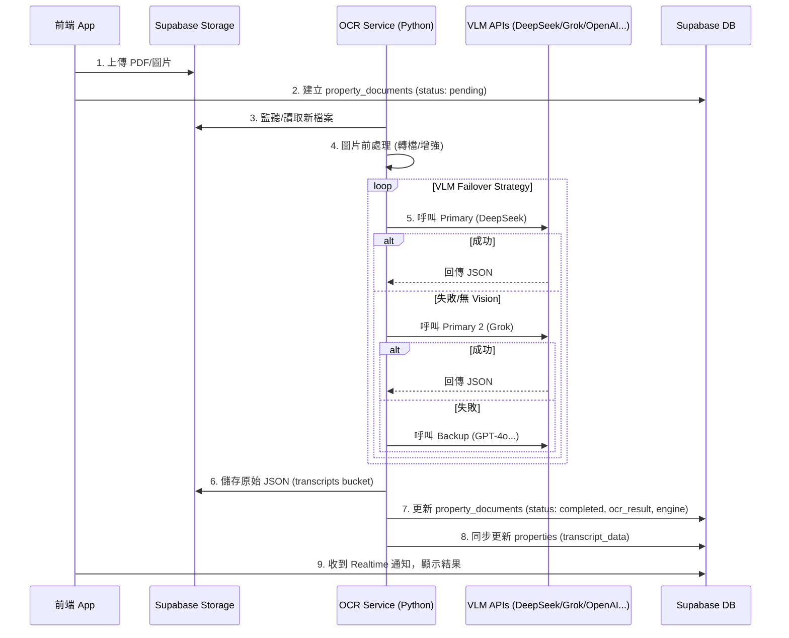

# OCR 資料儲存架構與 VLM 策略說明

> **創建日期**: 2026-01-30  
> **更新日期**: 2026-02-01  
> **狀態**: 已更新 (Cloud VLM Only - DeepSeek/Grok First)  
> **文件類型**: 技術架構文件

---

## 1. 核心策略：Cloud VLM Only (全雲端視覺模型)

為了確保對繁體中文建物所有權狀（包含複雜表格、印章、直排文字）的最佳辨識率，並同時兼顧成本效益與中文語境理解能力，本系統**全面採用 Cloud VLM**，並以中國頂尖模型與 xAI 的 Grok 作為主力。

### 1.1 VLM 模型優先順序 (Failover Strategy)

系統將依序嘗試以下模型，直到成功獲取結構化 JSON 為止：

| 優先序 | 角色 | 模型名稱 | 供應商 | 選擇理由 |
|:---:|:---:|:---|:---|:---|
| **1** | **主力 (Primary)** | **DeepSeek-Chat (V3)** | DeepSeek | 中文理解能力極強，且 API 成本極低，性價比最高的選擇。 |
| **2** | **主力 (Primary)** | **Grok 2 Vision** | xAI | 具備強大的視覺理解能力，作為 DeepSeek 之外的另一主力選擇。 |
| **3** | **強力備援** | **GPT-4o** | OpenAI | 綜合能力最強，當主力模型無法處理時的可靠後盾。 |
| **4** | **備援** | **Claude 3.5 Sonnet** | Anthropic | 視覺識別精準，特別擅長輸出嚴格的 JSON 格式。 |
| **5** | **備援** | **Gemini 1.5 Pro** | Google | Google 生態系整合，支援超長 Context。 |

> **注意**: 若 DeepSeek 暫時不支援圖片輸入 (Vision)，系統會自動 Failover 至 Grok 或 GPT-4o 處理。

### 1.2 System Prompt (角色與輸出規範)

所有 VLM 模型共用以下標準化提示詞，以確保輸出格式一致：

```markdown
# 角色指令
你是一位專業的地政士（土地登記專業代理人），專門解析「建物登記第二類謄本」（建物標示及所有權部）。你的任務是從用戶提供的PDF謄本文字內容中，精準提取結構化資訊，並輸出標準化JSON格式。

# 核心要求
1. **只處理文字內容**：僅使用用戶提供的文字內容，不臆測、不添加未出現的資訊
2. **資料準確性**：
   - 原樣複製文字內容，除非明顯錯字（如「粼」→「鄰」）可註明修正
   - 數字、日期、地址保持原文格式
   - 遇不一致處（如多個執照號碼）全部保留並註記
3. **完整涵蓋**：確保提取謄本中所有欄位資訊，不遺漏任何段落

# 輸出格式規範
輸出 **必須且只能** 為以下JSON結構，包含所有6個主要部分：

```json
{
  "document_info": {
    "document_type": "string (謄本類型)",
    "print_time": "string (列印時間)",
    "document_number": "string (謄本查號)",
    "verification_url": "string (查驗網址)",
    "issuing_office": "string (核發單位)",
    "issuing_officer": "string (主任姓名)",
    "certificate_number": "string (電騰字號)"
  },
  "building_basic_info": {
    "district": "string (行政區)",
    "section": "string (地段/小段)",
    "building_number": "string (建號)",
    "address": "string (門牌地址)",
    "land_lot_number": "string (坐落地號)"
  },
  "building_characteristics": {
    "main_use": "string (主要用途)",
    "main_structure": "string (主要建材)",
    "total_floors": "string (層數)",
    "located_floor": "string (層次)",
    "construction_completion_date": "string (建築完成日期)",
    "accessory_structures": ["string (附屬建物用途清單)"],
    "use_permit_number": ["string (使用執照字號清單)"]
  },
  "shared_areas": {
    "shared_building_number": "string (共有部分建號)",
    "shared_area_sqm": "number (共有部分面積，轉換為數字)"
  },
  "ownership_info": {
    "registration_order": "string (登記次序)",
    "registration_date": "string (登記日期)",
    "cause_date": "string (原因發生日期)",
    "owner": "string (所有權人姓名)",
    "owner_address": "string (所有權人住址)",
    "ownership_share": "string (權利範圍)",
    "ownership_certificate_number": "string (權狀字號)"
  },
  "notes": [
    "string (重要備註事項清單)"
  ]
}
```

# 輸出範例 (Few-shot Example)
以下為一個標準的輸出範例，請嚴格參考此格式：

```json
{
  "document_info": {
    "document_type": "建物登記第二類謄本（建物標示及所有權部）",
    "print_time": "民國102年07月05日10時46分",
    "document_number": "102AF007104REG03135F0D8C4F040059A60088EE802831",
    "verification_url": "http://ttt.land.net.tw",
    "issuing_office": "大安地政事務所",
    "issuing_officer": "主任 高麗香",
    "certificate_number": "大安電腾字第007104號"
  },
  "building_basic_info": {
    "district": "大安區",
    "section": "大安段一小段",
    "building_number": "02069-000建號",
    "address": "敦化南路586號十三樓之1",
    "land_lot_number": "大安段一小段 0020-0000"
  },
  "building_characteristics": {
    "main_use": "住家用",
    "main_structure": "鋼筋混凝土造",
    "total_floors": "018層",
    "located_floor": "十三層",
    "construction_completion_date": "民國076年07月11日",
    "accessory_structures": ["陽台", "花台"],
    "use_permit_number": ["76年使字509號", "76年使509號"]
  },
  "shared_areas": {
    "shared_building_number": "大安段一小段02089-000建號",
    "shared_area_sqm": 2029.25
  },
  "ownership_info": {
    "registration_order": "0001",
    "registration_date": "民國076年09月08日",
    "cause_date": "民國076年07月11日",
    "owner": "詹琬",
    "owner_address": "台北市松山區五全里7粼永吉路316號11楼",
    "ownership_share": "全部 1分之1",
    "ownership_certificate_number": "076北建字第024560號"
  },
  "notes": [
    "本謄本係建物標示及所有權部簡本，详细權利狀態請参閣全部本",
    "本電子謄本查驗期限為三個月"
  ]
}
```
```

---

## 2. 資料儲存位置總覽

OCR (VLM) 解析完成的 JSON 資料會儲存在 **兩個地方**，以確保資料安全性與查詢效能：

### 2.1 Supabase Storage（檔案儲存）📁

**路徑格式**:
```
supabase/storage/transcripts/{property_id}/{document_id}.json
```

**用途**:
- 長期保存完整的原始 JSON 回應 (Raw Response)。
- 提供「下載原始檔」功能。
- 作為資料的最終真實來源 (Source of Truth)。

### 2.2 Supabase Database（資料庫）💾

**表格**: `property_documents`

**欄位**:
- `ocr_result` (JSONB) - 解析後的標準化 Jason JSON 結構。
- `ocr_engine` (TEXT) - 記錄實際使用的模型 (e.g., "deepseek-chat", "grok-2-vision")。
- `ocr_confidence` (FLOAT) - 模型回傳的信心分數 (若有)。
- `json_storage_path` (TEXT) - Storage 中的檔案路徑。

**同時更新**: `properties` 表的 `transcript_data` (JSONB)，以便在物件列表中快速顯示關鍵資訊（如建號、面積）。

---

## 3. 完整資料流程 (Data Flow)



---

## 4. Storage Buckets 設定

需要建立以下 Storage buckets：

### 1. `property_pdfs`
- **用途**: 存放使用者上傳的原始權狀 PDF 或照片。
- **權限**: 僅限該物件的負責仲介 (Agent) 可讀寫。

### 2. `transcripts`
- **用途**: 存放 VLM 解析後的 JSON 檔案。
- **權限**: 
    - `service_role` (Backend): 可讀寫。
    - `authenticated` (Agent): 僅可讀取自己物件的檔案。

---

## 5. 總結

本架構透過 **多層級 VLM 備援機制**，並優先採用 **DeepSeek** 與 **Grok**，在確保辨識品質的同時，提供了更靈活的模型選擇。

1.  **DeepSeek/Grok** 作為主力，結合中文優勢與強大視覺能力。
2.  **GPT-4o/Claude** 作為強大後盾，確保在主力模型遇到困難時仍能產出高品質結果。
3.  資料採用 **Storage (原始檔) + Database (索引查詢)** 雙重儲存，兼顧了資料完整性與查詢效能。
