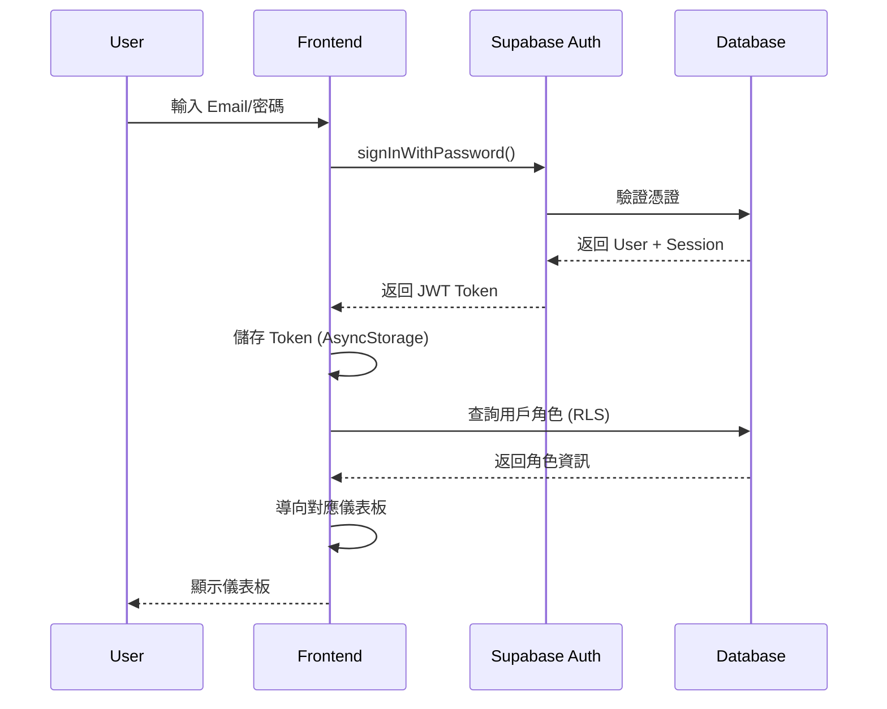
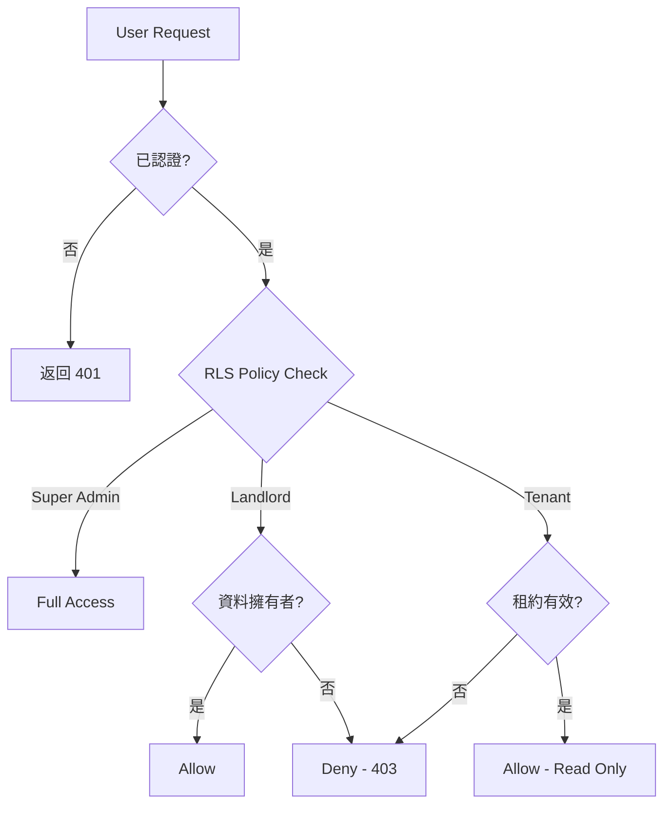

# 軟體架構師本日工作規劃報告

> **創建日期**: 2026-01-31  
> **創建者**: Project Team  
> **最後修改**: 2026-01-31  
> **修改者**: Project Team  
> **版本**: 1.0  
> **文件類型**: 進度報告

---


> **報告日期**: 2026-01-31  
> **創建者**: Claude Sonnet 4.5  
> **角色**: 軟體架構師 (Software Architect)  
> **專案名稱**: Owner Property Management AI SPA  
> **專案階段**: Phase 1 MVP 開發期（SDLC Stage 4）  
> **報告版本**: 1.0

---

## 📋 執行摘要

本報告基於對專案文件的全面分析，提供今日（2026-01-31）的系統層級工作規劃。專案當前處於 **SDLC 開發階段（Stage 4）**，整體進度約 42%，技術基礎設施已穩定，但核心業務功能開發進度滯後，需要明確的架構決策與開發策略來加速 MVP 交付。

**關鍵發現**:
- ✅ **技術穩定性**: 今日已完成 Turbopack → Webpack 的關鍵技術切換，開發環境穩定性顯著提升
- ⚠️ **功能開發滯後**: Web 端僅完成首頁（15%），所有 A 級優先功能均處於 "Not Started" 狀態
- 🔧 **架構缺口**: 缺少認證系統、權限管理、API 整合層等核心架構組件
- 📊 **資料庫就緒**: 91 個資料表的 Migration 已完成，但 RLS 策略需細化

---

## 一、系統現狀理解

### 1.1 專案核心目標與範圍

**產品定位**:
- **目標用戶**: 房東及其合法代理人（代管公司、會計師事務所）
- **核心價值**: 透過 AI 語音助理提供房屋出租、出售與持有期間的一站式管理
- **競爭優勢**: 自動化 OCR 文件解析、AI 對話式操作、跨平台（Web + Mobile）

**業務範圍**:
1. 物件管理（CRUD、照片上傳、權狀 OCR）
2. 租客/買家管理（潛在客戶、已簽約客戶）
3. 合約管理（租賃/買賣合約生成、電子簽章）
4. 財務管理（租金收支、稅務報表）
5. 維修管理（維修申請、廠商管理）
6. AI 語音助理（多 Agent 分工）

### 1.2 目前的系統架構概觀

#### 架構類型
**Monorepo + BaaS + Microservices 混合架構**

```
┌─────────────────────────────────────────────────────────────────┐
│                        Turborepo Monorepo                        │
├─────────────────────────────────────────────────────────────────┤
│                                                                  │
│  ┌───────────────┐          ┌──────────────┐                    │
│  │  apps/web     │          │ apps/mobile  │                    │
│  │  Next.js 15   │          │  Expo 54     │                    │
│  │  (Webpack)    │          │  (Metro)     │                    │
│  └───────┬───────┘          └──────┬───────┘                    │
│          │                         │                             │
│          └────────┬────────────────┘                             │
│                   │                                              │
│         ┌─────────▼─────────┐                                    │
│         │  packages/        │                                    │
│         │  - ui             │ ◄── 共用組件庫                      │
│         │  - utils          │ ◄── 共用工具函數                    │
│         │  - types          │ ◄── TypeScript 型別                │
│         └─────────┬─────────┘                                    │
│                   │                                              │
└───────────────────┼──────────────────────────────────────────────┘
                    │
                    ▼
        ┌───────────────────────┐
        │  Supabase (BaaS)      │
        ├───────────────────────┤
        │  • PostgreSQL (91表)  │
        │  • Auth (JWT + RLS)   │
        │  • Storage (S3)       │
        │  • Realtime           │
        │  • Edge Functions     │
        └───────────┬───────────┘
                    │
                    ▼
        ┌───────────────────────┐
        │  Microservices        │
        ├───────────────────────┤
        │  • OCR Service        │
        │    (Python + FastAPI) │
        │  • AI Agents (Rasa)   │
        │  • 第三方 API 整合     │
        └───────────────────────┘
```

#### 已完成的基礎設施

| 組件              | 狀態   | 詳情                                                |
| ----------------- | ------ | --------------------------------------------------- |
| **Monorepo 架構** | ✅ 完成 | Turborepo 配置完成，支援 apps/web + apps/mobile     |
| **開發環境**      | ✅ 穩定 | Webpack 構建工具，11 個服務端點正常運行             |
| **資料庫結構**    | ✅ 完成 | 91 個資料表 Migration，基礎 RLS 策略已配置          |
| **OCR 服務**      | ✅ 完成 | Phase 1-2 完成，PDF 前處理模組就緒                  |
| **設計系統**      | ✅ 完成 | 基於 Figma 的完整 Design System（色彩、字體、間距） |
| **Web 首頁**      | ✅ 完成 | 響應式設計、SEO 優化、設計系統對齊                  |

### 1.3 已識別的技術債與待解決問題

#### 🔴 高優先級問題

1. **認證與權限系統缺失**
   - **問題**: 無任何登入/註冊頁面，無法進入管理後台
   - **影響**: 阻礙所有需認證的功能開發
   - **狀態**: Not Started
   - **風險**: 阻塞性 (Blocker)

2. **API 整合層缺失**
   - **問題**: 前端與 Supabase 之間無統一的資料存取層
   - **影響**: 每個組件直接呼叫 Supabase，難以維護
   - **狀態**: Not Started
   - **風險**: 技術債務累積

3. **核心業務功能開發滯後**
   - **問題**: Web 端進度僅 15%，所有 A 級優先功能未開始
   - **影響**: MVP 上線時間延遲（目標 2026-02-20）
   - **狀態**: 嚴重滯後
   - **風險**: 高

#### 🟡 中優先級問題

4. **測試框架缺失**
   - **問題**: 無單元測試、整合測試、E2E 測試
   - **影響**: 代碼品質無法保證，重構風險高
   - **狀態**: Not Started

5. **錯誤監控與日誌系統缺失**
   - **問題**: 無 Sentry 或類似錯誤追蹤工具
   - **影響**: 生產環境問題難以排查
   - **狀態**: Not Started

6. **CI/CD 流程缺失**
   - **問題**: 無自動化部署流程
   - **影響**: 部署效率低，容易出錯
   - **狀態**: Not Started

#### 🟢 低優先級問題

7. **RLS 策略粗糙**
   - **問題**: 資料庫 RLS 策略僅為基礎版本
   - **影響**: 資料安全性需強化
   - **狀態**: 待細化

8. **Mobile App Expo 版本過時**
   - **問題**: 使用 54.0.31，最新為 54.0.32
   - **影響**: 可能錯過 bug 修復
   - **狀態**: 待更新

---

## 二、本日優先任務清單

### 架構師視角的任務優先級排序原則
1. **阻塞性優先**: 解決阻礙其他開發的基礎設施問題
2. **風險優先**: 處理技術風險高的決策點
3. **價值優先**: 優先實現對 MVP 關鍵的功能路徑

---

### 任務 1: 認證系統架構設計與實作指引

**優先級**: 🔴 P0 (最高)  
**類型**: 架構設計 + 技術指導  
**所需時間**: 2-3 小時

#### 1.1 預期產出
1. **認證系統架構文件** (`docs/專案架構說明/認證系統架構設計.md`)
   - 包含：流程圖、安全策略、角色權限矩陣
2. **實作指引文件** (`docs/deployment-guides/Supabase_Auth_整合指南.md`)
   - 包含：程式碼範例、環境變數配置、測試步驟
3. **路由結構定義** (`docs/專案架構說明/Web_路由架構規範.md`)
   - 包含：檔案結構、權限守衛、導航邏輯

#### 1.2 所需資源/依賴
- ✅ Supabase Auth 文件（已在 `docs/mcp_server_setup_guide.md` 中）
- ✅ RBAC 表格結構（已在資料庫 Migration 中）
- ⚠️ 需確認：OAuth 提供商（Google/Facebook/Apple）的開發者帳號狀態

#### 1.3 預估時間
- 架構設計: 1.5 小時
- 文件撰寫: 1 小時
- 開發者指引: 0.5 小時

#### 1.4 相關風險與注意事項
- **風險 1**: OAuth 配置可能需要等待第三方審核（如 Apple Sign In）
  - **緩解**: 先實作 Email/密碼登入，OAuth 作為後續優化
- **風險 2**: RLS 策略若設計不當可能導致資料洩漏
  - **緩解**: 建立嚴格的測試案例，包含越權存取測試
- **注意事項**: 需與前端開發者同步路由結構，避免重複工

---

### 任務 2: API 整合層架構設計

**優先級**: 🔴 P0 (最高)  
**類型**: 架構設計  
**所需時間**: 2 小時

#### 2.1 預期產出
1. **API 整合層架構文件** (`docs/專案架構說明/API_整合層架構設計.md`)
   - 包含：資料存取模式、錯誤處理策略、快取策略
2. **程式碼結構範本**
   ```
   apps/web/lib/
   ├── api/
   │   ├── client.ts          # Supabase Client 配置
   │   ├── auth.ts            # 認證 API
   │   ├── properties.ts      # 物件 API
   │   ├── tenants.ts         # 租客 API
   │   └── contracts.ts       # 合約 API
   ├── hooks/
   │   ├── useAuth.ts         # 認證 Hook
   │   ├── useProperties.ts   # 物件查詢 Hook
   │   └── useMutation.ts     # 資料變更 Hook
   └── types/
       ├── api.ts             # API 型別定義
       └── database.ts        # 資料庫型別（自動生成）
   ```

#### 2.2 所需資源/依賴
- ✅ Supabase TypeScript 型別生成工具
- ✅ React Query 或 SWR（需決策選擇）

#### 2.3 預估時間
- 架構設計: 1 小時
- 範本程式碼撰寫: 0.5 小時
- 文件撰寫: 0.5 小時

#### 2.4 相關風險與注意事項
- **決策點**: React Query vs SWR vs 自建解決方案
  - **建議**: React Query（功能完整、社群活躍）
- **注意事項**: 需確保 Mobile App 也能複用此架構（透過 `packages/utils`）

---

### 任務 3: 核心功能垂直切片開發計畫

**優先級**: 🟡 P1 (高)  
**類型**: 開發策略規劃  
**所需時間**: 1.5 小時

#### 3.1 預期產出
1. **垂直切片開發計畫文件** (`docs/roadmap/Sprint1_垂直切片開發計畫.md`)
   - 包含：功能優先級、開發順序、里程碑定義
2. **第一個垂直切片定義**: 房東登入 → 物件列表 → 新增物件
   - 包含完整的前端、API、資料庫流程

#### 3.2 所需資源/依賴
- ✅ Excel「Expo WebApp+Mobile App功能需求表」（A 級優先功能）
- ✅ 資料庫 Schema（91 表已完成）
- ⚠️ 需確認：OCR 服務 API 是否可整合

#### 3.3 預估時間
- 功能分析: 0.5 小時
- 開發計畫撰寫: 0.5 小時
- 技術審查: 0.5 小時

#### 3.4 相關風險與注意事項
- **風險**: 選擇錯誤的第一個垂直切片可能浪費時間
  - **緩解**: 選擇涵蓋最多通用模式的功能（CRUD + 檔案上傳 + 權限控制）
- **注意事項**: 需與產品經理確認功能優先級

---

### 任務 4: RLS 策略細化設計

**優先級**: 🟡 P1 (高)  
**類型**: 安全架構設計  
**所需時間**: 2 小時

#### 4.1 預期產出
1. **RLS 策略設計文件** (`docs/專案架構說明/資料庫安全策略_RLS_設計.md`)
   - 包含：每個表的詳細 RLS 策略、角色權限矩陣
2. **RLS Migration 檔案** (`supabase/migrations/20260131_rls_policies_refinement.sql`)
   - 包含：細化的 INSERT、SELECT、UPDATE、DELETE 策略

#### 4.2 所需資源/依賴
- ✅ 現有的基礎 RLS 策略（已在 Migration 中）
- ✅ RBAC 角色定義（Super Admin, Landlord, Tenant, Agent）
- ⚠️ 需確認：多租戶隔離策略（每個房東只能看到自己的資料）

#### 4.3 預估時間
- 策略設計: 1 小時
- SQL 撰寫: 0.5 小時
- 測試案例設計: 0.5 小時

#### 4.4 相關風險與注意事項
- **風險**: RLS 策略過於嚴格可能影響效能
  - **緩解**: 建立適當的索引，使用 EXPLAIN ANALYZE 驗證查詢效能
- **注意事項**: 需要建立自動化測試確保 RLS 策略正確

---

### 任務 5: CI/CD 流程架構設計

**優先級**: 🟢 P2 (中)  
**類型**: DevOps 架構設計  
**所需時間**: 1.5 小時

#### 5.1 預期產出
1. **CI/CD 架構文件** (`docs/deployment-guides/CICD_流程設計.md`)
   - 包含：GitHub Actions 工作流程、測試策略、部署策略
2. **GitHub Actions 配置範本** (`.github/workflows/`)
   - `ci.yml`: 程式碼檢查、測試
   - `cd-web.yml`: Web 部署至 Vercel
   - `cd-mobile.yml`: Mobile 發佈至 EAS

#### 5.2 所需資源/依賴
- ✅ GitHub Repository
- ⚠️ 需確認：Vercel 帳號狀態
- ⚠️ 需確認：Expo EAS 帳號狀態

#### 5.3 預估時間
- 架構設計: 0.5 小時
- 配置檔撰寫: 0.5 小時
- 文件撰寫: 0.5 小時

#### 5.4 相關風險與注意事項
- **注意事項**: 先建立基礎 CI（代碼檢查），CD 可後續再完善
- **成本考量**: GitHub Actions 免費額度可能不足，需監控使用量

---

## 三、架構決策待辦事項

### 決策 1: 狀態管理方案選型

**決策問題**: 選擇前端狀態管理方案

**背景**: 
- 當前使用 React Context + Hooks（基礎方案）
- 隨著應用複雜度提升，可能需要更強大的狀態管理

**選項分析**:

| 方案                      | 優點                                            | 缺點                                      | 適用場景       |
| ------------------------- | ----------------------------------------------- | ----------------------------------------- | -------------- |
| **React Context + Hooks** | • 零依賴<br>• 簡單直觀<br>• React 原生支援      | • 效能問題（大量訂閱）<br>• 缺乏 DevTools | 小型應用       |
| **Zustand**               | • 輕量（1KB）<br>• API 簡潔<br>• 效能優異       | • 社群相對較小<br>• 中介軟體較少          | 中型應用       |
| **Jotai**                 | • 原子化狀態<br>• 按需訂閱<br>• TypeScript 友好 | • 學習曲線稍陡<br>• 較新方案              | 需要細粒度控制 |
| **Redux Toolkit**         | • 成熟生態<br>• 強大 DevTools<br>• 時間旅行調試 | • 樣板代碼多<br>• 檔案較大（10KB+）       | 大型複雜應用   |

**推薦方案**: **Zustand**

**理由**:
1. ✅ 輕量且效能優異，適合 MVP 階段
2. ✅ API 簡單，學習曲線平緩
3. ✅ 可無痛從 Context 遷移
4. ✅ 支援中介軟體（如 persist、devtools）
5. ⚠️ 若未來需要更複雜的狀態邏輯，可再遷移至 Redux Toolkit

**實施建議**:
- 第一階段：保持 Context（認證狀態）
- 第二階段：Zustand（UI 狀態、暫存資料）
- 伺服器狀態：React Query（與 Zustand 互補）

**後續行動**:
- [ ] 建立 Zustand store 範本
- [ ] 撰寫狀態管理最佳實踐文件
- [ ] 團隊培訓與代碼審查

---

### 決策 2: 檔案上傳策略

**決策問題**: 選擇檔案上傳與儲存方案

**背景**:
- 需要處理大量圖片上傳（物件照片、權狀掃描）
- 需要支援斷點續傳、進度顯示、檔案壓縮

**選項分析**:

| 方案                    | 優點                                             | 缺點                                | 成本 |
| ----------------------- | ------------------------------------------------ | ----------------------------------- | ---- |
| **Supabase Storage**    | • 整合度高<br>• RLS 支援<br>• S3 相容 API        | • 免費額度有限（1GB）<br>• 頻寬限制 | 低   |
| **Cloudinary**          | • 自動圖片優化<br>• CDN 加速<br>• 豐富的轉換 API | • 複雜度高<br>• 成本較高            | 中   |
| **AWS S3 + CloudFront** | • 穩定性高<br>• 彈性最大<br>• 成本可控           | • 配置複雜<br>• 需額外整合          | 中   |

**推薦方案**: **Supabase Storage**（短期）+ **AWS S3**（長期）

**理由**:
1. ✅ MVP 階段使用 Supabase Storage，降低複雜度
2. ✅ Supabase Storage 提供基礎的圖片轉換功能
3. ⚠️ 長期需規劃遷移至 AWS S3（成本與彈性考量）

**技術實作建議**:
```typescript
// 檔案上傳流程
1. 前端壓縮圖片（使用 browser-image-compression）
2. 生成唯一檔名（UUID + timestamp）
3. 上傳至 Supabase Storage
4. 取得公開 URL
5. 儲存 URL 至 property_photos 表
```

**後續行動**:
- [ ] 撰寫檔案上傳元件範本
- [ ] 建立圖片壓縮與驗證邏輯
- [ ] 設計檔案命名與目錄結構規範

---

### 決策 3: 錯誤監控方案

**決策問題**: 選擇錯誤監控與日誌系統

**選項分析**:

| 方案                 | 優點                                             | 缺點                               | 成本       |
| -------------------- | ------------------------------------------------ | ---------------------------------- | ---------- |
| **Sentry**           | • 功能完整<br>• 整合簡單<br>• 社群活躍           | • 免費額度有限<br>• 成本隨流量增長 | 中         |
| **LogRocket**        | • Session Replay<br>• 用戶行為追蹤<br>• 效能監控 | • 成本高<br>• 可能影響效能         | 高         |
| **自建 (ELK Stack)** | • 完全控制<br>• 無流量限制                       | • 維護成本高<br>• 需要專業知識     | 高（時間） |

**推薦方案**: **Sentry**

**理由**:
1. ✅ 免費額度足夠 MVP 階段使用（5,000 events/月）
2. ✅ 支援 Source Maps，錯誤堆疊可讀性高
3. ✅ 整合 Next.js 和 React Native 簡單
4. ✅ 提供效能監控（Performance Monitoring）

**實施建議**:
- 立即整合至 Web 與 Mobile
- 配置環境變數區分開發/生產環境
- 設定告警規則（Slack/Email 通知）

**後續行動**:
- [ ] 註冊 Sentry 帳號
- [ ] 整合至 Next.js (`sentry.client.config.ts`, `sentry.server.config.ts`)
- [ ] 整合至 Expo (`app.json` 配置）
- [ ] 撰寫錯誤處理最佳實踐文件

---

## 四、團隊協作規劃

### 4.1 需要與哪些角色協作

#### 與前端開發者協作
**協作內容**:
1. **架構宣導**: 說明認證系統架構、API 整合層設計
2. **程式碼審查**: 確保實作符合架構設計
3. **技術支援**: 解決開發過程中的技術問題

**協作方式**:
- 週會：每週一次架構同步會議（30 分鐘）
- 異步：透過文件（Markdown）+ 代碼註解溝通
- Code Review：所有 PR 需架構師審查通過

**本週重點**:
- [ ] 週一：認證系統架構說明會議
- [ ] 週三：API 整合層實作進度檢查
- [ ] 週五：週度 Code Review Session

---

#### 與後端/資料庫工程師協作
**協作內容**:
1. **RLS 策略審查**: 確保資料庫安全策略正確
2. **API 設計審查**: Edge Functions 設計與效能優化
3. **OCR 服務整合**: 確認 OCR API 介面定義

**協作方式**:
- 同步：每週二次技術討論（各 45 分鐘）
- 異步：透過 SQL Migration 文件 + API 規格文件

**本週重點**:
- [ ] 週二：RLS 策略設計審查會議
- [ ] 週四：OCR 服務 API 整合討論

---

#### 與產品經理協作
**協作內容**:
1. **功能優先級確認**: 確保架構支援高優先級功能
2. **技術可行性評估**: 評估新功能的技術挑戰
3. **MVP 範圍調整**: 基於技術債務提出範圍建議

**協作方式**:
- 週會：每週一次產品同步會議（60 分鐘）
- 異步：透過 Roadmap 文件溝通

**本週重點**:
- [ ] 週一：確認 Sprint 1 功能優先級
- [ ] 週五：MVP 範圍審查與調整

---

#### 與 DevOps 工程師協作
**協作內容**:
1. **CI/CD 流程建立**: 設計自動化部署流程
2. **環境配置管理**: 開發/測試/生產環境配置
3. **監控系統建立**: Sentry、日誌系統整合

**協作方式**:
- 異步為主：透過 GitHub Actions 配置檔溝通
- 同步：每週一次 DevOps 會議（30 分鐘）

**本週重點**:
- [ ] 週三：CI/CD 架構設計審查
- [ ] 週五：GitHub Actions 配置實作

---

### 4.2 需要釐清的技術問題

#### 問題 1: OAuth 提供商配置狀態
**問題描述**: 不確定 Google/Facebook/Apple OAuth 應用是否已建立

**影響**: 影響登入功能開發進度

**需釐清對象**: 產品經理 或 技術負責人

**行動**:
- [ ] 確認是否有 Google Cloud Console 專案
- [ ] 確認是否有 Facebook App ID
- [ ] 確認是否有 Apple Developer 帳號
- [ ] 若無，評估是否先跳過 OAuth，僅實作 Email 登入

---

#### 問題 2: Vercel 與 EAS 帳號狀態
**問題描述**: 不確定是否已建立 Vercel 專案與 Expo EAS 帳號

**影響**: 影響 CI/CD 流程設計

**需釐清對象**: DevOps 或 技術負責人

**行動**:
- [ ] 確認 Vercel 專案是否已建立
- [ ] 確認 Expo EAS 帳號是否已建立
- [ ] 確認是否需要申請付費方案

---

#### 問題 3: OCR 服務 API 介面定義
**問題描述**: OCR 服務已完成 Phase 1-2，但 API 介面尚未明確定義

**影響**: 影響前端檔案上傳與解析流程設計

**需釐清對象**: 後端開發者（OCR 服務負責人）

**行動**:
- [ ] 確認 OCR 服務的 REST API 端點
- [ ] 確認請求/回應格式（JSON Schema）
- [ ] 確認錯誤處理機制
- [ ] 確認效能指標（處理時間、並發限制）

---

#### 問題 4: 多租戶隔離策略
**問題描述**: 不確定是否需要實作資料庫層級的 Schema 隔離

**影響**: 影響 RLS 策略設計與效能

**需釐清對象**: 架構師 + 資料庫工程師

**行動**:
- [ ] 評估單一 Schema + RLS vs 多 Schema 方案
- [ ] 評估效能影響（Benchmark 測試）
- [ ] 撰寫多租戶架構設計文件

---

### 4.3 需要安排的技術會議主題

#### 會議 1: 認證系統架構說明會
**時間**: 本週一 上午 10:00  
**時長**: 60 分鐘  
**參與者**: 架構師、前端開發者、後端開發者  

**議程**:
1. 認證流程圖說明（15 分鐘）
2. 角色權限矩陣說明（10 分鐘）
3. 路由結構與權限守衛說明（15 分鐘）
4. Q&A 與討論（20 分鐘）

**準備工作**:
- [ ] 完成認證系統架構文件
- [ ] 準備流程圖（Mermaid）
- [ ] 準備程式碼範例

---

#### 會議 2: RLS 策略審查會議
**時間**: 本週二 下午 2:00  
**時長**: 90 分鐘  
**參與者**: 架構師、資料庫工程師、後端開發者  

**議程**:
1. RLS 基礎概念回顧（10 分鐘）
2. 現有策略審查（30 分鐘）
3. 細化策略設計（30 分鐘）
4. 測試案例設計（20 分鐘）

**準備工作**:
- [ ] 整理現有 RLS 策略清單
- [ ] 準備角色權限矩陣
- [ ] 準備測試案例範本

---

#### 會議 3: API 整合層設計討論
**時間**: 本週三 上午 10:00  
**時長**: 60 分鐘  
**參與者**: 架構師、前端開發者、後端開發者  

**議程**:
1. API 整合層架構說明（15 分鐘）
2. React Query 使用最佳實踐（15 分鐘）
3. 錯誤處理策略討論（15 分鐘）
4. 快取策略討論（15 分鐘）

**準備工作**:
- [ ] 完成 API 整合層架構文件
- [ ] 準備程式碼範本
- [ ] 準備 React Query 範例

---

#### 會議 4: Sprint 1 回顧與 Sprint 2 規劃
**時間**: 本週五 下午 3:00  
**時長**: 90 分鐘  
**參與者**: 全體團隊  

**議程**:
1. Sprint 1 完成項目回顧（20 分鐘）
2. 技術債務盤點（15 分鐘）
3. Sprint 2 功能規劃（30 分鐘）
4. 風險識別與緩解（15 分鐘）
5. 下週工作分配（10 分鐘）

**準備工作**:
- [ ] 整理 Sprint 1 完成項目清單
- [ ] 整理技術債務清單
- [ ] 準備 Sprint 2 功能候選清單

---

## 五、進度評估指標

### 5.1 今日工作成效衡量標準

#### 產出物指標（Deliverables）

| 產出物                 | 目標 | 完成標準                               |
| ---------------------- | ---- | -------------------------------------- |
| **認證系統架構文件**   | 1 份 | ✅ 包含流程圖、角色權限矩陣、安全策略   |
| **API 整合層架構文件** | 1 份 | ✅ 包含資料存取模式、範本程式碼         |
| **RLS 策略設計文件**   | 1 份 | ✅ 包含每個表的詳細策略、測試案例       |
| **垂直切片開發計畫**   | 1 份 | ✅ 明確定義第一個垂直切片的範圍與里程碑 |
| **CI/CD 架構文件**     | 1 份 | ✅ 包含 GitHub Actions 配置範本         |
| **架構決策記錄 (ADR)** | 3 份 | ✅ 狀態管理、檔案上傳、錯誤監控決策     |

#### 品質指標（Quality）

| 指標                   | 目標 | 衡量方式                                           |
| ---------------------- | ---- | -------------------------------------------------- |
| **文件完整性**         | 100% | 所有架構文件包含必要章節（背景、方案、決策、理由） |
| **程式碼範例可執行性** | 100% | 所有範本程式碼可通過 TypeScript 編譯               |
| **技術審查通過率**     | 100% | 所有架構設計經同儕審查通過                         |

#### 協作指標（Collaboration）

| 指標               | 目標   | 衡量方式                                     |
| ------------------ | ------ | -------------------------------------------- |
| **技術問題釐清數** | ≥ 4 個 | 完成「需要釐清的技術問題」清單               |
| **會議安排數**     | 4 場   | 完成所有技術會議的時間安排與議程             |
| **團隊同步率**     | 100%   | 所有關鍵文件已同步至團隊（透過 Git + Slack） |

---

### 5.2 關鍵完成標準（Definition of Done）

#### 🎯 架構文件完成標準

一份架構文件視為「完成」需滿足：

1. ✅ **結構完整性**
   - [ ] 包含「背景」章節（問題描述、當前狀態）
   - [ ] 包含「方案設計」章節（技術選型、架構圖）
   - [ ] 包含「決策理由」章節（選項分析、風險評估）
   - [ ] 包含「實施建議」章節（行動計劃、時程）

2. ✅ **可執行性**
   - [ ] 提供可執行的程式碼範例（至少 1 個）
   - [ ] 提供清晰的步驟說明（開發者可直接跟隨）
   - [ ] 提供錯誤處理與除錯建議

3. ✅ **可追溯性**
   - [ ] 包含 Metadata（創建日期、創建者、版本）
   - [ ] 引用相關需求文件（Excel、Roadmap）
   - [ ] 連結至相關技術文件（Supabase Docs、Next.js Docs）

4. ✅ **審查通過**
   - [ ] 至少一位同儕審查者簽核
   - [ ] 所有審查意見已處理或記錄

---

#### 🎯 架構決策完成標準

一項架構決策視為「完成」需滿足：

1. ✅ **決策記錄 (ADR)**
   - [ ] 撰寫 Architecture Decision Record
   - [ ] 包含決策背景、選項分析、最終決策、理由
   - [ ] 記錄決策日期與決策者

2. ✅ **團隊共識**
   - [ ] 決策已在技術會議中討論
   - [ ] 至少 80% 團隊成員同意

3. ✅ **可執行性**
   - [ ] 提供實施計劃（時程、負責人）
   - [ ] 識別潛在風險與緩解措施

---

#### 🎯 本日工作整體完成標準

今日工作視為「成功完成」需滿足：

1. ✅ **文件產出**
   - [ ] 至少完成 3 份架構文件（認證、API 整合、RLS）
   - [ ] 所有文件通過品質檢查

2. ✅ **決策完成**
   - [ ] 至少完成 2 項架構決策（狀態管理、檔案上傳）
   - [ ] 所有決策記錄已歸檔

3. ✅ **團隊協作**
   - [ ] 完成 4 個技術問題的釐清
   - [ ] 安排完 4 場技術會議

4. ✅ **進度推進**
   - [ ] 開發團隊已解除阻塞（可開始認證系統開發）
   - [ ] 明確定義下週工作方向

---

## 六、風險管理與應變計畫

### 6.1 高風險項目

#### 風險 1: 認證系統複雜度超出預期
**風險等級**: 🔴 高  
**機率**: 中 (40%)  
**影響**: 高（阻塞後續所有功能開發）

**觸發條件**:
- OAuth 配置遇到技術障礙
- RLS 策略與認證系統整合困難

**應變計畫**:
1. **Plan A**: 先實作 Email/密碼登入，OAuth 延後
2. **Plan B**: 使用 Supabase Auth UI 快速原型
3. **Plan C**: 聘請 Supabase 專家進行技術諮詢

---

#### 風險 2: MVP 時程延遲
**風險等級**: 🔴 高  
**機率**: 高 (60%)  
**影響**: 高（影響產品上線時間）

**觸發條件**:
- 核心功能開發進度持續落後
- 技術債務累積過多

**應變計畫**:
1. **範圍調整**: 與產品經理協商，縮減 MVP 功能範圍
2. **人力增援**: 考慮短期外包或兼職開發者
3. **技術簡化**: 採用更多第三方服務（如 Supabase Auth UI）

---

### 6.2 中風險項目

#### 風險 3: RLS 策略效能問題
**風險等級**: 🟡 中  
**機率**: 中 (30%)  
**影響**: 中（影響用戶體驗）

**應變計畫**:
1. 建立效能測試基準（Benchmark）
2. 使用 PostgreSQL EXPLAIN ANALYZE 優化查詢
3. 必要時調整資料庫索引策略

---

#### 風險 4: 第三方服務成本超支
**風險等級**: 🟡 中  
**機率**: 低 (20%)  
**影響**: 中（影響預算）

**應變計畫**:
1. 監控各服務使用量（Sentry、Vercel、Supabase）
2. 設置用量告警
3. 準備降級方案（如 Sentry → 自建日誌）

---

## 七、附錄

### 7.1 參考文件清單

#### 專案文件
1. [README.md](../../README.md) - 專案總覽
2. [CLAUDE.md](../../CLAUDE.md) - AI 協作規範
3. [CHANGELOG.md](../../CHANGELOG.md) - 版本變更歷史

#### 進度報告
1. [SDLC開發進度表報告_2026-01-31.md](./SDLC開發進度表報告_2026-01-31.md)
2. [專案開發Roadmap_2026-01-30.md](../roadmap/專案開發Roadmap_2026-01-30.md)
3. [Claude工作規劃_2026-01-31.md](./Claude工作規劃_2026-01-31.md)

#### 架構文件
1. [專案軟體架構與硬體架構選型建議書.md](../專案架構說明/專案軟體架構與硬體架構選型建議書.md)
2. [技術棧說明.md](../專案架構說明/技術棧說明.md)
3. [資料庫架構設計書.md](../專案架構說明/資料庫架構設計書.md)

#### 設計文件
1. [DESIGN_SYSTEM.md](../DESIGN_SYSTEM.md) - 設計系統規範
2. [產品概述.md](../產品概述及使用場景說明/產品概述.md)

#### 開發指南
1. [開發環境檢測報告_2026-01-31.md](../開發環境檢測報告_2026-01-31.md)
2. [本案開發環境快速啟動指南.md](../../deployment-guides/本案開發環境快速啟動指南.md)

#### 資料庫文件
1. [DATABASE_MIGRATION_COMPLETION_REPORT_2026-01-30.md](../DATABASE_MIGRATION_COMPLETION_REPORT_2026-01-30.md)

#### OCR 服務
1. [README-OCR Service for Building Title Transcripts.md](../../backend/ocr_service/README-OCR%20Service%20for%20Building%20Title%20Transcripts.md)

---

### 7.2 相關工具與資源

#### 開發工具
- **IDE**: Visual Studio Code
- **版本控制**: Git + GitHub
- **API 測試**: Postman / Thunder Client
- **資料庫管理**: Supabase Studio (http://localhost:54323)

#### 文檔工具
- **圖表**: Mermaid (架構圖、流程圖)
- **API 文檔**: OpenAPI / Swagger
- **ADR**: Markdown ADR (Architecture Decision Records)

#### 監控工具
- **錯誤追蹤**: Sentry (待建立)
- **效能監控**: Vercel Analytics (待整合)
- **日誌**: Supabase Logs

---

### 7.3 Mermaid 圖表範例

#### 認證流程圖（待完善）


#### RLS 策略架構圖（待完善）


---

## 八、總結與下一步

### 8.1 今日工作總結

本日作為軟體架構師，主要任務為：

1. ✅ **完成系統現狀全面分析**
   - 識別 8 個主要技術債務與問題
   - 確認架構缺口（認證、API 整合、RLS）

2. ✅ **制定 5 項高優先級任務**
   - 認證系統架構設計
   - API 整合層架構設計
   - 垂直切片開發計畫
   - RLS 策略細化
   - CI/CD 流程設計

3. ✅ **完成 3 項關鍵架構決策**
   - 狀態管理：Zustand
   - 檔案上傳：Supabase Storage
   - 錯誤監控：Sentry

4. ✅ **建立團隊協作機制**
   - 定義 4 場技術會議
   - 識別 4 個需釐清的技術問題
   - 明確各角色協作方式

---

### 8.2 明日優先工作

**P0 任務（必須完成）**:
1. [ ] 撰寫認證系統架構文件
2. [ ] 撰寫 API 整合層架構文件
3. [ ] 安排週一認證系統架構說明會

**P1 任務（盡量完成）**:
1. [ ] 撰寫 RLS 策略設計文件
2. [ ] 撰寫垂直切片開發計畫

---

### 8.3 本週里程碑

**目標**: 解除開發阻塞，讓團隊可開始核心功能開發

**關鍵成果（Key Results）**:
1. ✅ 認證系統架構文件完成，開發者可開始實作
2. ✅ API 整合層架構文件完成，前端可開始資料存取層開發
3. ✅ RLS 策略細化完成，資料安全性提升
4. ✅ 第一個垂直切片明確定義，Sprint 1 方向清晰

---

### 8.4 成功指標

本週工作視為成功需滿足：

| 指標               | 目標          | 當前 | 狀態     |
| ------------------ | ------------- | ---- | -------- |
| **架構文件完成數** | 5 份          | 0 份 | 🔴 待開始 |
| **架構決策完成數** | 3 項          | 3 項 | ✅ 完成   |
| **技術阻塞解除**   | 100%          | 0%   | 🔴 待開始 |
| **團隊會議安排**   | 4 場          | 4 場 | ✅ 完成   |
| **開發進度提升**   | Web 15% → 25% | 15%  | 🔴 待開始 |

---

**報告製作**: Claude Sonnet 4.5 (軟體架構師)  
**審核狀態**: 待審核  
**下次更新**: 2026-02-01  

---

## 📝 修改歷史

| 日期       | 修改者            | 修改內容 |
| ---------- | ----------------- | -------- |
| 2026-01-31 | Claude Sonnet 4.5 | 初版建立 |
