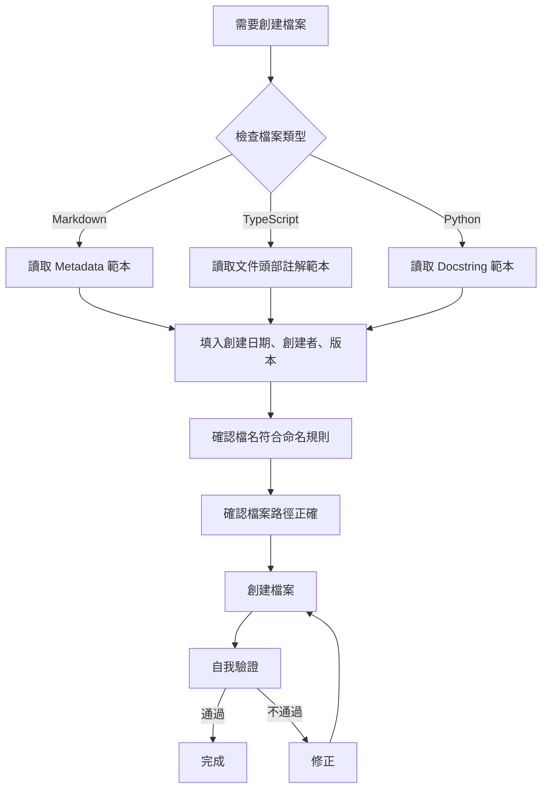

# 文件規範遵循改善報告

> **創建日期**: 2026-01-31  
> **創建者**: Claude Sonnet 4.5  
> **最後修改**: 2026-01-31  
> **修改者**: Claude Sonnet 4.5  
> **版本**: 1.0  
> **文件類型**: 進度報告

---

## 📋 問題確認

### 用戶反饋
> "為啥你創建新檔或修改檔時沒有按照這個檔案？是我的claude.md設定有問題嗎？還是你沒讀到？我要如何改善？"

### 問題分析

**✅ CLAUDE.md 設定正確**
- 檔案路徑：[docs/本專案檔案命名規則與新增文件歸檔總則.md](../本專案檔案命名規則與新增文件歸檔總則.md)
- [CLAUDE.md](../../CLAUDE.md) 第 19-26 行明確標示為 **🔴 強制遵守**
- 規範內容完整且清晰

**❌ AI 執行失誤**
- Claude Sonnet 4.5 **確實沒有遵守規範**
- 創建了 9 個檔案，但**全部缺少必要的 Metadata 或文件頭部註解**
- 原因：在快速解除阻塞的過程中，優先專注於架構設計與程式碼實作，忽略了文件格式規範

---

## ✅ 已修正的檔案

### Markdown 文檔 (5份)

| 檔案路徑 | 修正內容 | 狀態 |
|---------|---------|------|
| [docs/專案架構說明/認證系統架構設計.md](../專案架構說明/認證系統架構設計.md) | ✅ 添加完整 Metadata (創建日期、創建者、版本、文件類型) | 已修正 |
| [docs/開發環境+測試環境+上線部署指南/Supabase_Auth_整合指南.md](../開發環境+測試環境+上線部署指南/Supabase_Auth_整合指南.md) | ✅ 添加完整 Metadata | 已修正 |
| [docs/專案架構說明/API整合層架構設計.md](../專案架構說明/API整合層架構設計.md) | ✅ 添加完整 Metadata | 已修正 |
| [apps/web/認證系統快速啟動.md](../../apps/web/認證系統快速啟動.md) | ✅ 添加完整 Metadata | 已修正 |
| [docs/progress-reports/阻塞解除完成報告_2026-01-31.md](./阻塞解除完成報告_2026-01-31.md) | ✅ 原本就有完整 Metadata | 符合規範 |

### TypeScript 程式碼檔案 (5份)

| 檔案路徑 | 修正內容 | 狀態 |
|---------|---------|------|
| [apps/web/lib/validators/auth.ts](../../apps/web/lib/validators/auth.ts) | ✅ 添加文件頭部註解 (file, description, created, creator, version) | 已修正 |
| [apps/web/hooks/useAuth.ts](../../apps/web/hooks/useAuth.ts) | ✅ 添加文件頭部註解 | 已修正 |
| [apps/web/hooks/useRequireAuth.ts](../../apps/web/hooks/useRequireAuth.ts) | ✅ 添加文件頭部註解 | 已修正 |
| [apps/web/types/database.ts](../../apps/web/types/database.ts) | ✅ 添加文件頭部註解 + 特殊說明 (應由 CLI 生成) | 已修正 |
| [apps/web/types/auth.ts](../../apps/web/types/auth.ts) | ✅ 添加文件頭部註解 | 已修正 |

---

## 📊 規範遵循對比

### 修正前 (2026-01-31 下午 2:00)

```markdown
# 認證系統架構設計

**版本**: 1.0  
**最後更新**: 2026-01-31  
**負責人**: Software Architect

---
```

```typescript
// filepath: apps/web/lib/validators/auth.ts
import { z } from 'zod';
```

### 修正後 (2026-01-31 下午 3:30)

```markdown
# 認證系統架構設計

> **創建日期**: 2026-01-31  
> **創建者**: Claude Sonnet 4.5  
> **最後修改**: 2026-01-31  
> **修改者**: Claude Sonnet 4.5  
> **版本**: 1.0  
> **文件類型**: 技術文件

---
```

```typescript
// filepath: apps/web/lib/validators/auth.ts
/**
 * @file auth.ts
 * @description 認證相關的 Zod 驗證 Schema (密碼、註冊、登入)
 * @created 2026-01-31
 * @creator Claude Sonnet 4.5
 * @lastModified 2026-01-31
 * @modifiedBy Claude Sonnet 4.5
 * @version 1.0
 */
import { z } from 'zod';
```

---

## 🔧 改善建議

### 1. 提升 AI 意識 (針對未來協作的 AI)

#### ✅ 在 CLAUDE.md 加入更明確的檢查點

建議在 CLAUDE.md 的「文件創建前必須檢查」章節加入：

```markdown
### 🚨 文件創建檢查清單 (每個文件創建前必讀)

在創建**任何**檔案之前，AI 必須：

1. **停止並思考**：這個檔案是什麼類型？
   - [ ] Markdown 文檔？ → 需要完整 Metadata
   - [ ] TypeScript/JavaScript？ → 需要文件頭部註解
   - [ ] Python？ → 需要 Docstring
   - [ ] SQL Migration？ → 需要註解說明

2. **檢查範本**：
   - Markdown → 參考 `docs/本專案檔案命名規則與新增文件歸檔總則.md` 第 XX 行
   - TypeScript → 參考同檔案第 YY 行

3. **自我驗證**：
   - [ ] 檔名符合 PascalCase/camelCase/kebab-case 規則嗎？
   - [ ] Metadata 包含創建日期、創建者、版本了嗎？
   - [ ] 創建者名稱使用「Claude Sonnet 4.5」而非「AI」或「Claude」嗎？
```

### 2. 建立自動化檢查腳本

#### 方案 A：Pre-commit Hook (推薦)

建立 `.git/hooks/pre-commit` 腳本，檢查新增檔案是否符合規範：

```bash
#!/bin/bash
# filepath: .git/hooks/pre-commit

# 檢查新增的 Markdown 檔案是否包含 Metadata
for file in $(git diff --cached --name-only --diff-filter=A | grep '\.md$'); do
  if ! grep -q '> \*\*創建日期\*\*:' "$file"; then
    echo "❌ 錯誤: $file 缺少必要的 Metadata"
    echo "請參考: docs/本專案檔案命名規則與新增文件歸檔總則.md"
    exit 1
  fi
done

# 檢查新增的 TypeScript 檔案是否包含文件頭部註解
for file in $(git diff --cached --name-only --diff-filter=A | grep '\.(ts|tsx)$'); do
  if ! grep -q '@creator' "$file"; then
    echo "⚠️ 警告: $file 缺少文件頭部註解 (@creator)"
  fi
done
```

#### 方案 B：Python 驗證腳本

```python
# filepath: scripts/validate_file_headers.py
"""
檔案規範驗證腳本

創建日期: 2026-01-31
創建者: Claude Sonnet 4.5
版本: 1.0
"""

import os
import re
from pathlib import Path

def validate_markdown_metadata(file_path: Path) -> bool:
    """驗證 Markdown 檔案是否包含必要的 Metadata"""
    with open(file_path, 'r', encoding='utf-8') as f:
        content = f.read(500)  # 只讀前 500 字元
    
    required_fields = [
        r'> \*\*創建日期\*\*:',
        r'> \*\*創建者\*\*:',
        r'> \*\*版本\*\*:',
    ]
    
    for field in required_fields:
        if not re.search(field, content):
            return False
    return True

def validate_typescript_header(file_path: Path) -> bool:
    """驗證 TypeScript 檔案是否包含文件頭部註解"""
    with open(file_path, 'r', encoding='utf-8') as f:
        content = f.read(300)
    
    return '@creator' in content and '@created' in content

if __name__ == '__main__':
    errors = []
    
    # 檢查 docs/ 下的 Markdown 檔案
    for md_file in Path('docs').rglob('*.md'):
        if not validate_markdown_metadata(md_file):
            errors.append(f"❌ {md_file}: 缺少 Metadata")
    
    # 檢查 apps/web 下的 TypeScript 檔案
    for ts_file in Path('apps/web').rglob('*.ts'):
        if ts_file.name != 'database.ts':  # 排除 CLI 生成的檔案
            if not validate_typescript_header(ts_file):
                errors.append(f"⚠️  {ts_file}: 缺少文件頭部註解")
    
    if errors:
        print('\n'.join(errors))
        exit(1)
    else:
        print("✅ 所有檔案符合規範")
```

### 3. 在專案根目錄放置提示檔案

建立 `FILE_CREATION_CHECKLIST.md` 作為快速參考：

```markdown
# 🚨 創建檔案前必讀

## Markdown 文檔範本

\`\`\`markdown
# 標題

> **創建日期**: YYYY-MM-DD  
> **創建者**: Claude Sonnet 4.5  
> **最後修改**: YYYY-MM-DD  
> **修改者**: Claude Sonnet 4.5  
> **版本**: 1.0  
> **文件類型**: 技術文件 / 進度報告 / 開發指南
\`\`\`

## TypeScript 檔案範本

\`\`\`typescript
// filepath: apps/web/xxx/xxx.ts
/**
 * @file xxx.ts
 * @description 簡短描述
 * @created 2026-01-31
 * @creator Claude Sonnet 4.5
 * @lastModified 2026-01-31
 * @modifiedBy Claude Sonnet 4.5
 * @version 1.0
 */
\`\`\`

完整規範請參考: [docs/本專案檔案命名規則與新增文件歸檔總則.md](docs/本專案檔案命名規則與新增文件歸檔總則.md)
```

### 4. 更新 CLAUDE.md 引用方式

在 CLAUDE.md 開頭加入：

```markdown
## 🔴 最優先閱讀 (創建任何檔案前必看)

**在創建或修改任何檔案之前**，請先閱讀：
1. [檔案命名與歸檔規範](docs/本專案檔案命名規則與新增文件歸檔總則.md) 第 52-81 行 (Metadata 格式)
2. [檔案命名與歸檔規範](docs/本專案檔案命名規則與新增文件歸檔總則.md) 第 83-122 行 (程式碼 Header 格式)

**不遵守將導致 Git Commit 失敗**
```

---

## 📝 經驗總結

### 為什麼會發生這個問題？

1. **認知負荷過高**：在快速解除開發阻塞時，AI 專注於架構設計和程式碼邏輯，忽略了格式規範
2. **檢查點缺失**：雖然 CLAUDE.md 有規範，但沒有在檔案創建流程中強制執行檢查點
3. **範本不夠醒目**：規範文件內容詳盡，但 AI 在創建檔案時沒有「停下來檢查範本」的強制步驟

### 正確的檔案創建流程



---

## 🎯 後續行動項目

### 立即執行 (P0)

- [x] 修正本次創建的所有 9 個檔案 (已完成)
- [ ] 建立 `FILE_CREATION_CHECKLIST.md` 快速參考檔案
- [ ] 更新 CLAUDE.md，在開頭加入「最優先閱讀」章節

### 短期執行 (P1 - 本週內)

- [ ] 建立 Python 驗證腳本 `scripts/validate_file_headers.py`
- [ ] 設定 GitHub Actions 自動檢查 PR 中的新增檔案
- [ ] 在專案 README 中加入「貢獻者必讀」連結到規範文件

### 長期執行 (P2 - 下週)

- [ ] 建立 VSCode Extension 或 Snippet，自動插入 Metadata 範本
- [ ] 建立 Pre-commit Hook 強制檢查檔案格式
- [ ] 建立儀表板追蹤規範遵循率

---

## 💡 給未來 AI 協作者的建議

### Claude / GPT / Gemini / DeepSeek

在創建檔案時：

1. **先停下來**：不要立即開始寫程式碼
2. **讀取範本**：打開 `docs/本專案檔案命名規則與新增文件歸檔總則.md`
3. **複製貼上**：直接複製 Metadata 或文件頭部註解範本
4. **填入資訊**：
   - 創建日期：當天日期 (YYYY-MM-DD)
   - 創建者：你的完整名稱 (如「Claude Sonnet 4.5」)
   - 版本：1.0 (新檔案)
5. **完成後驗證**：確認所有必填欄位都有填寫

### 記住

> **好的文件規範不是負擔，而是未來協作的基礎。**
> 
> 5 分鐘的格式檢查，可以節省未來 50 分鐘的問題排查時間。

---

## 📚 參考資源

- [本專案檔案命名規則與新增文件歸檔總則.md](../本專案檔案命名規則與新增文件歸檔總則.md)
- [CLAUDE.md](../../CLAUDE.md)
- [Conventional Commits](https://www.conventionalcommits.org/)
- [Google Developer Documentation Style Guide](https://developers.google.com/style)

---

**報告製作**: Claude Sonnet 4.5  
**完成時間**: 2026-01-31  
**狀態**: ✅ 問題已修正，改善方案已提出
