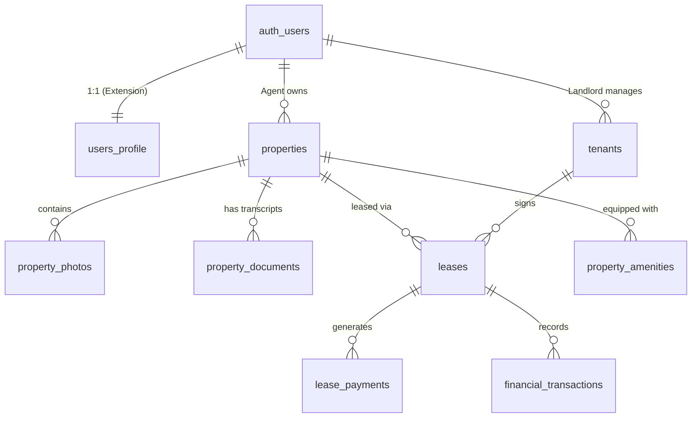

# Supabase 在本專案中的角色與功能分析報告

> **創建日期**: 2026-01-30  
> **創建者**: Project Team  
> **最後修改**: 2026-01-30  
> **修改者**: Project Team  
> **版本**: 1.0  
> **文件類型**: 技術文件

---


**文件版本**: 2.0  
**最後更新**: 2026-01-17  
**狀態**: 已更新 (Updated)

---

## 1. 專案背景與 Supabase 定位 (Project Context)

本專案為 **"Owner Real Estate Agent SaaS"**，旨在為房東提供一套全方位的管理系統。系統需整合行動端應用 (React Native/Expo)、後端 OCR 服務 (Python)，以及歷史資料遷移 (Legacy SQL Server)。

在此架構中，**Supabase** 不僅是資料庫，更是整個系統的 **Backend-as-a-Service (BaaS)** 核心樞紐，承擔以下關鍵職責：

1.  **統一數據中心**: 整合新業務數據與從 SQL Server 2012 遷移的歷史數據。
2.  **身份與權限中樞**: 透過 Auth 與 RLS (Row Level Security) 實現多租戶 (Multi-tenant) 架構下的嚴格資料隔離。
3.  **服務整合介面**: 作為 Frontend (Expo) 與 AI Service (OCR) 之間的資料交換層。
4.  **即時互動平台**: 支援即時通知與狀態更新 (如 OCR 處理完成通知)。

---

## 2. 核心架構與功能實現 (Core Architecture)

### 2.1 資料庫架構 (Database Schema)

本專案採用 PostgreSQL，利用其強大的關聯性與 JSONB 支援能力。

#### 核心實體關係圖 (Entity Relationship Overview)



#### 關鍵資料表設計
*   **`users_profile`**: 擴充 Supabase Auth 的使用者資訊，包含身份 (房東/仲介)、銀行帳戶等。
*   **`properties`**: 核心物件表，儲存基本資訊與 `transcript_data` (JSONB 格式的謄本解析結果)。
*   **`property_documents`**: 連接 OCR 服務的橋樑，儲存文件狀態 (`pending`, `processing`, `completed`) 與解析結果。
*   **`leases` & `tenants`**: 租賃管理核心，紀錄合約週期與租客背景。

### 2.2 身份認證與權限控制 (Auth & Security)

#### 認證機制
前端使用 `@supabase/supabase-js` 直接與 Supabase Auth 互動，支援 Email/Password 登入。

**前端實作範例 (`frontend/src/lib/supabase.ts`)**:
```typescript
import { createClient } from '@supabase/supabase-js'

// 單例模式初始化
export const supabase = createClient(process.env.EXPO_PUBLIC_SUPABASE_URL, process.env.EXPO_PUBLIC_SUPABASE_ANON_KEY)

// 身份驗證封裝
export async function signIn(email: string, password: string) {
  const { data, error } = await supabase.auth.signInWithPassword({ email, password })
  return { success: !error, data, error }
}
```

#### 資料權限 (RLS Policies)
本專案嚴格執行 **"仲介/房東只能存取自己資料"** 的原則。所有核心表格皆啟用 RLS。

**關鍵策略範例 (SQL)**:
```sql
-- 屬性：仲介只能查看自己的物件
CREATE POLICY "仲介只能查看自己的物件"
  ON properties FOR SELECT
  USING (auth.uid() = agent_id);

-- 文件：仲介只能操作自己的文件 (OCR 流程保護)
CREATE POLICY "仲介只能新增自己的文件"
  ON property_documents FOR INSERT
  WITH CHECK (auth.uid() = agent_id);

-- 租客：房東只能查看與自己有租約關聯的租客 (跨表查詢權限)
CREATE POLICY "房東可以查看自己租客的資料"
  ON tenants FOR SELECT
  USING (
    id IN (
      SELECT DISTINCT tenant_id FROM leases WHERE landlord_id = auth.uid()
    )
  );
```

### 2.3 檔案儲存 (Storage)

利用 Supabase Storage 管理非結構化資料，並透過 RLS 確保檔案存取安全。

*   **Bucket: `property-photos`**: 儲存房屋照片。
    *   路徑結構: `{property_id}/{timestamp}.jpg`
*   **Bucket: `transcripts`**: 儲存 PDF 謄本與 OCR 解析後的 JSON 檔。
    *   路徑結構: `{property_id}/{document_id}.{pdf|json}`

---

## 3. 系統整合與數據流 (System Integration)

### 3.1 OCR 服務整合流程
Python OCR 服務與 Supabase 的互動是非同步的，透過資料庫狀態驅動。

1.  **上傳**: 前端上傳 PDF 至 Storage，並在 `property_documents` 插入紀錄 (Status: `pending`)。
2.  **觸發**: Python 服務 (或 Edge Function) 監聽 `property_documents` 的變更或定期輪詢 `pending` 狀態的任務。
3.  **處理**: Python 服務下載 PDF，執行 OCR 解析。
4.  **回寫**: Python 服務將解析結果 (JSON) 寫入 `ocr_result` 欄位，更新狀態為 `completed`。
5.  **同步**: 前端透過 Supabase Realtime 訂閱狀態變更，即時顯示解析結果。

### 3.2 歷史資料遷移 (Legacy Migration)
針對 SQL Server 2012 的歷史資料 (`house063`)，Supabase 扮演接收端的角色。

*   **遷移策略**: 採用 ETL (Extract-Transform-Load) 流程。
*   **對應關係**:
    *   `hbhouse` (舊) -> `properties` (新)
    *   `hbcust` (舊) -> `clients` (新)
    *   `hbtrade` (舊) -> `leases` / `financial_transactions` (新)

---

## 4. 性能優化與安全性 (Performance & Security)

### 4.1 索引優化 (Indexing Strategy)
針對查詢熱點建立索引，確保 SaaS 平台響應速度。

*   **外鍵索引**: 所有關聯欄位 (`agent_id`, `property_id`) 皆建立索引，加速 Join 查詢。
*   **JSONB 索引**: 針對 `transcript_data` 與 `ocr_result` 建立 GIN 索引，支援對解析內容的全文檢索。
    ```sql
    CREATE INDEX IF NOT EXISTS idx_transcript_data ON properties USING GIN (transcript_data);
    ```
*   **排序索引**: 針對 `created_at` 建立降序索引，優化列表顯示。

### 4.2 安全性考量
*   **RLS 強制執行**: 應用層無須過度擔心權限過濾，資料庫層級保證隔離。
*   **Service Role Key 管控**: 僅限後端服務 (Python OCR, Migration Scripts) 使用 Service Role Key，前端嚴格使用 Anon Key。
*   **備份機制**: 依賴 Supabase 自動備份與 PITR (Point-in-Time Recovery) 功能。

---

## 5. 結論 (Conclusion)

Supabase 在本專案中成功實現了 Serverless 架構的願景。它不僅大幅降低了後端開發成本，更透過 RLS 解決了多租戶 SaaS 最棘手的資料隔離問題。配合 Python OCR 服務的非同步整合模式，展現了高度的擴充性與靈活性。

對於即將進行的歷史資料遷移，Supabase 的 PostgreSQL 核心提供了標準且高效的資料承接能力，確保 13 年的業務資產能夠平滑過渡至現代化平台。
