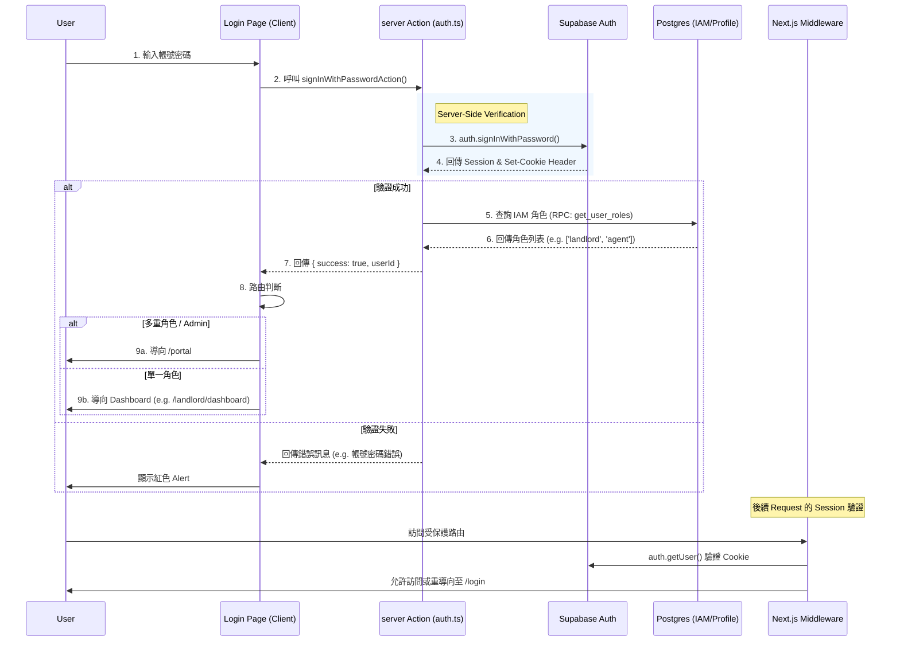

# 專案登入驗證流程與邏輯分析報告

**報告日期**: 2026-02-15
**分析人員**: AI Assistant (Claude)
**分析對象**: Owner Property Management AI SPA (Next.js + Supabase)

---

## 摘要

本報告針對現有專案的登入驗證系統進行深入分析。報告涵蓋技術架構、前端交互流程、後端驗證邏輯、安全性評估及改進建議。我們使用真實的系統截圖來輔助說明實際的使用者體驗與介面狀態。

---

## 1. 登入畫面與介面分析

我們對系統進行了實機測試，並截取了以下關鍵介面：

### 1.1 登入頁面 (Login Page)

使用者進入系統的第一個接觸點。介面設計簡潔，支援「密碼登入」與「第三方登入」。

**主要元素**:

- **身份驗證表單**: 包含電子郵件、密碼輸入框，以及「記住我」Checkbox。
- **第三方登入**: 整合 Google 與 Facebook OAuth。
- **輔助功能**: 忘記密碼連結、切換至「邀請碼登入」模式、註冊連結。

### 1.2 角色選擇入口 (Portal Page)

登入成功後，擁有多重role身份的user會進入此頁面選擇操作的role。

擁有單一身份的使用者，不會跳到Portal Page, 會直接跳到該role的dashboard.

**功能特點**:

- **動態角色卡片**: 根據使用者 IAM 權限動態渲染可用的角色卡片（如超級管理員、房東、仲介等）。
- **權限狀態**: 卡片會顯示該角色的啟用狀態，未啟用的權限將無法點擊或顯示為 Disabled。

### 1.3 角色工作台範例 (Role Dashboards)

使用者選擇角色後，將進入專屬的工作台介面。以下為兩個主要角色的 dashboard 範例：

**超級管理員後台 (Super Admin Dashboard)**
提供全系統的概覽，包含 IAM 用戶群組統計、總物件數、以及系統設定入口。

**房東後台 (Landlord Dashboard)**
專注於房東的資產管理，顯示物件總數、出租率、收入概況等關鍵指標。

---

## 2. 登入流程完整技術架構

系統採用 Next.js App Router 結合 Supabase Auth 與 Server Actions，實現了前後端分離但邏輯緊密整合的驗證流程。

---

## 3. 登入成功情境詳細流程

當使用者成功提交正確憑證後，系統執行以下關鍵步驟：

1. **Server Action 驗證**:

   - `signInWithPasswordAction` 接收表單數據。
   - 呼叫 Supabase Auth API 驗證憑證。
   - **關鍵點**: 成功回應會包含 `Set-Cookie` header，將 `sb-access-token` 和 `sb-refresh-token` 寫入 HttpOnly Cookie。
2. **角色權限獲取**:

   - 登入成功後，Action 立即呼叫 `getUserRoles(userId)`。
   - 系統優先呼叫資料庫 RPC `get_user_roles` 以獲取最新的 IAM 權限設定，確保權限即時性。
3. **前端導向策略**:

   - 前端收到 `success: true` 後，根據回傳的角色數量決定跳轉目標：
     - **多重角色** (如截圖所示，該測試帳號擁有 8 個角色): 強制導向至 `/portal`。
     - **單一角色**: 直接導向該角色的主控台 (Dashboard)，減少使用者點擊次數。
4. **環境適配**:

   - 代碼中包含對 `localhost` 與 Production 環境的判斷，確保在不同網域架構下都能正確跳轉。

---

## 4. 登入失敗情境錯誤處理流程

系統具備完善的錯誤處理機制：

| 情境              | 處理邏輯                                                | 前端回饋                                                            |
| :---------------- | :------------------------------------------------------ | :------------------------------------------------------------------ |
| **帳號/密碼錯誤** | 捕獲 Supabase `invalid_login_credentials` 錯誤          | 顯示通用錯誤訊息「登入失敗，請檢查您的帳號密碼」 (避免帳號枚舉攻擊) |
| **Email 未驗證**  | 檢測 `email_not_confirmed` 狀態                         | 提示使用者前往信箱收取驗證信                                        |
| **帳號鎖定**      | 依賴 Supabase Auth Rate Limiting (預設每小時 30 次失敗) | 暫停該 IP 或帳號的登入嘗試                                          |
| **系統異常**      | try-catch 捕獲未知 Exception                            | Console 記錄詳細堆疊，前端顯示「系統錯誤，請稍後再試」              |

---

## 5. 安全性檢查點分析

| 安全層面          | 實作細節                                                                           | 評估   |
| :---------------- | :--------------------------------------------------------------------------------- | :----- |
| **憑證傳輸**      | 強制 HTTPS (Production)；Cookie 設定 `Secure`, `HttpOnly`, `SameSite=Lax`          | ✅ 安全 |
| **密碼儲存**      | 委託 Supabase GoTrue (Bcrypt/Argon2)，不接觸明碼                                   | ✅ 安全 |
| **SQL Injection** | 使用 ORM 風格 SDK 與 Parameterized RPC，無字串拼接 SQL                             | ✅ 安全 |
| **CSRF 防護**     | Next.js Server Actions 內建 Origin 檢查與 CSRF Token                               | ✅ 安全 |
| **XSS 防護**      | React 自動轉義輸出；Cookie HttpOnly 防止脚本竊取 Token                             | ✅ 安全 |
| **權限控管**      | Middleware 針對每個 Request 驗證 Session；DB Row Level Security (RLS) 確保資料隔離 | ✅ 安全 |

---

## 6. 效能瓶頸評估與建議

經過代碼審查與流程分析，我們發現潛在的優化空間：

1. **Middleware 負載**:

   - **現狀**: `middleware.ts` 對幾乎所有路徑都執行 `supabase.auth.getUser()`，這會觸發對 Auth Server 的請求。
   - **風險**: 靜態資源 (圖片、JS、CSS) 的請求也會觸發驗證，增加延遲與伺服器負載。
   - **建議**: 修改 `matcher` 設定，明確**排除**靜態資源路徑。
2. **角色查詢冗餘**:

   - **現狀**: 登入時查一次角色，跳轉後 Middleware 可能又查一次 User Metadata。
   - **建議**: 統一使用 IAM 系統作為權限來源，並考慮在 Session 中適度快取非敏感的角色資訊。

---

## 7. 結論與改進建議

目前的登入系統架構穩健，安全性符合現代 Web 應用標準。透過 Server Actions 與 Supabase 的結合，實現了流暢且安全的使用者體驗。

**具體改進建議**:

1. **[High] 優化 Middleware Matcher**: 排除靜態檔案，提升全站加載速度。
2. **[Medium] 錯誤訊息優化**: 在 Production 環境確保錯誤訊息模糊化，但在開發環境保留詳細 Log 以利除錯。
3. **[Low] 登入後重導向 (Redirect Back)**: 完善 `redirectTo` 參數的處理邏輯，讓使用者從特定頁面被踢出登入後，登入回來能自動回到原頁面。
