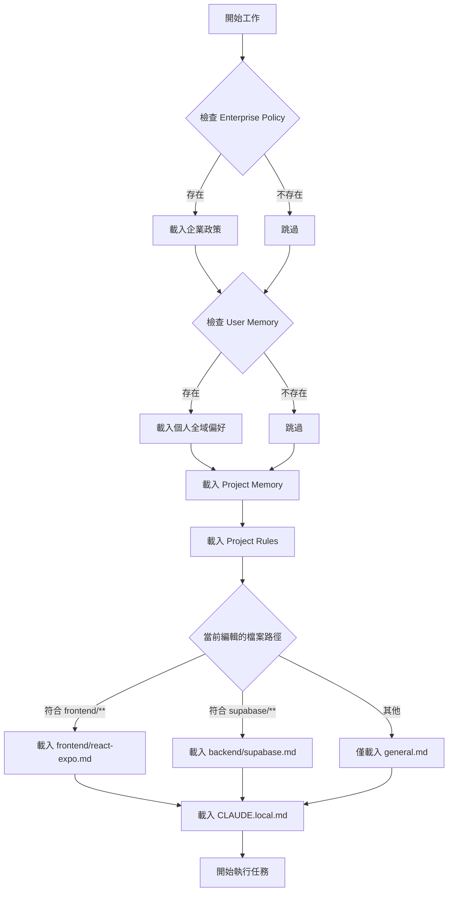

# 本專案 Claude Code 記憶體系統配置說明

> 更新日期：2026-01-16  
> 文檔版本：v1.1

---

## 📋 Claude Code Memory 層級架構

根據 [Claude Code 官方文檔](https://code.claude.com/docs/en/memory)，記憶體系統分為 5 個層級：

| 記憶體類型                 | 檔案位置                                                    | 作用範圍             | 共享對象             | 優先級     |
| :------------------------- | :---------------------------------------------------------- | :------------------- | :------------------- | :--------- |
| **Enterprise Policy**      | `/Library/Application Support/ClaudeCode/CLAUDE.md` (macOS) | 組織全域             | 所有企業用戶         | ⭐⭐⭐⭐⭐ |
| **User Memory**            | `~/.claude/CLAUDE.md`                                       | 個人全域（所有專案） | 僅自己               | ⭐⭐⭐⭐   |
| **Project Memory**         | `./CLAUDE.md` 或 `./.claude/CLAUDE.md`                      | 專案共享             | 團隊成員（透過 Git） | ⭐⭐⭐⭐   |
| **Project Rules**          | `./.claude/rules/*.md`                                      | 專案模塊化規則       | 團隊成員（透過 Git） | ⭐⭐⭐     |
| **Project Memory (Local)** | `./CLAUDE.local.md`                                         | 專案個人偏好         | 僅自己（不提交 Git） | ⭐⭐       |

---

## 🔍 本專案當前配置檢查結果

### ✅ 已配置的記憶體層級

#### 1. Project Memory - 專案共享記憶

**檔案路徑**：

- `/CLAUDE.md` （根目錄，快速參考）
- `/.claude/CLAUDE.md` （詳細專案記憶）

**用途**：

- 根目錄 `CLAUDE.md`：快速啟動指令、Context7 規則、重要路徑索引
- `.claude/CLAUDE.md`：專案架構、技術棧、API 文檔、開發流程

**狀態**：✅ 已配置並提交至 Git

---

#### 2. Project Rules - 模塊化規則

**檔案路徑**：`.claude/rules/`

**已建立的規則模塊**：

1. **`general.md`**
   - 適用範圍：整個專案所有檔案
   - 內容：命名規範、Git 工作流、Commit 訊息格式

2. **`frontend/react-expo.md`**
   - 適用範圍：`frontend/**/*.{ts,tsx,js,jsx}`
   - 內容：React 19 + Expo 54 開發規則、組件結構、Hooks 開發

3. **`backend/supabase.md`**
   - 適用範圍：`supabase/**/*.sql`, `backend/**/*.ts`, `**/lib/supabase.ts`
   - 內容：資料庫命名、Migration 規範、RLS 政策

4. **`backend/python-ocr.md`**
   - 適用範圍：`backend/ocr_service/**/*.py`, `backend/**/*.py`
   - 內容：Python 命名規範、pytest 測試規範、OCR 處理流程、錯誤處理

**狀態**：✅ 已配置並提交至 Git
編輯 Python 檔案時 → 自動載入 `backend/python-ocr.md`

- **智能載入機制**：
- 編輯前端檔案時 → 自動載入 `frontend/react-expo.md`
- 編輯 SQL 遷移檔案時 → 自動載入 `backend/supabase.md`
- 任何檔案都會載入 `general.md`

---

#### 3. Project Memory (Local) - 個人專案偏好

**檔案路徑**：`/CLAUDE.local.md`

**用途**：

- 本地開發環境 URL（Supabase、Expo）
- 個人回覆風格偏好（繁體中文、簡潔風格）
- 個人快捷指令

**狀態**：✅ 已配置且已加入 `.gitignore`（不會提交）

---

#### 4. User Memory - 個人全域記憶

**檔案路徑**：`~/.claude/CLAUDE.md`

**用途**：

- 個人回覆風格偏好（繁體中文、簡潔風格）
- 程式碼風格偏好（TypeScript, Python）
- 開發工具偏好（VS Code, iTerm2）
- 錯誤處理與測試策略
- 跨專案通用的個人習慣

**狀態**：✅ 已配置（適用於所有專案）

---

### ❌ 未配置的記憶體層級

#### 1. Enterprise Policy - 企業政策

**檔案路徑**：`/Library/Application Support/ClaudeCode/CLAUDE.md`  
**檢查結果**：❌ 不存在（本專案為個人/小團隊專案，無需企業級配置）

---

## 📊 AI 讀取優先順序與合併機制

當 Claude Code 開始工作時，記憶體載入順序如下：



**合併規則**：

- 高優先級規則可覆蓋低優先級規則
- 同級別規則若衝突，以最具體的規則為準
- Project Rules 根據檔案路徑智能載入（節省 token）

---

## 🎯 專業建議與優化方案

### ✅ 現有配置評估

| 配置項               | 評分       | 說明                                                |
| :------------------- | :--------- | :-------------------------------------------------- |
| User Memory 全域配置 | ⭐⭐⭐⭐⭐ | 跨專案個人偏好統一，提升一致性                      |
| Project Memory 分層  | ⭐⭐⭐⭐⭐ | 根目錄快速參考 + .claude 詳細記憶，結構清晰         |
| Project Rules 模塊化 | ⭐⭐⭐⭐⭐ | 按前後端分離，智能載入，符合最佳實踐                |
| Local Memory 隔離    | ⭐⭐⭐⭐⭐ | CLAUDE.local.md 已加入 .gitignore，避免污染團隊配置 |

**總體評價**：✅ 配置結構完整，所有層級均已配置，符合 Claude Code 官方最佳實踐

---

## 📊 本專案完整記憶體配置總覽表

| Memory Type                | Location                                                    | Purpose                  | Use Case Examples                                                                         | Shared With          |
| :------------------------- | :---------------------------------------------------------- | :----------------------- | :---------------------------------------------------------------------------------------- | :------------------- |
| **Enterprise Policy**      | `/Library/Application Support/ClaudeCode/CLAUDE.md` (macOS) | 組織級開發政策與合規要求 | 公司編碼標準、安全政策、合規要求                                                          | 組織內所有用戶       |
| **User Memory**            | `~/.claude/CLAUDE.md`                                       | 個人跨專案開發偏好       | 回覆風格（繁體中文）、程式碼偏好（TypeScript strict mode）、開發工具（VS Code）、Git 習慣 | 僅自己（所有專案）   |
| **Project Memory**         | `./CLAUDE.md`                                               | 專案快速參考與索引       | Context7 使用規則、快速指令、重要路徑索引、代碼生成規範引用                               | 團隊成員（透過 Git） |
| **Project Memory**         | `./.claude/CLAUDE.md`                                       | 專案詳細架構與文檔       | 技術棧說明、目錄結構、API 函數列表、開發階段規劃、RLS 政策                                | 團隊成員（透過 Git） |
| **Project Rules**          | `./.claude/rules/general.md`                                | 通用開發規則             | 命名規範快速參考、Git 工作流、Commit 訊息格式、程式碼風格、語言偏好                       | 團隊成員（透過 Git） |
| **Project Rules**          | `./.claude/rules/frontend/react-expo.md`                    | 前端開發規則             | React 19 組件結構、Hooks 開發、TypeScript 型別定義、Expo 配置                             | 團隊成員（透過 Git） |
| **Project Rules**          | `./.claude/rules/backend/supabase.md`                       | 後端資料庫規則           | PostgreSQL 命名、Migration 規範、RLS 政策、索引約束                                       | 團隊成員（透過 Git） |
| **Project Rules**          | `./.claude/rules/backend/python-ocr.md`                     | Python/OCR 開發規則      | Python 命名規範、pytest 測試、OCR 處理流程、錯誤處理、Docstring 格式                      | 團隊成員（透過 Git） |
| **Project Memory (Local)** | `./CLAUDE.local.md`                                         | 個人專案環境配置         | 本地 Supabase URL、個人快捷指令、開發習慣（不影響團隊）                                   | 僅自己（當前專案）   |

### 載入優先順序說明

當 Claude Code 開始工作時，記憶體按以下優先級合併：

1. **最高優先**：Enterprise Policy（如存在）→ 強制執行組織政策
2. **高優先**：User Memory → 應用個人全域偏好
3. **專案優先**：Project Memory（./CLAUDE.md + ./.claude/CLAUDE.md）→ 載入專案知識
4. **智能載入**：Project Rules → 根據編輯的檔案路徑自動載入對應規則
5. **最終覆蓋**：Project Memory (Local) → 應用個人專案配置

**衝突解決規則**：

- 高優先級規則可覆蓋低優先級規則
- 同級別規則若衝突，以最具體（最詳細）的規則為準
- Project Rules 只載入與當前檔案路徑匹配的規則（節省 token）

---

### 🔧 配置優化建議（已完成）

#### ✅ 已完成的優化

1. **【已完成】建立 User Memory - 個人全域偏好**
   - 檔案位置：`~/.claude/CLAUDE.md`
   - 內容：回覆風格、程式碼偏好、開發工具、錯誤處理策略
   - 效果：在所有專案中保持一致的開發體驗

2. **【已完成】在根目錄 CLAUDE.md 加入 Project Rules 引用**
   - 新增模塊化規則的完整說明
   - 列出所有規則文件並說明自動載入機制
   - 效果：AI 明確知道可參考的規則文件

3. **【已完成】新增 Python/OCR 專屬規則**
   - 檔案位置：`.claude/rules/backend/python-ocr.md`
   - 內容：Python 命名、pytest 測試、OCR 處理流程、錯誤處理
   - 效果：編輯 Python 檔案時自動載入專屬規範

4. **【已完成】避免命名規範重複**
   - 修改 `.claude/rules/general.md` 引用主文檔
   - 保持 Single Source of Truth
   - 效果：避免規範不一致，降低維護成本

---

## 🎉 配置完成總結

本專案的 Claude Code 記憶體系統已完成以下配置：

### ✅ 已配置層級（5/5）

| 層級                   | 狀態      | 說明                                                     |
| :--------------------- | :-------- | :------------------------------------------------------- |
| Enterprise Policy      | ⚪ N/A    | 個人/小團隊專案無需企業級配置                            |
| User Memory            | ✅ 已配置 | `~/.claude/CLAUDE.md` - 跨專案個人偏好                   |
| Project Memory         | ✅ 已配置 | 雙層結構：快速參考 + 詳細記憶                            |
| Project Rules          | ✅ 已配置 | 4 個模塊：general, frontend, backend (Supabase + Python) |
| Project Memory (Local) | ✅ 已配置 | `CLAUDE.local.md` - 個人專案環境                         |

### 🎯 配置優勢

1. **完整性**：覆蓋所有適用的記憶體層級
2. **模塊化**：Project Rules 按技術棧智能載入
3. **一致性**：User Memory 確保跨專案體驗統一
4. **隔離性**：Local Memory 不影響團隊配置
5. **可維護性**：避免重複，Single Source of Truth

---

### 🔧 建議優化項目（未來可選）

本節保留未來可能的優化方向，目前配置已非常完善。

---

## 📝 配置維護檢查清單

### 每次新增功能模塊時

- [ ] 評估是否需要新增專屬 Project Rule（如新技術棧）
- [ ] 在 `.claude/rules/` 新增對應 `.md` 檔案
- [ ] 設定正確的 `paths` 前置定義
- [ ] 提交至 Git 供團隊共享

### 每次更新命名規範時

- [ ] 更新 `docs/本專案檔案命名規則與新增文件歸檔總則.md`
- [ ] 檢查 `.claude/rules/general.md` 是否需同步
- [ ] 通知團隊成員

### 個人環境變更時

- [ ] 僅修改 `CLAUDE.local.md`（不影響團隊）
- [ ] 不要修改 `.claude/CLAUDE.md` 的個人化內容

---

## 🚀 快速指令參考

```bash
# 查看當前專案所有 Claude 配置
find . -name "CLAUDE*.md" -o -path "./.claude/rules/*.md"

# 編輯專案共享記憶
code .claude/CLAUDE.md

# 編輯個人專案偏好
code CLAUDE.local.md

# 新增前端規則模塊
code .claude/rules/frontend/react-expo.md

# 新增後端規則模塊
code .claude/rules/backend/supabase.md
```

---

## 📚 延伸閱讀

- [Claude Code 官方記憶體文檔](https://code.claude.com/docs/en/memory)
- [本專案檔案命名規則與新增文件歸檔總則](../本專案檔案命名規則與新增文件歸檔總則.md)
- [本專案 SDLC 進度表](../專案SDLC進度表報告_2026-01-14.md)

---

**文檔維護者**：Jason  
**最後更新**：2026-01-16  
**下次審查**：功能模塊新增時
