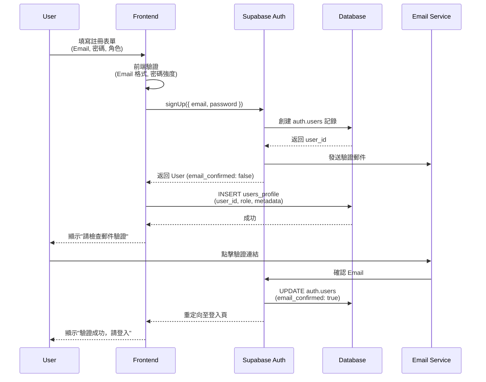
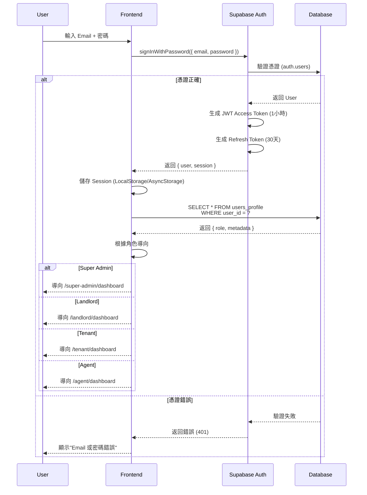
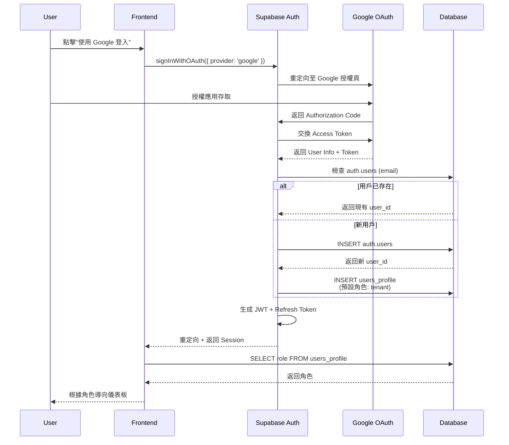
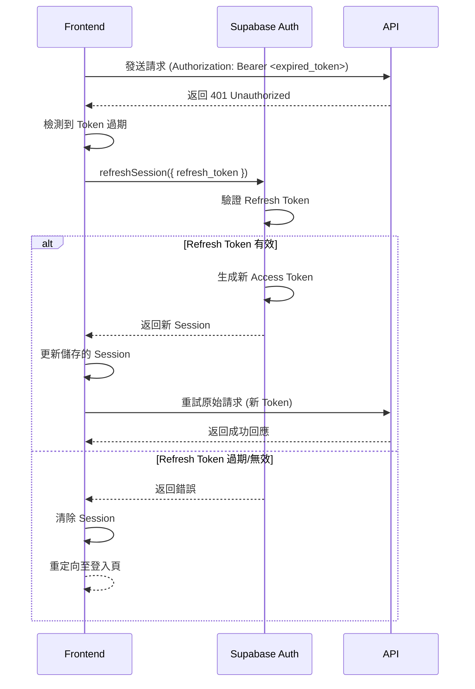

# 認證系統架構設計

> **創建日期**: 2026-01-31  
> **創建者**: Claude Sonnet 4.5  
> **最後修改**: 2026-01-31  
> **修改者**: Claude Sonnet 4.5  
> **版本**: 1.0  
> **文件類型**: 架構設計文件

---

## 📋 執行摘要

本文件定義了房東物件管理 AI 平台的完整認證系統架構，基於 Supabase Auth 實作多角色、多租戶的安全認證機制。

**關鍵決策**:
- ✅ 使用 Supabase Auth 作為認證基礎設施
- ✅ 實作 Row Level Security (RLS) 確保多租戶資料隔離
- ✅ 支援 Email/密碼、OAuth (Google/Facebook/Apple) 登入
- ✅ 採用 JWT Token + Refresh Token 機制

---

## 一、認證系統概觀

### 1.1 系統目標

1. **安全性**: 保護用戶資料，防止未授權存取
2. **多角色支援**: Super Admin, Landlord, Tenant, Agent
3. **多租戶隔離**: 確保不同房東的資料完全隔離
4. **用戶體驗**: 提供流暢的登入/註冊流程
5. **可擴展性**: 支援未來新增的認證方式

### 1.2 支援的認證方式

| 認證方式 | 優先級 | 狀態 | 說明 |
|---------|--------|------|------|
| **Email + 密碼** | P0 | ✅ 立即實作 | 基礎認證，最低依賴 |
| **Google OAuth** | P1 | ⏳ 第二階段 | 提升註冊轉換率 |
| **Facebook OAuth** | P1 | ⏳ 第二階段 | 社群帳號整合 |
| **Apple Sign In** | P1 | ⏳ 第二階段 | iOS 用戶友好 |
| **手機號碼 OTP** | P2 | 📋 待評估 | 需整合簡訊服務 |

---

## 二、認證流程設計

### 2.1 註冊流程



### 2.2 登入流程



### 2.3 OAuth 登入流程 (Google 範例)



### 2.4 Token 刷新流程



---

## 三、角色與權限系統 (RBAC)

### 3.1 角色定義

| 角色 | 英文名稱 | 權限範圍 | 典型用戶 |
|------|---------|---------|---------|
| **超級管理員** | `super_admin` | 完整系統存取權限 | 平台運營人員 |
| **房東** | `landlord` | 自己的物件、租客、合約 | 房屋所有權人 |
| **租客** | `tenant` | 自己的租約、繳費記錄 | 承租人 |
| **仲介** | `agent` | 經手的物件與客戶 | 房地產經紀人 |
| **廠商** | `service_provider` | 維修請求與報價 | 維修廠商 |

### 3.2 角色權限矩陣

#### 物件管理 (Properties)

| 操作 | Super Admin | Landlord | Tenant | Agent |
|------|------------|----------|--------|-------|
| **查看所有物件** | ✅ | ❌ | ❌ | ❌ |
| **查看自己的物件** | ✅ | ✅ | ❌ | ✅ (經手) |
| **新增物件** | ✅ | ✅ | ❌ | ❌ |
| **編輯物件** | ✅ | ✅ (自己) | ❌ | ❌ |
| **刪除物件** | ✅ | ✅ (自己) | ❌ | ❌ |
| **查看物件詳情** | ✅ | ✅ (自己) | ✅ (租用) | ✅ (經手) |

#### 租客管理 (Tenants)

| 操作 | Super Admin | Landlord | Tenant | Agent |
|------|------------|----------|--------|-------|
| **查看所有租客** | ✅ | ❌ | ❌ | ❌ |
| **查看自己的租客** | ✅ | ✅ | ❌ | ✅ (經手) |
| **新增租客** | ✅ | ✅ | ❌ | ✅ |
| **編輯租客資料** | ✅ | ✅ (自己) | ❌ | ✅ (經手) |
| **查看租金記錄** | ✅ | ✅ (自己) | ✅ (自己) | ❌ |

#### 合約管理 (Contracts)

| 操作 | Super Admin | Landlord | Tenant | Agent |
|------|------------|----------|--------|-------|
| **查看所有合約** | ✅ | ❌ | ❌ | ❌ |
| **查看自己的合約** | ✅ | ✅ | ✅ | ✅ (經手) |
| **創建合約** | ✅ | ✅ | ❌ | ✅ |
| **簽署合約** | ✅ | ✅ (房東) | ✅ (租客) | ❌ |
| **終止合約** | ✅ | ✅ (自己) | ❌ | ❌ |

### 3.3 資料庫角色映射

```sql
-- users_profile 表結構
CREATE TABLE users_profile (
  id UUID PRIMARY KEY DEFAULT gen_random_uuid(),
  user_id UUID REFERENCES auth.users(id) ON DELETE CASCADE UNIQUE NOT NULL,
  role TEXT NOT NULL CHECK (role IN ('super_admin', 'landlord', 'tenant', 'agent', 'service_provider')),
  email TEXT NOT NULL,
  full_name TEXT,
  phone TEXT,
  avatar_url TEXT,
  metadata JSONB DEFAULT '{}',
  created_at TIMESTAMPTZ DEFAULT NOW(),
  updated_at TIMESTAMPTZ DEFAULT NOW()
);

-- 創建索引
CREATE INDEX idx_users_profile_user_id ON users_profile(user_id);
CREATE INDEX idx_users_profile_role ON users_profile(role);
```

---

## 四、Row Level Security (RLS) 策略

### 4.1 RLS 設計原則

1. **預設拒絕**: 所有表格預設禁止任何存取
2. **最小權限**: 僅授予必要的權限
3. **角色隔離**: 不同角色看到不同的資料
4. **多租戶隔離**: 房東只能看到自己的資料

### 4.2 users_profile RLS 策略

```sql
-- 啟用 RLS
ALTER TABLE users_profile ENABLE ROW LEVEL SECURITY;

-- 策略 1: 用戶可查看自己的資料
CREATE POLICY "Users can view own profile"
ON users_profile
FOR SELECT
USING (auth.uid() = user_id);

-- 策略 2: 用戶可更新自己的資料 (除了 role)
CREATE POLICY "Users can update own profile"
ON users_profile
FOR UPDATE
USING (auth.uid() = user_id)
WITH CHECK (auth.uid() = user_id AND role = (SELECT role FROM users_profile WHERE user_id = auth.uid()));

-- 策略 3: Super Admin 可查看所有用戶
CREATE POLICY "Super admin can view all profiles"
ON users_profile
FOR SELECT
USING (
  EXISTS (
    SELECT 1 FROM users_profile
    WHERE user_id = auth.uid() AND role = 'super_admin'
  )
);

-- 策略 4: Super Admin 可更新所有用戶
CREATE POLICY "Super admin can update all profiles"
ON users_profile
FOR UPDATE
USING (
  EXISTS (
    SELECT 1 FROM users_profile
    WHERE user_id = auth.uid() AND role = 'super_admin'
  )
);
```

### 4.3 Properties RLS 策略範例

```sql
-- 假設 property_rentals 表有 landlord_id 欄位
ALTER TABLE property_rentals ENABLE ROW LEVEL SECURITY;

-- 策略 1: 房東可查看自己的物件
CREATE POLICY "Landlords can view own properties"
ON property_rentals
FOR SELECT
USING (
  landlord_id = auth.uid()
  OR
  EXISTS (
    SELECT 1 FROM users_profile
    WHERE user_id = auth.uid() AND role = 'super_admin'
  )
);

-- 策略 2: 租客可查看自己租用的物件
CREATE POLICY "Tenants can view rented properties"
ON property_rentals
FOR SELECT
USING (
  EXISTS (
    SELECT 1 FROM lease_agreements
    WHERE property_id = property_rentals.id
    AND tenant_id = auth.uid()
    AND status = 'active'
  )
);

-- 策略 3: 房東可新增物件
CREATE POLICY "Landlords can insert properties"
ON property_rentals
FOR INSERT
WITH CHECK (
  landlord_id = auth.uid()
  AND
  EXISTS (
    SELECT 1 FROM users_profile
    WHERE user_id = auth.uid() AND role = 'landlord'
  )
);

-- 策略 4: 房東可更新自己的物件
CREATE POLICY "Landlords can update own properties"
ON property_rentals
FOR UPDATE
USING (landlord_id = auth.uid())
WITH CHECK (landlord_id = auth.uid());

-- 策略 5: 房東可刪除自己的物件
CREATE POLICY "Landlords can delete own properties"
ON property_rentals
FOR DELETE
USING (landlord_id = auth.uid());
```

---

## 五、安全性設計

### 5.1 密碼安全

**要求**:
- ✅ 最少 8 個字元
- ✅ 至少包含一個大寫字母
- ✅ 至少包含一個小寫字母
- ✅ 至少包含一個數字
- ✅ 建議包含特殊字元

**實作** (前端驗證):
```typescript
// lib/validators/auth.ts
import { z } from 'zod';

export const passwordSchema = z
  .string()
  .min(8, '密碼至少需要 8 個字元')
  .regex(/[A-Z]/, '密碼必須包含至少一個大寫字母')
  .regex(/[a-z]/, '密碼必須包含至少一個小寫字母')
  .regex(/[0-9]/, '密碼必須包含至少一個數字')
  .regex(/[^A-Za-z0-9]/, '建議包含特殊字元 (!@#$%^&*)');

export const signUpSchema = z.object({
  email: z.string().email('請輸入有效的 Email 地址'),
  password: passwordSchema,
  confirmPassword: z.string(),
  role: z.enum(['landlord', 'tenant', 'agent']),
  fullName: z.string().min(2, '姓名至少需要 2 個字元'),
  phone: z.string().optional(),
}).refine((data) => data.password === data.confirmPassword, {
  message: '密碼不一致',
  path: ['confirmPassword'],
});
```

### 5.2 Session 管理

**配置**:
```typescript
// Supabase 配置
const supabaseConfig = {
  auth: {
    autoRefreshToken: true,           // 自動刷新 Token
    persistSession: true,              // 持久化 Session
    detectSessionInUrl: true,          // 從 URL 檢測 Session (OAuth)
    flowType: 'pkce',                  // 使用 PKCE 流程 (更安全)
  },
  global: {
    headers: {
      'x-application-name': 'owner-property-management',
    },
  },
};
```

**Token 生命週期**:
- **Access Token**: 1 小時
- **Refresh Token**: 30 天
- **自動刷新**: 在 Token 過期前 5 分鐘自動刷新

### 5.3 CSRF 防護

Supabase Auth 內建 PKCE (Proof Key for Code Exchange) 流程，可防止 CSRF 攻擊。

**額外防護措施**:
```typescript
// middleware.ts
import { createMiddlewareClient } from '@supabase/auth-helpers-nextjs';
import { NextResponse } from 'next/server';
import type { NextRequest } from 'next/server';

export async function middleware(req: NextRequest) {
  const res = NextResponse.next();
  const supabase = createMiddlewareClient({ req, res });

  // 刷新 Session
  await supabase.auth.getSession();

  return res;
}

export const config = {
  matcher: [
    '/((?!_next/static|_next/image|favicon.ico).*)',
  ],
};
```

### 5.4 XSS 防護

**措施**:
1. ✅ Next.js 自動轉義 HTML
2. ✅ 使用 `dangerouslySetInnerHTML` 時需經過 DOMPurify 清理
3. ✅ 設置 Content Security Policy (CSP)

```typescript
// next.config.ts
const securityHeaders = [
  {
    key: 'X-DNS-Prefetch-Control',
    value: 'on',
  },
  {
    key: 'X-Frame-Options',
    value: 'SAMEORIGIN',
  },
  {
    key: 'X-Content-Type-Options',
    value: 'nosniff',
  },
  {
    key: 'Referrer-Policy',
    value: 'origin-when-cross-origin',
  },
  {
    key: 'Content-Security-Policy',
    value: "default-src 'self'; script-src 'self' 'unsafe-eval' 'unsafe-inline'; style-src 'self' 'unsafe-inline';",
  },
];

module.exports = {
  async headers() {
    return [
      {
        source: '/:path*',
        headers: securityHeaders,
      },
    ];
  },
};
```

---

## 六、錯誤處理

### 6.1 常見錯誤碼

| 錯誤碼 | 說明 | 用戶訊息 | 處理方式 |
|--------|------|---------|---------|
| `400` | Invalid request | 請求格式錯誤 | 檢查表單驗證 |
| `401` | Invalid credentials | Email 或密碼錯誤 | 提示用戶重新輸入 |
| `403` | Email not confirmed | 請先驗證 Email | 提供重新發送驗證郵件選項 |
| `422` | User already registered | 此 Email 已註冊 | 提供登入連結 |
| `429` | Rate limit exceeded | 請求過於頻繁 | 顯示等待時間 |
| `500` | Server error | 系統錯誤，請稍後再試 | 記錄錯誤至 Sentry |

### 6.2 錯誤處理範例

```typescript
// lib/auth.ts
import { AuthError } from '@supabase/supabase-js';

export function handleAuthError(error: AuthError): string {
  switch (error.message) {
    case 'Invalid login credentials':
      return 'Email 或密碼錯誤，請重新輸入';
    case 'Email not confirmed':
      return '請先驗證您的 Email 地址';
    case 'User already registered':
      return '此 Email 已註冊，請直接登入';
    case 'Password should be at least 8 characters':
      return '密碼至少需要 8 個字元';
    default:
      console.error('Auth error:', error);
      return '登入失敗，請稍後再試';
  }
}
```

---

## 七、測試策略

### 7.1 單元測試

**測試範圍**:
- ✅ 密碼驗證邏輯
- ✅ Email 格式驗證
- ✅ 錯誤處理函數

```typescript
// __tests__/lib/validators/auth.test.ts
import { passwordSchema, signUpSchema } from '@/lib/validators/auth';

describe('Password Validation', () => {
  it('應拒絕少於 8 個字元的密碼', () => {
    expect(() => passwordSchema.parse('Short1!')).toThrow();
  });

  it('應拒絕缺少大寫字母的密碼', () => {
    expect(() => passwordSchema.parse('lowercase123!')).toThrow();
  });

  it('應接受符合所有規則的密碼', () => {
    expect(() => passwordSchema.parse('ValidPass123!')).not.toThrow();
  });
});
```

### 7.2 整合測試

**測試範圍**:
- ✅ 註冊流程
- ✅ 登入流程
- ✅ Token 刷新
- ✅ OAuth 流程 (Mocked)

```typescript
// __tests__/integration/auth.test.ts
import { createClient } from '@supabase/supabase-js';

describe('Authentication Flow', () => {
  let supabase: any;

  beforeAll(() => {
    supabase = createClient(
      process.env.NEXT_PUBLIC_SUPABASE_URL!,
      process.env.SUPABASE_SERVICE_ROLE_KEY!
    );
  });

  it('應成功註冊新用戶', async () => {
    const { data, error } = await supabase.auth.signUp({
      email: 'test@example.com',
      password: 'TestPass123!',
    });

    expect(error).toBeNull();
    expect(data.user).toBeDefined();
  });

  // 更多測試...
});
```

### 7.3 RLS 測試

**測試策略**:
- ✅ 驗證房東無法看到其他房東的物件
- ✅ 驗證租客無法修改物件資料
- ✅ 驗證 Super Admin 可存取所有資料

```sql
-- tests/sql/rls_test.sql

-- 測試 1: 房東 A 無法查看房東 B 的物件
BEGIN;
  SET LOCAL ROLE authenticated;
  SET LOCAL request.jwt.claims TO '{"sub": "landlord-a-uuid", "role": "authenticated"}';
  
  -- 應該返回 0 筆記錄
  SELECT COUNT(*) FROM property_rentals WHERE landlord_id = 'landlord-b-uuid';
  -- 預期: 0
ROLLBACK;

-- 測試 2: 租客無法新增物件
BEGIN;
  SET LOCAL ROLE authenticated;
  SET LOCAL request.jwt.claims TO '{"sub": "tenant-uuid", "role": "authenticated"}';
  
  -- 應該拋出權限錯誤
  INSERT INTO property_rentals (landlord_id, title) VALUES ('tenant-uuid', 'Test');
  -- 預期: ERROR - new row violates row-level security policy
ROLLBACK;
```

---

## 八、實施計劃

### 8.1 Phase 1: 基礎認證 (第 1 週)

**目標**: 實作 Email/密碼登入與註冊

- [ ] Day 1-2: 建立 Supabase Client 與環境變數配置
- [ ] Day 2-3: 實作註冊頁面與 API
- [ ] Day 3-4: 實作登入頁面與 Session 管理
- [ ] Day 4-5: 實作權限守衛 (Middleware)
- [ ] Day 5: 測試與除錯

**交付物**:
- ✅ `/login` 頁面
- ✅ `/register` 頁面
- ✅ `lib/supabase/client.ts`
- ✅ `lib/supabase/auth.ts`
- ✅ `middleware.ts`

### 8.2 Phase 2: 角色權限 (第 2 週)

**目標**: 實作 RBAC 與 RLS 策略

- [ ] Day 1-2: 建立 `users_profile` 表與 RLS 策略
- [ ] Day 2-3: 實作角色導向邏輯
- [ ] Day 3-4: 細化所有表的 RLS 策略
- [ ] Day 4-5: 測試權限隔離

**交付物**:
- ✅ RLS Migration 檔案
- ✅ 角色守衛 Hook (`useRequireRole`)
- ✅ 測試案例

### 8.3 Phase 3: OAuth 整合 (第 3 週)

**目標**: 實作社群帳號登入

- [ ] Day 1: 配置 Google OAuth
- [ ] Day 2: 配置 Facebook OAuth
- [ ] Day 3: 配置 Apple Sign In
- [ ] Day 4-5: 測試與優化

---

## 九、監控與維護

### 9.1 監控指標

| 指標 | 目標 | 監控工具 |
|------|------|---------|
| **登入成功率** | ≥ 98% | Supabase Dashboard |
| **註冊轉換率** | ≥ 60% | Google Analytics |
| **Token 刷新失敗率** | ≤ 1% | Sentry |
| **平均登入時間** | ≤ 2 秒 | Vercel Analytics |

### 9.2 安全審計

**定期檢查**:
- [ ] 每月檢查 RLS 策略是否正確
- [ ] 每季檢查用戶密碼強度分佈
- [ ] 每季進行滲透測試

---

## 十、常見問題 (FAQ)

**Q1: 忘記密碼怎麼辦？**
A: Supabase Auth 提供 `resetPasswordForEmail()` API，發送重設郵件。

**Q2: 如何更改用戶角色？**
A: 僅 Super Admin 可透過更新 `users_profile` 表更改角色。

**Q3: OAuth 登入的用戶預設角色是什麼？**
A: 預設為 `tenant`，可在首次登入後提示選擇角色。

**Q4: 如何實作多重身份驗證 (MFA)？**
A: Supabase 支援 TOTP MFA，可在 Phase 4 加入。

---

## 附錄

### A. 相關文件
- [Supabase Auth 官方文件](https://supabase.com/docs/guides/auth)
- [Row Level Security 指南](https://supabase.com/docs/guides/auth/row-level-security)
- [Next.js Authentication 最佳實踐](https://nextjs.org/docs/authentication)

### B. 程式碼範本位置
- `apps/web/lib/supabase/` - Supabase Client 配置
- `apps/web/app/(auth)/` - 認證頁面
- `apps/web/middleware.ts` - 路由守衛

---

**文件狀態**: ✅ 完成  
**下次審查**: 2026-02-07  
**負責人**: 架構師 + 前端團隊
