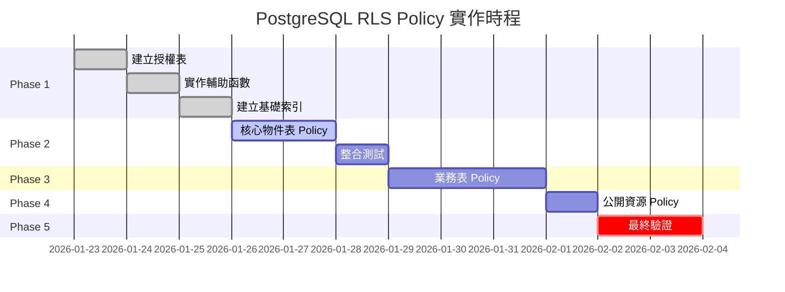

# PostgreSQL Row Level Security (RLS) POLICY 設計規劃書

> **專案名稱**：房東物件管理 AI SaaS  
> **文件版本**：1.0.0  
> **建立日期**：2026-01-22  
> **適用範圍**：30 張資料表的完整安全政策設計

---

## 📋 目錄

1. [專案背景與需求分析](#1-專案背景與需求分析)
2. [RLS 安全架構設計理念](#2-rls-安全架構設計理念)
3. [角色與權限矩陣](#3-角色與權限矩陣)
4. [仲介授權核心機制](#4-仲介授權核心機制)
5. [資料表分級 Policy 設計](#5-資料表分級-policy-設計)
6. [完整 Policy 實作範例](#6-完整-policy-實作範例)
7. [效能優化與索引策略](#7-效能優化與索引策略)
8. [測試與驗證方案](#8-測試與驗證方案)
9. [實作時間表與里程碑](#9-實作時間表與里程碑)

---

## 1. 專案背景與需求分析

### 1.1 系統定位

本系統為「房東物件管理語音 AI 平台」，主要使用者為：

- **房東 (Landlord)**：擁有物件的所有者，系統核心使用者
- **仲介 (Agent)**：受房東委託協助管理物件的專業人員
- **系統管理員 (Admin)**：平台營運人員（預留角色）

### 1.2 核心安全需求

| 需求編號 | 需求描述                                   | 優先級 |
| -------- | ------------------------------------------ | ------ |
| SEC-001  | 房東只能存取自己擁有的物件及相關資料       | P0     |
| SEC-002  | 仲介只能存取被授權代管的物件               | P0     |
| SEC-003  | 支援多層次授權：完整管理、唯讀、特定功能   | P1     |
| SEC-004  | 授權需支援時效性控制（開始日期、結束日期） | P1     |
| SEC-005  | 授權需支援細緻化物件範圍控制               | P2     |
| SEC-006  | 所有資料操作需完整稽核                     | P1     |

### 1.3 當前 Schema 狀態分析

根據 `20260122000000_full_schema.sql`，現有 30 張資料表已分為 7 大模組：

```
1. Identity & Core (1 table)    - users_profile
2. Property Assets (4 tables)   - Property_Sales, Property_Rentals, Property_Photos, Property_Inventory
3. Leads & CRM (6 tables)       - Leads_Tenants, Leads_Buyers, Viewing_Appointments, Inquiries
4. Transactions (6 tables)      - Lease_Agreements, Sales_Agreements, Contracted entities, Offers
5. Finance (4 tables)           - Rental_Ledger, Sales_Ledger, Receipts
6. Operations (5 tables)        - Agent_Directory, Vendors, Designers, Legal Services
7. Support & AI (4 tables)      - Blog_Posts, Glossary_Terms, AI_Chat_Logs, Notifications
```

**現有 RLS 狀態**：
- ✅ 已啟用全域 RLS (`ENABLE ROW LEVEL SECURITY`)
- ⚠️ 僅實作基礎 Policy（`auth.uid() = owner_id`）
- ❌ 缺乏仲介授權機制
- ❌ 缺乏細緻化權限控制

---

## 2. RLS 安全架構設計理念

### 2.1 設計原則

```
┌─────────────────────────────────────────────────────────────┐
│                      安全設計五大原則                          │
├─────────────────────────────────────────────────────────────┤
│ 1. 預設拒絕 (Deny by Default)                               │
│    → 未明確授權的資源，一律拒絕存取                           │
│                                                             │
│ 2. 最小權限 (Principle of Least Privilege)                  │
│    → 僅授予完成工作所需的最小權限                             │
│                                                             │
│ 3. 職責分離 (Separation of Duties)                          │
│    → 房東、仲介、系統管理員權限明確區隔                       │
│                                                             │
│ 4. 深度防禦 (Defense in Depth)                              │
│    → RLS + 應用層權限檢查 + API 驗證多層防護                  │
│                                                             │
│ 5. 可稽核性 (Auditability)                                  │
│    → 所有授權變更與資料存取需完整記錄                         │
└─────────────────────────────────────────────────────────────┘
```

### 2.2 安全層次架構

```
┌────────────────────────────────────────────────────────┐
│  Layer 1: Authentication (Supabase Auth)              │
│  ├─ Email/Password, OAuth, Magic Link                 │
│  └─ JWT Token 驗證                                     │
├────────────────────────────────────────────────────────┤
│  Layer 2: Role-Based Access (users_profile.role)      │
│  ├─ landlord: 物件擁有者                               │
│  ├─ agent: 受託仲介                                    │
│  └─ admin: 系統管理員（預留）                           │
├────────────────────────────────────────────────────────┤
│  Layer 3: Row Level Security (PostgreSQL RLS)         │
│  ├─ Policy 基於 owner_id 判定                          │
│  ├─ Policy 基於 agent_authorizations 授權表            │
│  └─ Policy 支援時效性與範圍控制                         │
├────────────────────────────────────────────────────────┤
│  Layer 4: Application Logic (API/Backend)             │
│  ├─ 業務規則驗證                                       │
│  ├─ 額外權限檢查                                       │
│  └─ 操作稽核日誌                                       │
└────────────────────────────────────────────────────────┘
```

---

## 3. 角色與權限矩陣

### 3.1 角色定義

| 角色代碼 | 角色名稱                  | 說明                         | users_profile.role 值 |
| -------- | ------------------------- | ---------------------------- | --------------------- |
| L        | Landlord (房東)           | 物件所有者，擁有完整管理權   | 'landlord'            |
| A        | Agent (仲介)              | 受託管理者，權限由授權表決定 | 'agent'               |
| S        | System Admin (系統管理員) | 平台營運人員（預留）         | 'admin'               |

### 3.2 資料表權限矩陣

| 模組            | 資料表                 | 房東 (L)    | 仲介 (A)    | 說明                             |
| --------------- | ---------------------- | ----------- | ----------- | -------------------------------- |
| **Core**        | users_profile          | CRUD (Self) | CRUD (Self) | 僅能操作自己的資料               |
| **Property**    | Property_Sales         | CRUD (Own)  | R (Auth)    | 房東全權管理，仲介僅可讀授權物件 |
|                 | Property_Rentals       | CRUD (Own)  | RU (Auth)   | 仲介可更新授權的租賃物件狀態     |
|                 | Property_Photos        | CRUD (Own)  | R (Auth)    | 照片管理權歸房東                 |
|                 | Property_Inventory     | CRUD (Own)  | RU (Auth)   | 仲介可更新設備狀態               |
| **CRM**         | Leads_Tenants          | CRUD (Own)  | CRUD (Auth) | 仲介可完整管理授權物件的客源     |
|                 | Leads_Buyers           | CRUD (Own)  | CRUD (Auth) | 同上                             |
|                 | Viewing_Appointments   | CRUD (Own)  | CRUD (Auth) | 仲介可安排看房                   |
|                 | Tenant_Inquiries       | CRUD (Own)  | CRUD (Auth) | 仲介可處理詢問                   |
|                 | Buyer_Intentions       | CRUD (Own)  | CRUD (Auth) | 仲介可記錄買方意向               |
| **Transaction** | Lease_Agreements       | CRUD (Own)  | R (Auth)    | 合約由房東管理                   |
|                 | Sales_Agreements       | CRUD (Own)  | R (Auth)    | 同上                             |
|                 | Contracted_Tenants     | R (Own)     | R (Auth)    | 成交記錄唯讀                     |
|                 | Contracted_Buyers      | R (Own)     | R (Auth)    | 成交記錄唯讀                     |
|                 | Purchase_Offers        | CRUD (Own)  | CRUD (Auth) | 仲介可協助處理要約               |
|                 | Payment_Workflow       | R (Own)     | R (Auth)    | 履約流程唯讀                     |
| **Finance**     | Rental_Ledger          | CRUD (Own)  | R (Auth)    | 財務資料僅房東管理               |
|                 | Sales_Ledger           | CRUD (Own)  | R (Auth)    | 財務資料僅房東管理               |
|                 | Earnest_Money_Receipts | CRUD (Own)  | R (Auth)    | 收據由房東管理                   |
|                 | Deposit_Receipts       | CRUD (Own)  | R (Auth)    | 收據由房東管理                   |
| **Operations**  | Agent_Directory        | R (All)     | R (All)     | 公開仲介名單                     |
|                 | Maintenance_Vendors    | CRUD (Own)  | R (Auth)    | 廠商由房東管理                   |
|                 | Maintenance_Quotes     | CRUD (Own)  | CR (Auth)   | 仲介可請求報價                   |
|                 | Interior_Designers     | R (All)     | R (All)     | 公開設計師名單                   |
|                 | Escrow_Legal_Services  | R (All)     | R (All)     | 公開法律服務名單                 |
| **Support**     | Blog_Posts             | R (All)     | R (All)     | 公開文章                         |
|                 | Glossary_Terms         | R (All)     | R (All)     | 公開詞彙表                       |
|                 | AI_Chat_Logs           | CRUD (Self) | CRUD (Self) | 個人對話記錄                     |
|                 | System_Notifications   | RU (Self)   | RU (Self)   | 個人通知                         |

**權限代碼說明**：
- `C`: Create (新增)
- `R`: Read (讀取)
- `U`: Update (更新)
- `D`: Delete (刪除)
- `(Own)`: 僅限自己擁有的資源
- `(Auth)`: 僅限已授權的資源
- `(Self)`: 僅限個人資料
- `(All)`: 所有使用者

---

## 4. 仲介授權核心機制

### 4.1 授權資料表設計

新增 `agent_authorizations` 表，作為授權關係的核心：

```sql
-- 仲介授權表
CREATE TABLE public.agent_authorizations (
    id UUID PRIMARY KEY DEFAULT gen_random_uuid(),
    
    -- 授權關係
    landlord_id UUID NOT NULL REFERENCES users_profile(id) ON DELETE CASCADE,
    agent_id UUID NOT NULL REFERENCES users_profile(id) ON DELETE CASCADE,
    
    -- 授權範圍
    property_type TEXT CHECK (property_type IN ('sales', 'rentals', 'both')),
    property_ids UUID[], -- 特定物件 ID 陣列，NULL 表示全部授權
    
    -- 授權等級
    authorization_level TEXT NOT NULL DEFAULT 'readonly' 
        CHECK (authorization_level IN ('readonly', 'manage', 'full')),
    
    -- 細緻權限（JSONB 格式）
    permissions JSONB DEFAULT '{
        "can_view_properties": true,
        "can_update_property_status": false,
        "can_manage_leads": false,
        "can_schedule_viewings": false,
        "can_view_financials": false,
        "can_create_offers": false,
        "can_request_maintenance": false
    }',
    
    -- 授權時效
    valid_from TIMESTAMPTZ NOT NULL DEFAULT NOW(),
    valid_until TIMESTAMPTZ, -- NULL 表示永久有效
    
    -- 狀態
    status TEXT NOT NULL DEFAULT 'active'
        CHECK (status IN ('active', 'suspended', 'revoked', 'expired')),
    
    -- 備註
    notes TEXT,
    
    -- 稽核欄位
    created_at TIMESTAMPTZ NOT NULL DEFAULT NOW(),
    updated_at TIMESTAMPTZ NOT NULL DEFAULT NOW(),
    created_by UUID REFERENCES users_profile(id),
    
    -- 唯一約束
    UNIQUE(landlord_id, agent_id)
);

-- 索引
CREATE INDEX idx_agent_auth_landlord ON agent_authorizations(landlord_id, status);
CREATE INDEX idx_agent_auth_agent ON agent_authorizations(agent_id, status);
CREATE INDEX idx_agent_auth_dates ON agent_authorizations(valid_from, valid_until);
CREATE INDEX idx_agent_auth_property_ids ON agent_authorizations USING gin(property_ids);

-- RLS Policy（授權表本身）
ALTER TABLE agent_authorizations ENABLE ROW LEVEL SECURITY;

CREATE POLICY "landlords_manage_own_authorizations" ON agent_authorizations
    FOR ALL USING (auth.uid() = landlord_id);

CREATE POLICY "agents_view_own_authorizations" ON agent_authorizations
    FOR SELECT USING (auth.uid() = agent_id);
```

### 4.2 授權等級說明

| 授權等級 | 代碼     | 說明                           | 適用場景               |
| -------- | -------- | ------------------------------ | ---------------------- |
| 唯讀     | readonly | 僅可查看物件資訊，不可修改     | 潛在合作仲介、諮詢顧問 |
| 管理     | manage   | 可管理客源、安排看房、更新狀態 | 一般委託仲介           |
| 完整     | full     | 幾乎等同房東權限（除財務外）   | 信任度高的專屬仲介     |

### 4.3 權限檢查輔助函數

```sql
-- 函數 1: 檢查仲介是否有特定權限
CREATE OR REPLACE FUNCTION check_agent_permission(
    p_agent_id UUID,
    p_landlord_id UUID,
    p_permission_key TEXT,
    p_property_id UUID DEFAULT NULL
)
RETURNS BOOLEAN AS $$
DECLARE
    v_has_permission BOOLEAN;
BEGIN
    SELECT EXISTS (
        SELECT 1 
        FROM agent_authorizations aa
        WHERE aa.agent_id = p_agent_id
          AND aa.landlord_id = p_landlord_id
          AND aa.status = 'active'
          AND aa.valid_from <= NOW()
          AND (aa.valid_until IS NULL OR aa.valid_until >= NOW())
          -- 檢查物件範圍
          AND (
            p_property_id IS NULL 
            OR aa.property_ids IS NULL 
            OR p_property_id = ANY(aa.property_ids)
          )
          -- 檢查特定權限
          AND (aa.permissions->>p_permission_key)::BOOLEAN = TRUE
    ) INTO v_has_permission;
    
    RETURN v_has_permission;
END;
$$ LANGUAGE plpgsql SECURITY DEFINER STABLE;

-- 函數 2: 檢查使用者是否為物件所有者或授權仲介
CREATE OR REPLACE FUNCTION is_owner_or_authorized_agent(
    p_user_id UUID,
    p_landlord_id UUID,
    p_property_id UUID DEFAULT NULL
)
RETURNS BOOLEAN AS $$
DECLARE
    v_user_role TEXT;
    v_is_authorized BOOLEAN := FALSE;
BEGIN
    -- 如果是房東本人
    IF p_user_id = p_landlord_id THEN
        RETURN TRUE;
    END IF;
    
    -- 取得使用者角色
    SELECT role INTO v_user_role
    FROM users_profile
    WHERE id = p_user_id;
    
    -- 如果是仲介，檢查授權
    IF v_user_role = 'agent' THEN
        SELECT EXISTS (
            SELECT 1
            FROM agent_authorizations aa
            WHERE aa.agent_id = p_user_id
              AND aa.landlord_id = p_landlord_id
              AND aa.status = 'active'
              AND aa.valid_from <= NOW()
              AND (aa.valid_until IS NULL OR aa.valid_until >= NOW())
              AND (
                p_property_id IS NULL
                OR aa.property_ids IS NULL
                OR p_property_id = ANY(aa.property_ids)
              )
        ) INTO v_is_authorized;
        
        RETURN v_is_authorized;
    END IF;
    
    -- 預設拒絕
    RETURN FALSE;
END;
$$ LANGUAGE plpgsql SECURITY DEFINER STABLE;

-- 函數 3: 取得仲介可存取的房東清單
CREATE OR REPLACE FUNCTION get_authorized_landlords(
    p_agent_id UUID DEFAULT NULL
)
RETURNS TABLE (
    landlord_id UUID,
    landlord_name TEXT,
    authorization_level TEXT,
    valid_until TIMESTAMPTZ,
    property_count BIGINT
) AS $$
BEGIN
    IF p_agent_id IS NULL THEN
        p_agent_id := auth.uid();
    END IF;
    
    RETURN QUERY
    SELECT 
        aa.landlord_id,
        up.display_name as landlord_name,
        aa.authorization_level,
        aa.valid_until,
        CASE 
            WHEN aa.property_ids IS NULL THEN 
                (SELECT COUNT(*) FROM Property_Rentals WHERE owner_id = aa.landlord_id) +
                (SELECT COUNT(*) FROM Property_Sales WHERE owner_id = aa.landlord_id)
            ELSE array_length(aa.property_ids, 1)::BIGINT
        END as property_count
    FROM agent_authorizations aa
    JOIN users_profile up ON aa.landlord_id = up.id
    WHERE aa.agent_id = p_agent_id
      AND aa.status = 'active'
      AND aa.valid_from <= NOW()
      AND (aa.valid_until IS NULL OR aa.valid_until >= NOW())
    ORDER BY up.display_name;
END;
$$ LANGUAGE plpgsql SECURITY DEFINER;
```

### 4.4 自動過期機制

```sql
-- 定期檢查並更新過期授權
CREATE OR REPLACE FUNCTION expire_outdated_authorizations()
RETURNS void AS $$
BEGIN
    UPDATE agent_authorizations
    SET status = 'expired',
        updated_at = NOW()
    WHERE status = 'active'
      AND valid_until IS NOT NULL
      AND valid_until < NOW();
END;
$$ LANGUAGE plpgsql;

-- 建立定期執行排程（需要 pg_cron 擴充）
-- SELECT cron.schedule('expire-authorizations', '0 0 * * *', 
--     'SELECT expire_outdated_authorizations();');
```

---

## 5. 資料表分級 Policy 設計

根據資料敏感度與業務邏輯，將 30 張表分為 4 個等級：

### 5.1 等級分類

| 等級              | 說明                          | 資料表數量 | Policy 複雜度 |
| ----------------- | ----------------------------- | ---------- | ------------- |
| **L1 - 核心身分** | 個人資料，僅本人存取          | 1          | 簡單          |
| **L2 - 物件核心** | 物件及關聯資料，支援授權存取  | 4          | 複雜          |
| **L3 - 業務資料** | CRM、交易、財務，繼承物件權限 | 19         | 中等          |
| **L4 - 公開資源** | 全域資源，所有使用者可讀      | 6          | 簡單          |

### 5.2 L1 - 核心身分表 Policy

**適用表**：`users_profile`

```sql
-- Policy 1: 使用者可以檢視和編輯自己的資料
CREATE POLICY "users_manage_own_profile" ON users_profile
    FOR ALL 
    USING (auth.uid() = id);
```

### 5.3 L2 - 物件核心表 Policy

**適用表**：`Property_Sales`, `Property_Rentals`, `Property_Photos`, `Property_Inventory`

#### Property_Sales

```sql
-- Policy 1: 房東管理自己的銷售物件
CREATE POLICY "landlords_manage_own_sales" ON Property_Sales
    FOR ALL
    USING (auth.uid() = owner_id);

-- Policy 2: 授權仲介可讀取
CREATE POLICY "agents_view_authorized_sales" ON Property_Sales
    FOR SELECT
    USING (
        EXISTS (
            SELECT 1 FROM users_profile WHERE id = auth.uid() AND role = 'agent'
        )
        AND
        is_owner_or_authorized_agent(auth.uid(), owner_id, id)
    );

-- Policy 3: 授權仲介可更新狀態（需特定權限）
CREATE POLICY "agents_update_authorized_sales_status" ON Property_Sales
    FOR UPDATE
    USING (
        EXISTS (
            SELECT 1 FROM users_profile WHERE id = auth.uid() AND role = 'agent'
        )
        AND
        check_agent_permission(auth.uid(), owner_id, 'can_update_property_status', id)
    )
    WITH CHECK (
        -- 僅允許更新特定欄位（透過觸發器或應用層控制）
        check_agent_permission(auth.uid(), owner_id, 'can_update_property_status', id)
    );
```

#### Property_Rentals

```sql
-- Policy 1: 房東完整管理租賃物件
CREATE POLICY "landlords_manage_own_rentals" ON Property_Rentals
    FOR ALL
    USING (auth.uid() = owner_id);

-- Policy 2: 授權仲介可讀取
CREATE POLICY "agents_view_authorized_rentals" ON Property_Rentals
    FOR SELECT
    USING (
        EXISTS (
            SELECT 1 FROM users_profile WHERE id = auth.uid() AND role = 'agent'
        )
        AND
        is_owner_or_authorized_agent(auth.uid(), owner_id, id)
    );

-- Policy 3: 授權仲介可更新
CREATE POLICY "agents_update_authorized_rentals" ON Property_Rentals
    FOR UPDATE
    USING (
        EXISTS (
            SELECT 1 FROM users_profile WHERE id = auth.uid() AND role = 'agent'
        )
        AND
        check_agent_permission(auth.uid(), owner_id, 'can_update_property_status', id)
    )
    WITH CHECK (
        check_agent_permission(auth.uid(), owner_id, 'can_update_property_status', id)
    );
```

#### Property_Photos

```sql
-- Policy 1: 房東管理物件照片
CREATE POLICY "landlords_manage_property_photos" ON Property_Photos
    FOR ALL
    USING (
        property_id IN (
            SELECT id FROM Property_Sales WHERE owner_id = auth.uid()
            UNION
            SELECT id FROM Property_Rentals WHERE owner_id = auth.uid()
        )
    );

-- Policy 2: 授權仲介可讀取
CREATE POLICY "agents_view_authorized_photos" ON Property_Photos
    FOR SELECT
    USING (
        EXISTS (
            SELECT 1 FROM users_profile WHERE id = auth.uid() AND role = 'agent'
        )
        AND
        (
            property_id IN (
                SELECT ps.id FROM Property_Sales ps
                WHERE is_owner_or_authorized_agent(auth.uid(), ps.owner_id, ps.id)
            )
            OR
            property_id IN (
                SELECT pr.id FROM Property_Rentals pr
                WHERE is_owner_or_authorized_agent(auth.uid(), pr.owner_id, pr.id)
            )
        )
    );
```

#### Property_Inventory

```sql
-- Policy 1: 房東管理設備清單
CREATE POLICY "landlords_manage_inventory" ON Property_Inventory
    FOR ALL
    USING (
        property_id IN (
            SELECT id FROM Property_Rentals WHERE owner_id = auth.uid()
        )
    );

-- Policy 2: 授權仲介可讀取和更新
CREATE POLICY "agents_update_authorized_inventory" ON Property_Inventory
    FOR SELECT, UPDATE
    USING (
        EXISTS (
            SELECT 1 FROM users_profile WHERE id = auth.uid() AND role = 'agent'
        )
        AND
        property_id IN (
            SELECT pr.id FROM Property_Rentals pr
            WHERE is_owner_or_authorized_agent(auth.uid(), pr.owner_id, pr.id)
        )
    );
```

### 5.4 L3 - 業務資料表 Policy

**適用表**：Leads、Transactions、Finance 相關表

#### Leads_Tenants（範本，其他 Leads 表類似）

```sql
-- Policy 1: 房東管理自己的客源
CREATE POLICY "landlords_manage_own_tenant_leads" ON Leads_Tenants
    FOR ALL
    USING (auth.uid() = owner_id);

-- Policy 2: 授權仲介可完整管理
CREATE POLICY "agents_manage_authorized_tenant_leads" ON Leads_Tenants
    FOR ALL
    USING (
        EXISTS (
            SELECT 1 FROM users_profile WHERE id = auth.uid() AND role = 'agent'
        )
        AND
        check_agent_permission(auth.uid(), owner_id, 'can_manage_leads')
    );
```

#### Rental_Ledger（範本，財務表僅房東和有權限仲介可讀）

```sql
-- Policy 1: 房東管理財務記錄
CREATE POLICY "landlords_manage_rental_ledger" ON Rental_Ledger
    FOR ALL
    USING (
        property_id IN (
            SELECT id FROM Property_Rentals WHERE owner_id = auth.uid()
        )
    );

-- Policy 2: 授權仲介唯讀（需權限）
CREATE POLICY "agents_view_rental_ledger" ON Rental_Ledger
    FOR SELECT
    USING (
        EXISTS (
            SELECT 1 FROM users_profile WHERE id = auth.uid() AND role = 'agent'
        )
        AND
        property_id IN (
            SELECT pr.id FROM Property_Rentals pr
            WHERE check_agent_permission(auth.uid(), pr.owner_id, 'can_view_financials', pr.id)
        )
    );
```

### 5.5 L4 - 公開資源表 Policy

**適用表**：`Agent_Directory`, `Blog_Posts`, `Glossary_Terms`, 等

```sql
-- 公開資源：所有已驗證使用者可讀
CREATE POLICY "authenticated_users_view_public_resources" ON Agent_Directory
    FOR SELECT
    USING (auth.role() = 'authenticated');

-- 房東可管理自己的專業服務名單
CREATE POLICY "landlords_manage_own_vendors" ON Maintenance_Vendors
    FOR ALL
    USING (
        -- 假設 Maintenance_Vendors 需要新增 owner_id 欄位
        auth.uid() = owner_id
    );
```

---

## 6. 完整 Policy 實作範例

### 6.1 複雜場景：Viewing_Appointments_Tenant

此表需考慮：
1. 房東可管理自己物件的預約
2. 仲介可管理授權物件的預約
3. 預約需關聯到 lead_id，進而關聯到物件

```sql
-- 步驟 1: 確認資料關聯路徑
-- Viewing_Appointments_Tenant → Leads_Tenants → (物件 ID 需從應用層或 details 取得)
-- 為簡化，假設 Leads_Tenants 表新增 property_id 外鍵

ALTER TABLE Leads_Tenants 
ADD COLUMN property_id UUID REFERENCES Property_Rentals(id);

-- 步驟 2: 制定 Policy
CREATE POLICY "landlords_manage_tenant_viewings" ON Viewing_Appointments_Tenant
    FOR ALL
    USING (
        lead_id IN (
            SELECT lt.id FROM Leads_Tenants lt
            WHERE lt.owner_id = auth.uid()
        )
    );

CREATE POLICY "agents_manage_authorized_tenant_viewings" ON Viewing_Appointments_Tenant
    FOR ALL
    USING (
        EXISTS (
            SELECT 1 FROM users_profile WHERE id = auth.uid() AND role = 'agent'
        )
        AND
        lead_id IN (
            SELECT lt.id FROM Leads_Tenants lt
            JOIN Property_Rentals pr ON lt.property_id = pr.id
            WHERE check_agent_permission(auth.uid(), pr.owner_id, 'can_schedule_viewings', pr.id)
        )
    );
```

### 6.2 複雜場景：Maintenance_Quotes

此表涉及三方：房東、仲介、廠商

```sql
-- Policy 1: 房東可管理自己物件的報價
CREATE POLICY "landlords_manage_maintenance_quotes" ON Maintenance_Quotes
    FOR ALL
    USING (
        property_id IN (
            SELECT id FROM Property_Rentals WHERE owner_id = auth.uid()
        )
    );

-- Policy 2: 授權仲介可請求報價
CREATE POLICY "agents_create_maintenance_quotes" ON Maintenance_Quotes
    FOR INSERT, SELECT
    WITH CHECK (
        EXISTS (
            SELECT 1 FROM users_profile WHERE id = auth.uid() AND role = 'agent'
        )
        AND
        property_id IN (
            SELECT pr.id FROM Property_Rentals pr
            WHERE check_agent_permission(auth.uid(), pr.owner_id, 'can_request_maintenance', pr.id)
        )
    );

-- Policy 3: 所有相關方可讀取
CREATE POLICY "all_parties_view_quotes" ON Maintenance_Quotes
    FOR SELECT
    USING (
        -- 房東
        property_id IN (SELECT id FROM Property_Rentals WHERE owner_id = auth.uid())
        OR
        -- 授權仲介
        (
            EXISTS (SELECT 1 FROM users_profile WHERE id = auth.uid() AND role = 'agent')
            AND
            property_id IN (
                SELECT pr.id FROM Property_Rentals pr
                WHERE is_owner_or_authorized_agent(auth.uid(), pr.owner_id, pr.id)
            )
        )
        -- 未來可新增：廠商角色
    );
```

---

## 7. 效能優化與索引策略

### 7.1 Policy 效能分析

RLS Policy 會對每個查詢附加額外的 WHERE 條件，可能影響效能。優化策略：

```sql
-- 優化 1: 針對常用查詢路徑建立複合索引
CREATE INDEX idx_property_rentals_owner_status 
    ON Property_Rentals(owner_id, status);

CREATE INDEX idx_property_sales_owner_status 
    ON Property_Sales(owner_id, status);

-- 優化 2: 針對 JSONB 權限欄位建立 GIN 索引
CREATE INDEX idx_agent_auth_permissions 
    ON agent_authorizations USING gin(permissions);

-- 優化 3: 針對陣列查詢建立 GIN 索引
CREATE INDEX idx_agent_auth_property_ids 
    ON agent_authorizations USING gin(property_ids);

-- 優化 4: 針對時間範圍查詢建立 B-tree 索引
CREATE INDEX idx_agent_auth_active_period 
    ON agent_authorizations(valid_from, valid_until) 
    WHERE status = 'active';
```

### 7.2 效能監控查詢

```sql
-- 查詢 1: 檢查 Policy 執行計畫
EXPLAIN ANALYZE
SELECT * FROM Property_Rentals
WHERE status = 'vacant';

-- 查詢 2: 識別慢查詢
SELECT 
    schemaname,
    tablename,
    indexname,
    idx_scan,
    idx_tup_read,
    idx_tup_fetch
FROM pg_stat_user_indexes
WHERE schemaname = 'public'
ORDER BY idx_scan DESC;

-- 查詢 3: 檢查 RLS 是否啟用
SELECT 
    schemaname,
    tablename,
    rowsecurity
FROM pg_tables
WHERE schemaname = 'public'
ORDER BY tablename;
```

---

## 8. 測試與驗證方案

### 8.1 測試資料準備

```sql
-- 步驟 1: 建立測試房東
INSERT INTO auth.users (id, email) VALUES 
    ('00000000-0000-0000-0000-000000000001', 'landlord1@test.com');

INSERT INTO users_profile (id, role, display_name) VALUES 
    ('00000000-0000-0000-0000-000000000001', 'landlord', '測試房東A');

-- 步驟 2: 建立測試仲介
INSERT INTO auth.users (id, email) VALUES 
    ('00000000-0000-0000-0000-000000000002', 'agent1@test.com');

INSERT INTO users_profile (id, role, display_name) VALUES 
    ('00000000-0000-0000-0000-000000000002', 'agent', '測試仲介B');

-- 步驟 3: 建立測試物件
INSERT INTO Property_Rentals (id, owner_id, address, monthly_rent, status) VALUES 
    ('10000000-0000-0000-0000-000000000001', '00000000-0000-0000-0000-000000000001', 
     '台北市大安區測試路1號', 30000, 'vacant');

-- 步驟 4: 建立授權關係
INSERT INTO agent_authorizations (landlord_id, agent_id, authorization_level, permissions) VALUES 
    ('00000000-0000-0000-0000-000000000001', 
     '00000000-0000-0000-0000-000000000002',
     'manage',
     '{"can_view_properties": true, "can_update_property_status": true, "can_manage_leads": true, "can_schedule_viewings": true}'::jsonb);
```

### 8.2 Policy 測試案例

```sql
-- 測試 1: 房東可見自己的物件
SET LOCAL ROLE authenticated;
SET LOCAL request.jwt.claims TO '{"sub": "00000000-0000-0000-0000-000000000001"}';
SELECT * FROM Property_Rentals; 
-- 預期：1 筆記錄

-- 測試 2: 仲介可見授權的物件
SET LOCAL request.jwt.claims TO '{"sub": "00000000-0000-0000-0000-000000000002"}';
SELECT * FROM Property_Rentals;
-- 預期：1 筆記錄

-- 測試 3: 未授權仲介無法存取
SET LOCAL request.jwt.claims TO '{"sub": "00000000-0000-0000-0000-000000000003"}';
SELECT * FROM Property_Rentals;
-- 預期：0 筆記錄

-- 測試 4: 仲介無法刪除物件（僅房東可刪除）
SET LOCAL request.jwt.claims TO '{"sub": "00000000-0000-0000-0000-000000000002"}';
DELETE FROM Property_Rentals WHERE id = '10000000-0000-0000-0000-000000000001';
-- 預期：權限拒絕錯誤

-- 測試 5: 權限過期後無法存取
UPDATE agent_authorizations 
SET valid_until = NOW() - INTERVAL '1 day'
WHERE agent_id = '00000000-0000-0000-0000-000000000002';

SET LOCAL request.jwt.claims TO '{"sub": "00000000-0000-0000-0000-000000000002"}';
SELECT * FROM Property_Rentals;
-- 預期：0 筆記錄
```

### 8.3 自動化測試框架（pgTAP）

```sql
-- 安裝 pgTAP 後執行
BEGIN;
SELECT plan(5);

-- Test 1: RLS 已啟用
SELECT has_table_privilege('authenticated', 'Property_Rentals', 'SELECT');

-- Test 2: Policy 存在
SELECT policies_are('public', 'Property_Rentals', ARRAY[
    'landlords_manage_own_rentals',
    'agents_view_authorized_rentals',
    'agents_update_authorized_rentals'
]);

-- Test 3: 函數存在
SELECT has_function('public', 'check_agent_permission', ARRAY['uuid', 'uuid', 'text', 'uuid']);

-- Test 4: 索引存在
SELECT has_index('agent_authorizations', 'idx_agent_auth_landlord', 'Index on landlord_id exists');

-- Test 5: 約束正確
SELECT col_not_null('agent_authorizations', 'landlord_id');

SELECT * FROM finish();
ROLLBACK;
```

---

## 9. 實作時間表與里程碑

### 9.1 分階段實作計畫

| 階段        | 任務                                   | 預計工時   | 完成標準                 | 風險評估 |
| ----------- | -------------------------------------- | ---------- | ------------------------ | -------- |
| **Phase 1** | **基礎架構**                           | 8 hrs      |                          |          |
| 1.1         | 建立 agent_authorizations 表           | 2 hrs      | Migration 檔案建立並測試 | 低       |
| 1.2         | 實作輔助函數（3 個核心函數）           | 4 hrs      | 函數通過單元測試         | 中       |
| 1.3         | 建立基礎索引                           | 2 hrs      | EXPLAIN ANALYZE 驗證效能 | 低       |
| **Phase 2** | **L1/L2 表 Policy**                    | 12 hrs     |                          |          |
| 2.1         | users_profile Policy                   | 1 hr       | Policy 測試通過          | 低       |
| 2.2         | Property_Sales Policy (3 policies)     | 3 hrs      | 房東+仲介測試通過        | 中       |
| 2.3         | Property_Rentals Policy (3 policies)   | 3 hrs      | 房東+仲介測試通過        | 中       |
| 2.4         | Property_Photos Policy (2 policies)    | 2 hrs      | 繼承權限測試通過         | 中       |
| 2.5         | Property_Inventory Policy (2 policies) | 2 hrs      | 繼承權限測試通過         | 中       |
| 2.6         | 整合測試 Phase 1+2                     | 1 hr       | 端對端測試通過           | 高       |
| **Phase 3** | **L3 業務表 Policy**                   | 16 hrs     |                          |          |
| 3.1         | Leads 相關表 (6 tables)                | 6 hrs      | CRM 流程測試通過         | 中       |
| 3.2         | Transaction 相關表 (6 tables)          | 5 hrs      | 交易流程測試通過         | 中       |
| 3.3         | Finance 相關表 (4 tables)              | 3 hrs      | 財務隔離測試通過         | 高       |
| 3.4         | Operations 相關表 (5 tables)           | 2 hrs      | 服務商存取測試通過       | 低       |
| **Phase 4** | **L4 公開資源與 AI**                   | 4 hrs      |                          |          |
| 4.1         | Blog/Glossary/Directory Policy         | 2 hrs      | 公開存取測試通過         | 低       |
| 4.2         | AI_Chat_Logs/Notifications Policy      | 2 hrs      | 個人隔離測試通過         | 低       |
| **Phase 5** | **最終驗證與文件**                     | 8 hrs      |                          |          |
| 5.1         | 完整端對端測試（30 張表）              | 4 hrs      | 100% Policy 覆蓋率       | 高       |
| 5.2         | 效能基準測試                           | 2 hrs      | 查詢時間 < 100ms         | 中       |
| 5.3         | 安全稽核與滲透測試                     | 2 hrs      | 無權限繞過漏洞           | 高       |
| **總計**    |                                        | **48 hrs** |                          |          |

### 9.2 關鍵里程碑檢查點



### 9.3 風險緩解策略

| 風險項目                           | 影響 | 機率 | 緩解措施                                           |
| ---------------------------------- | ---- | ---- | -------------------------------------------------- |
| Policy 邏輯錯誤導致資料洩漏        | 嚴重 | 中   | 1. 完整測試覆蓋<br>2. Code Review<br>3. 分階段上線 |
| 複雜 Policy 影響查詢效能           | 高   | 中   | 1. 建立適當索引<br>2. 效能基準測試<br>3. 查詢優化  |
| 函數 SECURITY DEFINER 權限提升風險 | 嚴重 | 低   | 1. 最小權限原則<br>2. 輸入驗證<br>3. 定期稽核      |
| 授權表資料不一致                   | 中   | 低   | 1. 外鍵約束<br>2. 觸發器驗證<br>3. 定期清理        |

---

## 10. 附錄

### 10.1 完整 Migration 腳本範例

```sql
-- File: supabase/migrations/20260123000000_agent_authorization_rls.sql
-- Description: 實作完整的 RLS Policy 系統

-- ========================================
-- Part 1: 建立授權表
-- ========================================
CREATE TABLE IF NOT EXISTS public.agent_authorizations (
    -- (完整定義如 Section 4.1)
);

-- ========================================
-- Part 2: 建立輔助函數
-- ========================================
-- (如 Section 4.3)

-- ========================================
-- Part 3: 建立 Policy（按資料表分類）
-- ========================================

-- L1: Core Tables
ALTER TABLE users_profile ENABLE ROW LEVEL SECURITY;
-- (Policies...)

-- L2: Property Tables
ALTER TABLE Property_Sales ENABLE ROW LEVEL SECURITY;
-- (Policies...)

-- L3: Business Tables
-- (Policies...)

-- L4: Public Resources
-- (Policies...)

-- ========================================
-- Part 4: 建立索引
-- ========================================
-- (如 Section 7.1)

-- ========================================
-- Part 5: 資料驗證與清理
-- ========================================
DO $$
BEGIN
    -- 檢查是否有孤立的授權記錄
    IF EXISTS (
        SELECT 1 FROM agent_authorizations aa
        LEFT JOIN users_profile up_l ON aa.landlord_id = up_l.id
        LEFT JOIN users_profile up_a ON aa.agent_id = up_a.id
        WHERE up_l.id IS NULL OR up_a.id IS NULL
    ) THEN
        RAISE WARNING '發現孤立的授權記錄，請檢查資料完整性';
    END IF;
END $$;
```

### 10.2 常用管理查詢

```sql
-- 查詢 1: 檢視所有授權關係
SELECT 
    up_l.display_name AS landlord_name,
    up_a.display_name AS agent_name,
    aa.authorization_level,
    aa.property_type,
    CASE 
        WHEN aa.property_ids IS NULL THEN 'All Properties'
        ELSE array_length(aa.property_ids, 1)::TEXT || ' Properties'
    END AS scope,
    aa.status,
    aa.valid_from,
    aa.valid_until
FROM agent_authorizations aa
JOIN users_profile up_l ON aa.landlord_id = up_l.id
JOIN users_profile up_a ON aa.agent_id = up_a.id
ORDER BY aa.created_at DESC;

-- 查詢 2: 檢視即將過期的授權
SELECT 
    up_l.display_name AS landlord,
    up_a.display_name AS agent,
    aa.valid_until,
    aa.valid_until - NOW() AS time_remaining
FROM agent_authorizations aa
JOIN users_profile up_l ON aa.landlord_id = up_l.id
JOIN users_profile up_a ON aa.agent_id = up_a.id
WHERE aa.status = 'active'
  AND aa.valid_until IS NOT NULL
  AND aa.valid_until BETWEEN NOW() AND NOW() + INTERVAL '7 days'
ORDER BY aa.valid_until;

-- 查詢 3: 統計各仲介管理的物件數量
SELECT 
    up.display_name AS agent_name,
    COUNT(DISTINCT aa.landlord_id) AS landlord_count,
    SUM(
        CASE 
            WHEN aa.property_ids IS NULL THEN 
                (SELECT COUNT(*) FROM Property_Rentals WHERE owner_id = aa.landlord_id) +
                (SELECT COUNT(*) FROM Property_Sales WHERE owner_id = aa.landlord_id)
            ELSE array_length(aa.property_ids, 1)
        END
    ) AS total_properties
FROM agent_authorizations aa
JOIN users_profile up ON aa.agent_id = up.id
WHERE aa.status = 'active'
GROUP BY up.id, up.display_name
ORDER BY total_properties DESC;
```

### 10.3 Troubleshooting 常見問題

#### Q1: Policy 測試時出現「permission denied」錯誤

**原因**：
1. RLS 未正確啟用
2. Policy 條件邏輯錯誤
3. 測試時未正確設定 auth.uid()

**解決方法**：
```sql
-- 檢查 RLS 是否啟用
SELECT tablename, rowsecurity 
FROM pg_tables 
WHERE schemaname = 'public' AND tablename = 'Property_Rentals';

-- 檢查 Policy 是否存在
SELECT * FROM pg_policies 
WHERE schemaname = 'public' AND tablename = 'Property_Rentals';

-- 測試時正確設定使用者
SET LOCAL role authenticated;
SET LOCAL request.jwt.claims TO '{"sub": "your-user-id"}';
```

#### Q2: 查詢效能顯著下降

**原因**：
1. Policy 包含複雜子查詢
2. 缺少適當索引
3. 函數未標記為 STABLE 或 IMMUTABLE

**解決方法**：
```sql
-- 使用 EXPLAIN ANALYZE 分析查詢計畫
EXPLAIN (ANALYZE, BUFFERS, VERBOSE)
SELECT * FROM Property_Rentals WHERE status = 'vacant';

-- 確保函數標記為 STABLE
ALTER FUNCTION check_agent_permission STABLE;

-- 建立複合索引
CREATE INDEX IF NOT EXISTS idx_property_rentals_owner_status 
    ON Property_Rentals(owner_id, status);
```

#### Q3: 授權表資料不一致

**原因**：
1. 外鍵約束未正確設定
2. 應用層邏輯錯誤
3. 手動資料修改

**解決方法**：
```sql
-- 建立觸發器驗證授權資料
CREATE OR REPLACE FUNCTION validate_agent_authorization()
RETURNS TRIGGER AS $$
BEGIN
    -- 檢查 landlord 必須是 landlord 角色
    IF NOT EXISTS (
        SELECT 1 FROM users_profile 
        WHERE id = NEW.landlord_id AND role = 'landlord'
    ) THEN
        RAISE EXCEPTION 'landlord_id 必須對應到角色為 landlord 的使用者';
    END IF;
    
    -- 檢查 agent 必須是 agent 角色
    IF NOT EXISTS (
        SELECT 1 FROM users_profile 
        WHERE id = NEW.agent_id AND role = 'agent'
    ) THEN
        RAISE EXCEPTION 'agent_id 必須對應到角色為 agent 的使用者';
    END IF;
    
    -- 檢查 property_ids 是否有效
    IF NEW.property_ids IS NOT NULL THEN
        IF NOT (
            SELECT bool_and(
                id IN (SELECT id FROM Property_Rentals WHERE owner_id = NEW.landlord_id)
                OR
                id IN (SELECT id FROM Property_Sales WHERE owner_id = NEW.landlord_id)
            )
            FROM unnest(NEW.property_ids) AS id
        ) THEN
            RAISE EXCEPTION 'property_ids 包含無效或不屬於該房東的物件';
        END IF;
    END IF;
    
    RETURN NEW;
END;
$$ LANGUAGE plpgsql;

CREATE TRIGGER validate_agent_authorization_trigger
    BEFORE INSERT OR UPDATE ON agent_authorizations
    FOR EACH ROW
    EXECUTE FUNCTION validate_agent_authorization();
```

---

## 結語

本設計規劃書提供了完整的 PostgreSQL RLS Policy 實作框架，針對本專案的 30 張資料表設計了分級、細緻的安全政策。核心亮點包括：

1. **彈性授權機制**：透過 `agent_authorizations` 表支援多層次、時效性、範圍可控的授權
2. **完整權限矩陣**：明確定義房東、仲介對每張表的存取權限
3. **效能優化**：配套索引策略確保 Policy 不影響查詢效能
4. **可測試性**：提供完整測試案例與自動化測試框架
5. **可維護性**：分階段實作計畫與詳細文件

**下一步行動**：
1. Review 本文件並與團隊討論調整
2. 開始 Phase 1 實作（授權表與輔助函數）
3. 建立測試環境並執行 Policy 測試
4. 逐步部署到 Staging 環境驗證

---

**文件變更記錄**

| 版本  | 日期       | 作者     | 變更說明 |
| ----- | ---------- | -------- | -------- |
| 1.0.0 | 2026-01-22 | 開發團隊 | 初版建立 |

