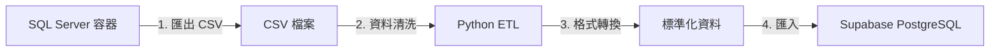

# 舊資料庫分析報告

## 一、資料庫規模統計

### 基本資訊

- **資料庫類型**: Microsoft SQL Server 2012 (從備份檔推測)
- **資料庫名稱**: house063
- **備份日期**: 2012-11-01
- **表格數量**: 141 個
- **總資料筆數**: 約 **180 萬筆** (1,800,000+ rows)

### 核心資料表 (Top 20)

| 表格名稱         | 筆數       | 用途推測            |
| ---------------- | ---------- | ------------------- |
| hblog            | 311,105    | 系統操作日誌        |
| hbmatchnoted     | 185,998    | 配對備註記錄        |
| hbmatchsale2     | 149,253    | 售屋配對記錄        |
| hbsmsrecord      | 149,072    | 簡訊發送記錄        |
| hbmatchcust2     | 118,002    | 客戶配對記錄        |
| hbbuildsearch    | 116,203    | 建案搜尋記錄        |
| **hbcustlook**   | **98,441** | **客戶看屋記錄** ⭐ |
| **hbcontact**    | **88,338** | **聯絡記錄** ⭐     |
| hbquerylog       | 66,389     | 查詢日誌            |
| hbmyschedule     | 58,275     | 個人行程表          |
| hbbuildhouse     | 35,816     | 建案房屋資料        |
| **hbhouseowner** | **35,802** | **屋主資料** ⭐     |
| hbautomatch2     | 30,295     | 自動配對記錄2       |
| hbdoctable       | 23,555     | 文件表              |
| readpublicuser   | 21,243     | 公開資料讀取記錄    |
| hbinv            | 19,526     | 發票/財務記錄       |
| hbempduty        | 17,671     | 員工值班記錄        |
| **hbcust**       | **15,435** | **客戶主檔** ⭐     |
| hbinvtalk        | 11,352     | 財務溝通記錄        |
| hbauth           | 11,022     | 權限設定            |

---

## 二、新舊資料庫對比

### 舊資料庫 (house063 - SQL Server)

- **技術**: Microsoft SQL Server 2012
- **架構**: Windows Server 桌面應用程式時代的傳統架構
- **特點**:
  - 單體式設計 (Monolithic)
  - 內網部署 (On-Premise)
  - Windows 桌面客戶端 + SQL Server
  - 表格名稱有明確命名規則 (`hb` 前綴 = House Broker?)
  - 欄位名稱為中文拼音縮寫 (如 `cust_name`, `emp_no`)

### 新專案資料庫 (Supabase - PostgreSQL)

- **技術**: PostgreSQL 17.x (透過 Supabase 雲端平台)
- **架構**: 現代化 SaaS 雲端架構
- **特點**:
  - 微服務導向
  - 雲端部署 (AWS/Cloud)
  - React Native App + RESTful API + PostgreSQL
  - 支援即時訂閱 (Realtime)
  - 內建身份驗證、儲存桶、邊緣函數
  - Row Level Security (RLS) 資料安全機制

---

## 三、關係分析

### 相同點

1. **業務領域完全一致**: 都是房屋仲介管理系統
2. **核心實體類似**:
   - 客戶 (Customer)
   - 房屋/物件 (Property/House)
   - 成交 (Transaction/Trade)
   - 員工 (Employee)
   - 看屋記錄 (Viewing/Look)

### 不同點

| 面向   | 舊系統             | 新系統                         |
| ------ | ------------------ | ------------------------------ |
| 使用者 | 單一公司內部員工   | 多租戶 SaaS (房東、房客、仲介) |
| 介面   | Windows 桌面軟體   | 手機 App + Web                 |
| 資料庫 | SQL Server (T-SQL) | PostgreSQL (PL/pgSQL)          |
| 認證   | Windows 帳號       | OAuth/Email/手機驗證           |
| 儲存   | 本地硬碟           | 雲端 Object Storage            |
| 即時性 | 定時同步           | WebSocket 即時推播             |

---

## 四、遷移可行性評估

### ✅ 可以遷移的資料

#### 高價值資料 (建議優先遷移)

1. **客戶資料** (`hbcust` → `profiles` 或新的 `customers` 表)
   - 15,435 筆客戶基本資料
   - 可對應到新系統的「房客」角色
2. **屋主資料** (`hbhouseowner` → `landlords` 或 `property_owners`)
   - 35,802 筆屋主資料
   - 可對應到新系統的「房東」角色

3. **成交記錄** (`hbtrade` → `transactions`)
   - 1,665 筆歷史成交資料
   - 保留商業智慧分析價值

4. **看屋記錄** (`hbcustlook` → `property_viewings`)
   - 98,441 筆帶看記錄
   - 可用於客戶偏好分析

#### 中等價值資料

- **聯絡記錄** (`hbcontact`) - 可整合到 CRM 模組
- **建案資料** (`hbbuild`, `hbbuildhouse`) - 可作為房源參考
- **員工資料** (`hbemp`) - 可轉為系統管理員

### ⚠️ 需要轉換的資料

- **權限系統** (`hbauth`) - 新系統使用 Supabase Auth，需重新設計
- **簡訊記錄** (`hbsmsrecord`) - 可保留統計，但不可直接使用

### ❌ 不建議遷移

- **系統日誌** (`hblog`, `hbquerylog`) - 無業務價值
- **舊版設定** (`hbsys`, `hbbackcolor`) - 與新系統架構不相容
- **暫存表** (`hbtemp*`) - 無保存意義

---

## 五、遷移方案建議

### 方案A：完整歷史遷移 (推薦)

**目標**: 保留所有有價值的歷史資料作為「唯讀檔案館」

1. 建立獨立的 `legacy_data` schema
2. 保持原始表格結構，僅做最小必要調整 (欄位類型轉換)
3. 在新系統中建立「歷史資料查詢」功能
4. 重要資料(客戶、成交)建立 View 連結到新表格

**優點**: 資料完整、可追溯、風險低
**缺點**: 資料庫空間需求較大

### 方案B：精選遷移 + ETL

**目標**: 只遷移核心業務資料並轉換為新格式

1. 僅遷移客戶、屋主、成交、物件 4 大類
2. 使用 ETL 腳本進行欄位映射與清洗
3. 資料標準化 (統一電話格式、地址格式)
4. 合併重複資料

**優點**: 資料乾淨、符合新架構
**缺點**: 需要大量資料清洗工作、可能遺失部分資訊

### 方案C：保留原始 + 選擇性同步

**目標**: 舊系統維持唯讀，新系統從零開始

1. 將 SQL Server 容器長期保留作為查詢用途
2. 僅將「VIP 客戶」手動挑選並轉移
3. 新業務完全在新系統進行

**優點**: 最低工作量、風險最小
**缺點**: 需維護兩套系統、查詢不便

---

## 六、技術遷移路徑

### 工具選擇

```
SQL Server → PostgreSQL 遷移工具：
1. pgLoader (開源、自動化程度高) ⭐ 推薦
2. AWS Database Migration Service (如果使用 AWS)
3. 手寫 Python ETL 腳本 (最靈活)
```

### 基本流程



---

## 七、立即行動建議

1. **第一步**: 匯出關鍵表格為 CSV (已完成 ✅)
2. **第二步**: 分析 `hbcust` 與新系統 `profiles` 的欄位對應關係
3. **第三步**: 撰寫測試性 ETL 腳本，先遷移 100 筆客戶資料驗證
4. **第四步**: 根據測試結果決定採用方案 A/B/C
5. **第五步**: 完整遷移並驗證資料完整性

---

**結論**: 這個 10 年前的資料庫包含約 **180 萬筆寶貴的歷史記錄**，其中約 **15 萬筆核心業務資料** (客戶+屋主+成交+看屋) 具有極高的遷移價值。建議採用**方案A (完整歷史遷移)**，保留所有資料作為商業智慧與客戶關係的重要資產。
